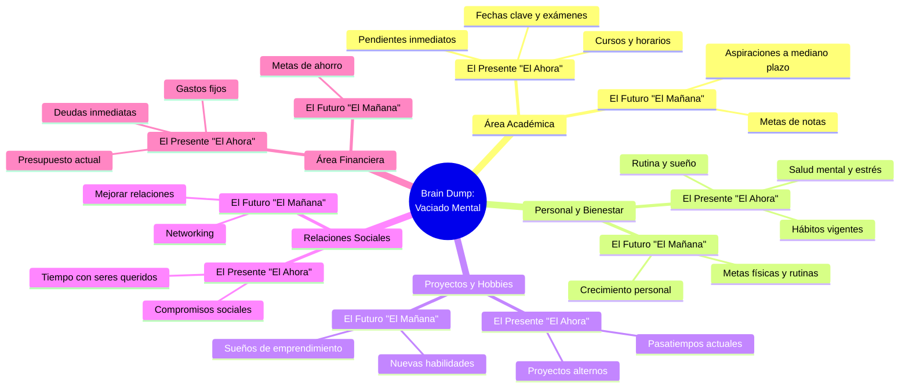
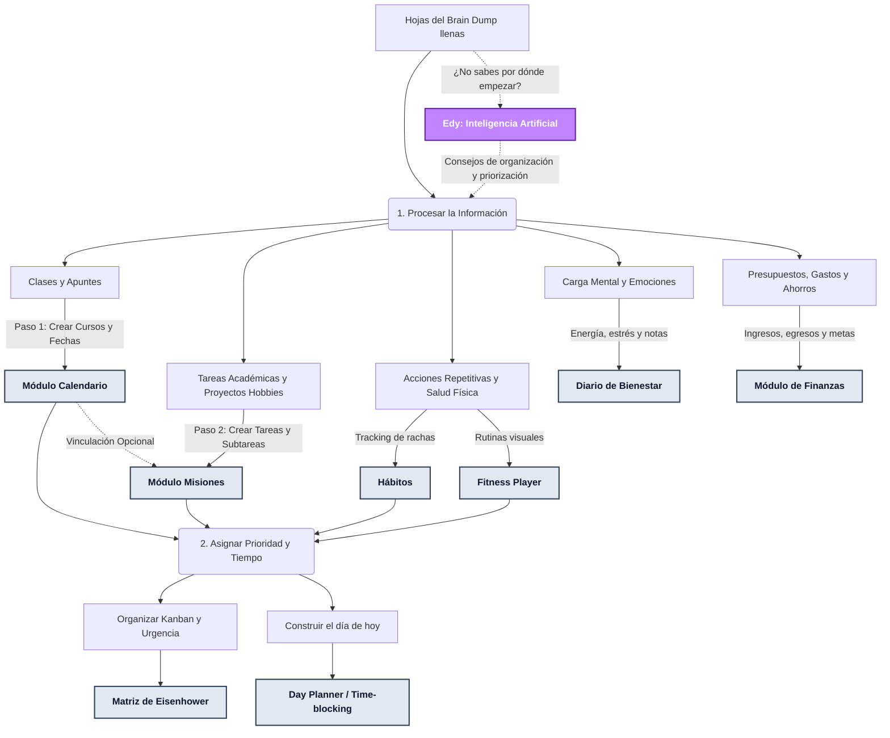
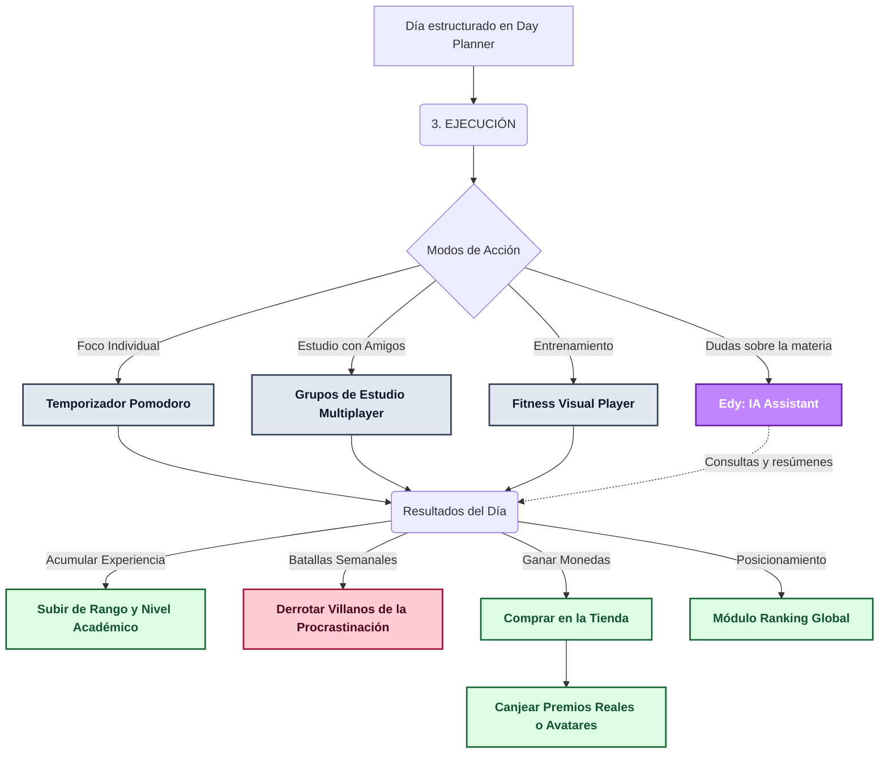

# Flujo de Trabajo: Brain Dump ➔ Epycus (Versión Detallada)

Aquí tienes la versión ampliada y corregida. Tienes toda la razón: **Epycus sí cuenta con un módulo de Finanzas nativo** (con control de ingresos/egresos, presupuestos y metas de ahorro), además de la **Inteligencia Artificial (Edy)**, Grupos de Estudio, y un ecosistema completo de gamificación. 

Estos diagramas ahora reflejan con total fidelidad la arquitectura técnica de Epycus para que tu explicación en el video sea perfecta.

---

## 1. El Vaciado Mental (Brain Dump)
Este diagrama inicial (qué poner en el papel) se mantiene conceptualmente igual, ya que representa la psicología del estudiante antes de usar el sistema.

---

## 2. Procesar y Asignar en Epycus (La Estructura)
Este es el diagrama más importante para enseñar a usar la app. Muestra **dónde va cada cosa**. Destaca que el **Calendario es el corazón inicial** (ahí nacen los cursos) y que **Edy (IA)** actúa como copiloto para ayudar al estudiante a organizar este caos si se siente abrumado.

---

## 3. Ejecutar y Recompensar (La Acción Gamificada)
Aquí es donde Epycus brilla frente a Notion u otras agendas. El estudiante no solo marca un "check", sino que **juega** contra la procrastinación.

### Casos de Uso Específicos para mencionar en el Video:
1. **Inteligencia Artificial (Edy):**
   * *Caso 1 (En el Procesamiento):* Si en su Brain Dump tienen 40 cosas mezcladas y sienten ansiedad, abren a Edy y le dicen: *"Edy, esto es lo que tengo que hacer esta semana: [lista]. Ayúdame a priorizarlo según la matriz de Eisenhower"*.
   * *Caso 2 (En la Ejecución):* Mientras usan el Pomodoro, si se atascan con un problema de Cálculo, le consultan a Edy para destrabarse rápidamente sin romper su concentración navegando por internet.
2. **Finanzas Estudiantiles:**
   * Mostrar cómo pueden fijar su *presupuesto mensual de fotocopias o transporte*, ir restando gastos y establecer una *meta de ahorro* (ej. "Ahorro para laptop nueva") con una barra de progreso visual.
3. **Misiones Multiuso:**
   * Mostrar que una Misión no tiene por qué ser obligatoriamente un trabajo de universidad. Pueden crear una misión llamada *"Aprender a editar en Premiere"*, no vincularla a ningún curso, y dividirla en Kanban (Subtareas).
4. **Villanos y Ranking (El Gancho Final):**
   * Explicar que fallar en sus tareas le da "puntos de vida" a los Villanos semanales. Si el estudiante ejecuta, les hace daño; si procrastina, el villano ataca sus estadísticas y los hace bajar en el Ranking global de estudiantes.
