\
# 00 - Arquitectura del Software

> Monolito modular con arquitectura limpia por modulo. Lee este documento entero antes de crear cualquier archivo.

---

## 1. Por que esta arquitectura

No es sobre-ingenieria gratuita. Hay tres razones concretas:

1. **El alcance va a cambiar.** Despues del analisis de encuestas y del documento de requisitos, van a aparecer modulos nuevos y cambios visuales. La modularidad permite agregar sin romper.
2. **Varias IA distintas van a escribir codigo aqui.** Las fronteras explicitas entre modulos evitan que una IA rompa lo que hizo otra.
3. **La telemetria debe ser inviolable.** Aislarla como modulo con contratos propios impide que un cambio en Pomodoro rompa el registro de eventos.

**Monolito, no microservicios.** Un solo despliegue, una sola base de datos, un solo repositorio. En hosting compartido con 1 nucleo, los microservicios serian absurdos.

---

## 2. Estructura de Modulos Reales (verificado 2026-08-17)

Los siguientes modulos existen en `app/Modules/` con estructura DDD completa (Domain / Application / Infrastructure / Presentation):

| Modulo | Casos de Uso Principales | Vistas Frontend |
|--------|--------------------------|-----------------|
| **Identity** | RegisterUserUseCase, CompleteProfileUseCase, RecordConsentUseCase, RecordEpaPretestUseCase, UpdatePreferencesUseCase | Pages/Auth/, Pages/Identity/CompleteProfile.vue, Pages/Identity/Consent.vue |
| **Habits** | CreateHabitUseCase, UpdateHabitUseCase, DeleteHabitUseCase, ArchiveHabitUseCase, UnarchiveHabitUseCase, ToggleHabitCompletionUseCase | Pages/Habits/Index.vue |
| | Plantillas atomicas rapidas, Habit Stacking (`cue_trigger`), filtros por momento del dia (`time_of_day`), vista semanal 7 dias + heatmap mensual | |
| **Pomodoro** | StartPomodoroUseCase, PausePomodoroUseCase, ResumePomodoroUseCase, AbandonPomodoroUseCase, CompletePomodoroUseCase, GetActiveSessionUseCase, ResolveStaleSessionUseCase | Pages/Pomodoro/Index.vue |
| **Missions** | CreateMissionUseCase, UpdateMissionUseCase, DeleteMissionUseCase, CompleteMissionUseCase, UncompleteMissionUseCase, AddSubtaskUseCase, ToggleSubtaskUseCase, UpdateSubtaskUseCase, ReorderSubtasksUseCase, ChangeQuadrantUseCase | Pages/Missions/Index.vue, Pages/Missions/Detail.vue |
| | Tablero Kanban 4 columnas, Matriz de Eisenhower (Q1-Q4), subtareas interactivas en post-its, tips pedagogicos | |
| **Calendar** | CalendarController (multi-funcion), NoteImageController | Pages/Calendar/Index.vue |
| **Wellbeing** | CreateEntryUseCase, EditEntryUseCase, GetMonthCalendarUseCase, GetDayDetailUseCase, GetMoodTrendUseCase | Pages/Wellbeing/Index.vue, Pages/Wellbeing/Day.vue |
| **Gamification** | AwardXpUseCase, EvaluateStreaksUseCase | (integrado via eventos) |
| **Villains** | AssignWeeklyVillainUseCase, GetCurrentVillainUseCase, ApplyDamageUseCase, ExpireVillainUseCase | Pages/Villains/Index.vue |
| | Catalogo expandido a 10 bosses academicos, Bestiario / Sala de Trofeos, Botones de Ataque Directo, Playbook Estrategico, Battle Log | |
| **Ranking** | GetGlobalRankingUseCase, GetOwnPositionUseCase | Pages/Ranking/Index.vue |
| **Achievements** | EvaluateAchievementsUseCase, GetUserAchievementsUseCase | Pages/Achievements/Index.vue |
| **Motivation** | GetQuoteForLoginUseCase, GetTipForModuleUseCase, DismissTipUseCase | (integrado en Dashboard) |
| **StudyGroups** | CreateStudySessionUseCase, JoinSessionUseCase, LeaveSessionUseCase, PollSessionUseCase, SendMessageUseCase, StartGroupPomodoroUseCase, ConfigureRoomUseCase, AdvancePhaseUseCase | Pages/StudyGroups/Index.vue, Pages/StudyGroups/Show.vue |
| **AiAssistant** | SendConsultationUseCase, CheckQuotaUseCase, GetConversationHistoryUseCase, ListUserConversationsUseCase, RateAdviceUseCase | Pages/AiAssistant/Index.vue |
| **Telemetry** | RecordEventBatchUseCase | (solo backend) |
| **Admin** | GetAdminDashboardMetricsUseCase, GetAdminParticipantsUseCase, GetAdminDropoutUseCase, GetAdminTelemetryMetricsUseCase, GetAdminSystemHealthUseCase, GenerateDatasetCsvUseCase | Pages/Admin/Index.vue |

Ademas, fuera del sistema de modulos:
- `app/Http/Controllers/DashboardController.php` - Orquestador del Dashboard principal
- `app/Http/Controllers/FeedbackController.php` - Buzon de la comunidad (POST /feedback)
- `app/Http/Controllers/ProfileController.php` - Gestion de perfil (GET/PATCH/DELETE /profile)

---

## 3. Estructura de carpetas

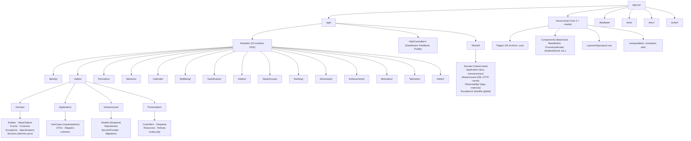

---

## 4. Regla de dependencia - la mas importante

```
Presentation  ->  Application  ->  Domain
                                    ^
                             Infrastructure
```

Las flechas indican quien puede importar a quien:

- **Domain no importa NADA.** Ni Laravel, ni Eloquent, ni Carbon, ni otro modulo. Solo PHP puro y clases de Shared/Domain. Si escribes `use Illuminate\\...` dentro de Domain/, esta mal.
- **Application** importa Domain. Orquesta. No sabe de HTTP ni de base de datos.
- **Infrastructure** implementa las interfaces que declara Domain/Contracts. Aqui si vive Eloquent.
- **Presentation** importa Application. Traduce HTTP a llamadas de caso de uso.

**Prueba mental:** si borras la carpeta Infrastructure/ de un modulo, Domain/ debe seguir compilando. Si no, hay una dependencia mal puesta.

---

## 5. Comunicacion entre modulos: solo eventos

**Un modulo nunca importa clases de otro modulo.** Ni siquiera para "leer algo rapido". La unica via es el bus de eventos de Laravel.

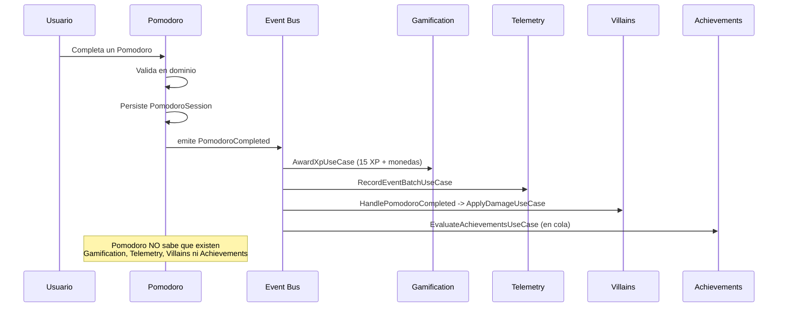

### Eventos de dominio implementados

| Evento | Modulo Emisor | Listeners (modulo receptor) |
|--------|---------------|----------------------------|
| HabitCompleted | Habits | Gamification, Telemetry, Villains, Achievements |
| PomodoroCompleted | Pomodoro | Gamification, Telemetry, Villains, Achievements |
| MissionCompleted | Missions | Gamification, Telemetry, Villains, Achievements |
| HabitCreated | Habits | Telemetry |
| JournalEntryCreated | Wellbeing | Gamification, Telemetry, Villains |
| JournalEntryEdited | Wellbeing | Telemetry |
| VillainAssigned | Villains | Telemetry |
| VillainDefeated | Villains | Gamification (XP bonus), Achievements |
| VillainWeakened | Villains | Telemetry |
| VillainSurvived | Villains | Telemetry |
| UserRegistered | Identity | Telemetry |
| ProfileCompleted | Identity | Telemetry |
| ConsentGranted | Identity | Telemetry |

---

## 6. Arquitectura del sistema de rutas

El sistema tiene dos dominios con comportamiento diferente:

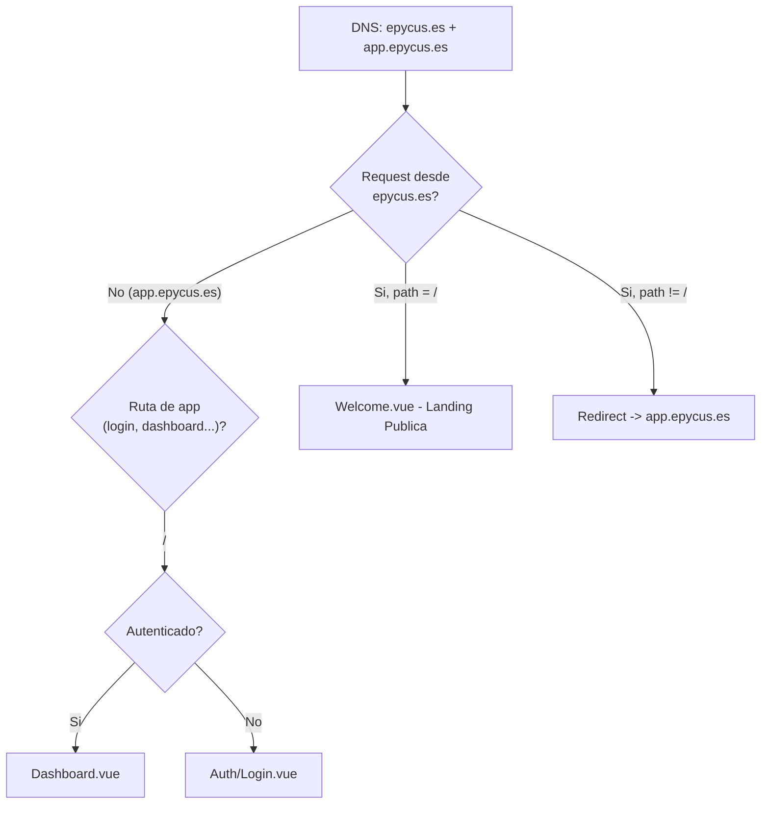

**Rutas publicas sin autenticacion:**
- `GET /` - Landing page (Welcome.vue)
- `POST /feedback` - Buzon de la comunidad (FeedbackController)
- `GET /sitemap.xml` - Sitemap para SEO
- `GET /robots.txt` - Robots para crawlers
- `GET /terms` - Terminos y condiciones

**Rutas de autenticacion** (en `routes/auth.php`):
- `GET /login`, `POST /login`
- `GET /register`, `POST /register`
- `POST /logout`
- `GET /forgot-password`, `POST /forgot-password`
- `GET /reset-password/{token}`, `POST /reset-password`

**Rutas protegidas** (middleware `auth`):
- `GET /dashboard` - DashboardController
- `GET|PATCH|DELETE /profile` - ProfileController
- + todas las rutas de modulos cargadas desde `Presentation/routes.php` de cada modulo

---

## 7. Base de datos - Esquema real (2026-08-17)

### Tablas del sistema base
| Tabla | Descripcion |
|-------|-------------|
| users | Usuarios con: id, name, email, password, role, google_id, career, institution_type, avatar_style, avatar_gender, avatar_options (JSON) |
| participants | Codigo de participante, grupo de investigacion |
| cache | Cache de Laravel (driver database) |
| jobs | Cola de trabajos (driver database) |
| feedbacks | Buzon de la comunidad: type, name, email, message, ip_address, user_agent, is_read |

### Tablas de modulos
| Tabla | Modulo | Descripcion |
|-------|--------|-------------|
| habits | Habits | Habitos del usuario con `time_of_day` (morning/afternoon/night/anytime) y `cue_trigger` (habit stacking) |
| habit_completions | Habits | Registro de completados por dia |
| pomodoro_sessions | Pomodoro | Sesiones con estado, focus_minutes, mission_id nullable |
| missions | Missions | Tareas academicas con days_early_or_late y `eisenhower_quadrant` (q1/q2/q3/q4) |
| subtasks | Missions | Subtareas reordenables |
| courses | Calendar | Cursos con color, starts_at, ends_at |
| course_sessions | Calendar | Horarios semanales por curso |
| course_notes | Calendar | Apuntes de texto por curso |
| note_images | Calendar | Imagenes adjuntas a apuntes |
| holidays | Calendar | Feriados peruanos 2025-2028 |
| class_schedules | Calendar | (legado, migrado a courses) |
| journal_entries | Wellbeing | Entradas de animo con mood_score, energy, stress, tags |
| user_progress | Gamification | XP, nivel, racha, monedas por usuario |
| villains | Villains | Catalogo de villanos (10 bosses academicos) |
| villain_instances | Villains | Instancia semanal activa por usuario |
| study_sessions | StudyGroups | Sala de estudio grupal con room_config |
| session_participants | StudyGroups | Participantes activos en sala |
| chat_messages | StudyGroups | Mensajes efimeros (purga a 7 dias) |
| ai_conversations | AiAssistant | Conversaciones con Edy |
| ai_messages | AiAssistant | Mensajes cifrados en reposo |
| achievements | Achievements | Catalogo cerrado de logros |
| user_achievements | Achievements | Logros desbloqueados por usuario (UNIQUE user_id+achievement_id) |
| motivational_quotes | Motivation | Frases motivacionales |
| user_quote_views | Motivation | Registro NoRepeatPicker de frases |
| usage_tips | Motivation | Consejos de uso por modulo |
| user_tip_views | Motivation | Registro NoRepeatPicker de tips |
| user_preferences | Identity | Tema, wallpaper_id, notificaciones |
| user_unlocked_wallpapers | Identity | Fondos desbloqueados por logros/villanos |
| epa_responses | Identity | Respuestas al cuestionario EPA inicial |
| telemetry_events | Telemetry | Eventos de comportamiento en lotes |

---

## 8. Transacciones

Nunca uses `DB::transaction()` directamente en un caso de uso. Usa el contrato compartido:

```php
// Shared/Application/TransactionManagerInterface.php
interface TransactionManagerInterface
{
    public function run(callable $operation): mixed;
}
```

El evento se emite FUERA de la transaccion, despues del commit. Si lo emites dentro y la transaccion hace rollback, ya otorgaste XP por algo que no ocurrio.

---

## 9. Excepciones

Jerarquia en tres niveles:

```
Shared/Domain/Exceptions/DomainException.php          (abstracta, base de todas)
    Shared/Domain/Exceptions/NotFoundException.php     -> HTTP 404
    Shared/Domain/Exceptions/ValidationException.php   -> HTTP 422
    Shared/Domain/Exceptions/ForbiddenException.php    -> HTTP 403
    Shared/Domain/Exceptions/ConflictException.php     -> HTTP 409
```

**Todo mensaje de excepcion visible al usuario va en espanol y sin jerga tecnica.**

---

## 10. Observabilidad

Tres canales separados definidos en `Shared/Observability/`:

| Canal | Archivo | Para que | Retencion |
|-------|---------|----------|-----------|
| app | storage/logs/app-YYYY-MM-DD.log | Errores y avisos de aplicacion | 14 dias |
| domain | storage/logs/domain-YYYY-MM-DD.log | Excepciones de dominio | 14 dias |
| telemetry_failure | storage/logs/telemetry-fail-YYYY-MM-DD.log | Fallos de registro de telemetria | 90 dias |

Nunca loguees: nombre, correo, WhatsApp, codigo de estudiante, contenido del diario de bienestar, ni contenido de mensajes de chat.

---

## 11. Configuracion por entorno

Un archivo de config por modulo en `config/`, leido siempre con `config()`, **nunca con `env()` fuera de los archivos de config**.

```php
// config/gamification.php
return [
    'xp' => [
        'habit_completed'    => env('XP_HABIT', 10),
        'pomodoro_completed' => env('XP_POMODORO', 15),
        'mission_easy'       => env('XP_MISSION_EASY', 20),
        'mission_medium'     => env('XP_MISSION_MEDIUM', 30),
        'mission_hard'       => env('XP_MISSION_HARD', 40),
        'subtask_completed'  => env('XP_SUBTASK', 5),
        'journal_entry'      => env('XP_JOURNAL', 10),
        'villain_defeated'   => env('XP_VILLAIN', 100),
    ],
    'daily_caps' => [
        'habits'    => env('CAP_HABITS', 5),
        'pomodoros' => env('CAP_POMODOROS', 8),
        'missions'  => env('CAP_MISSIONS', 3),
        'journal'   => 1,
    ],
    'level_curve' => [
        'base'      => 100,
        'increment' => 45,
        'max_level' => 50,
    ],
    'wallet' => [
        'xp_per_coin' => 10,
    ],
];
```

---

## 12. Pruebas

| Tipo | Carpeta | Que cubre | Obligatoriedad |
|------|---------|-----------|----------------|
| Unitarias | tests/Unit/Modules/{Modulo}/ | Entidades, objetos de valor, especificaciones, calculo de XP | Obligatorio en Domain |
| Integracion | tests/Feature/Modules/{Modulo}/ | Casos de uso con base de datos real | Obligatorio en casos de uso que escriben |
| Telemetria | tests/Feature/Telemetry/ | Que cada accion emita su evento | Obligatorio, sin excepcion |
| HTTP | tests/Feature/Http/ | Rutas, policies, validacion | Recomendado |

**Estado actual (2026-08-17):** 131 tests, 419 assertions, 0 fallos.

---

## 13. Convenciones de codigo

- **PHP:** PSR-12. `declare(strict_types=1);` en todos los archivos. Clases `final` salvo que exista razon para extender.
- **Nombres:** clases en ingles (Habit, PomodoroSession). Textos visibles al usuario en espanol.
- **Tipado:** todo parametro y retorno tipado. `mixed` solo cuando sea inevitable.
- **Inmutabilidad:** DTOs y eventos siempre `final readonly`.
- **Vue:** Composition API con `<script setup>`. Componentes en PascalCase. Un componente por archivo.
- **Commits:** `tipo(modulo): descripcion` - por ejemplo `feat(habits): agregar tope diario de completado`.
- **Sin comentarios obvios.** Comenta el porque, no el que. Especialmente cuando una decision responde a una restriccion del estudio o del hosting.

---

## 14. Diagrama de Clases UML

```mermaid
classDiagram
    class User {
        +int id
        +string email
        +string role
        +string career
        +string institution_type
        +string avatar_style
        +string avatar_gender
        +json avatar_options
        +string google_id
    }
    class Participant {
        +string participantCode
        +int groupId
    }
    class Habit {
        +int id
        +string title
        +string frequency
        +string category
        +string timeOfDay
        +string cueTrigger
        +bool isActive
        +DateTime deletedAt
    }
    class HabitCompletion {
        +int id
        +date completedFor
    }
    class PomodoroSession {
        +int id
        +int focusMinutes
        +int plannedMinutes
        +string status
        +int missionId
        +DateTime startedAt
        +DateTime completedAt
    }
    class Mission {
        +int id
        +string title
        +string difficulty
        +string status
        +string eisenhowerQuadrant
        +int daysEarlyOrLate
        +DateTime dueDate
        +DateTime completedAt
    }
    class Subtask {
        +int id
        +string title
        +bool isCompleted
        +int sortOrder
    }
    class Course {
        +int id
        +string name
        +string color
        +date startsAt
        +date endsAt
    }
    class CourseSession {
        +int id
        +int dayOfWeek
        +time startTime
        +time endTime
    }
    class CourseNote {
        +int id
        +string content
    }
    class JournalEntry {
        +int id
        +int moodScore
        +int energy
        +int stress
        +string tags
        +string content
        +date date
    }
    class UserProgress {
        +int xp
        +int level
        +int streakDays
        +int coins
        +int phase
    }
    class Villain {
        +int id
        +string name
        +string code
        +int baseHp
    }
    class VillainInstance {
        +int id
        +int currentHp
        +string status
        +DateTime weekStart
        +DateTime weekEnd
    }
    class StudySession {
        +int id
        +int maxParticipants
        +string phase
        +json roomConfig
    }
    class ChatMessage {
        +int id
        +string content
        +DateTime sentAt
    }
    class Achievement {
        +int id
        +string name
        +string category
        +string criteria
        +int xpReward
    }
    class UserAchievement {
        +int id
        +DateTime unlockedAt
    }
    class MotivationalQuote {
        +int id
        +string text
        +string author
    }
    class AiConversation {
        +int id
        +DateTime startedAt
    }
    class AiMessage {
        +int id
        +string role
        +string content
        +DateTime sentAt
    }
    class TelemetryEvent {
        +int id
        +string eventType
        +json payload
        +DateTime timestamp
    }
    class Feedback {
        +int id
        +string type
        +string name
        +string email
        +string message
        +bool isRead
    }
    class UserPreferences {
        +int id
        +string theme
        +string wallpaperKey
        +bool notificationsEnabled
    }

    User "1" -- "0..1" Participant
    User "1" -- "1" UserProgress
    User "1" -- "1" UserPreferences
    User "1" -- "*" Habit
    Habit "1" -- "*" HabitCompletion
    User "1" -- "*" PomodoroSession
    User "1" -- "*" Mission
    Mission "1" -- "*" Subtask
    Mission "1" -- "*" PomodoroSession
    User "1" -- "*" Course
    Course "1" -- "*" CourseSession
    Course "1" -- "*" CourseNote
    User "1" -- "*" JournalEntry
    Villain "1" -- "*" VillainInstance
    User "1" -- "*" VillainInstance
    User "1" -- "*" StudySession
    StudySession "1" -- "*" ChatMessage
    Achievement "1" -- "*" UserAchievement
    User "1" -- "*" UserAchievement
    User "1" -- "*" AiConversation
    AiConversation "1" -- "*" AiMessage
    Participant "1" -- "*" TelemetryEvent
```

---

## 15. Diagrama de Casos de Uso UML

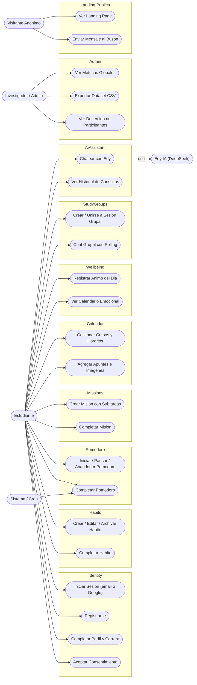

---

## 16. C4 Model - Nivel 1 (Contexto del Sistema)

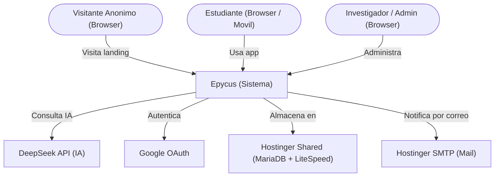

---

## 17. C4 Model - Nivel 2 (Contenedores)

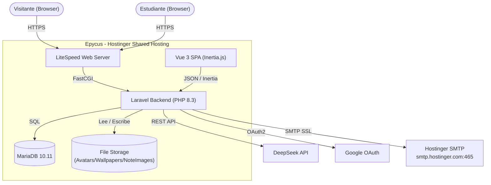

---

## 18. C4 Model - Nivel 3 (Componentes Backend)

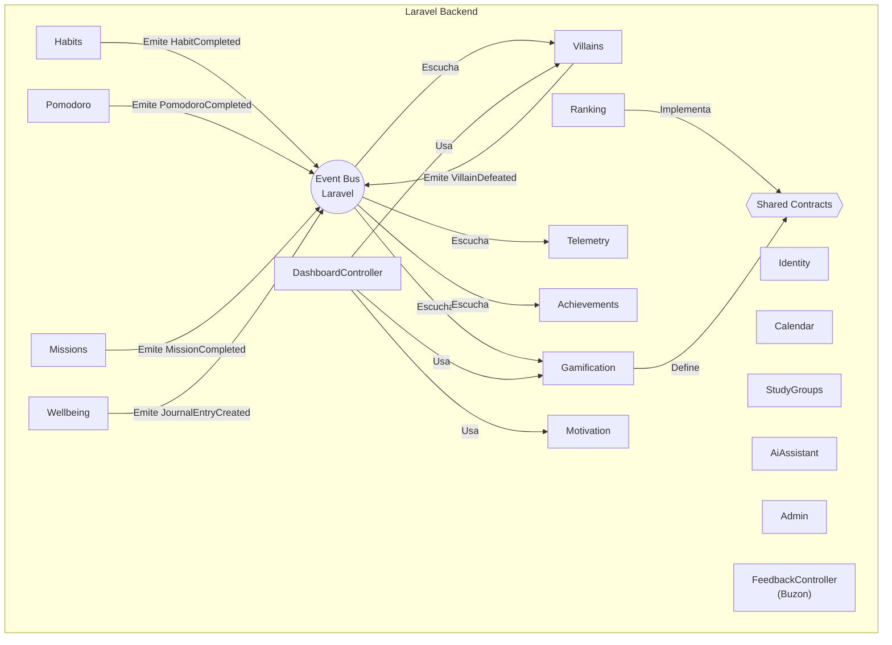

---

## 19. Diagrama de Despliegue UML

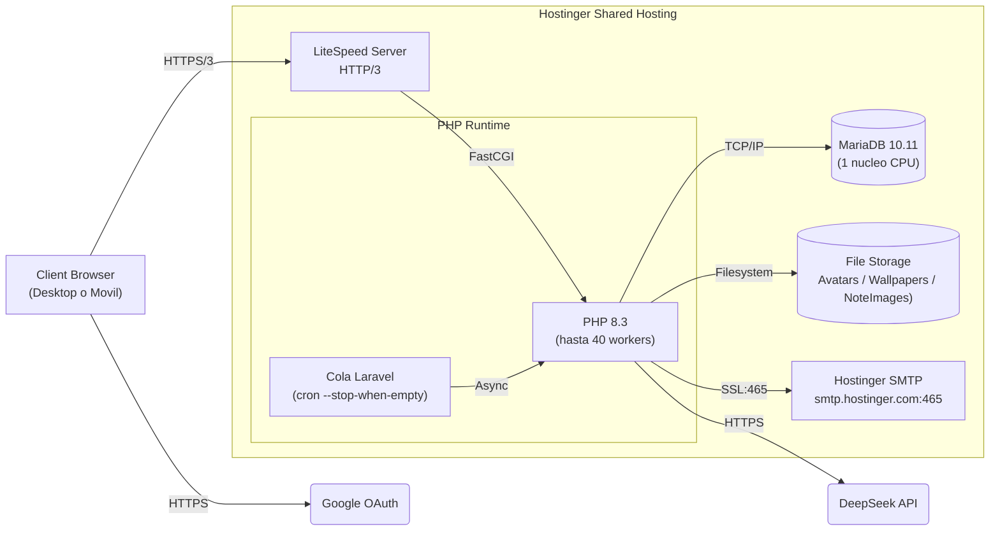

---

## 20. Diagrama de Flujo de Datos (DFD Nivel 0)

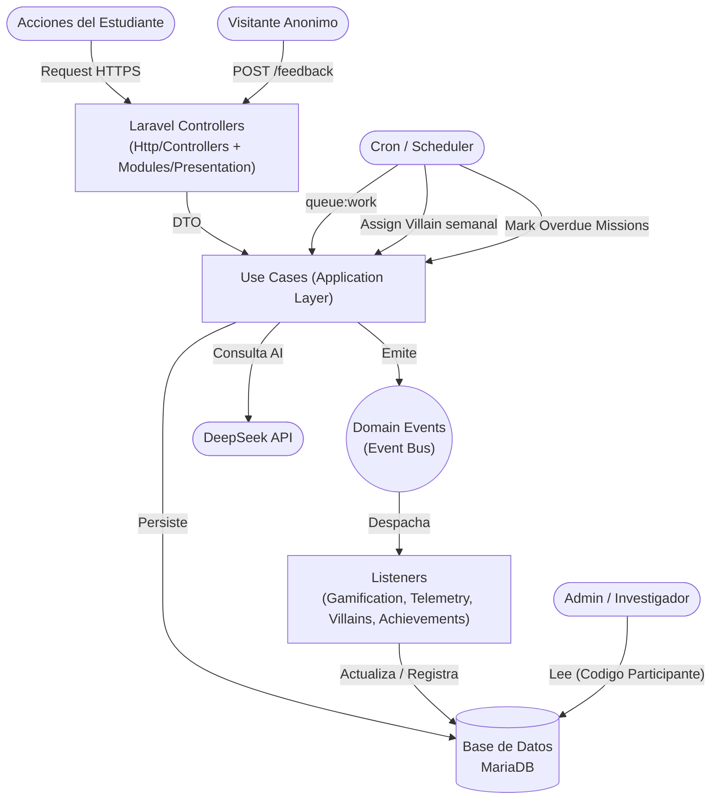

---

## 21. Diagrama de Arquitectura Logica (Clean Architecture)

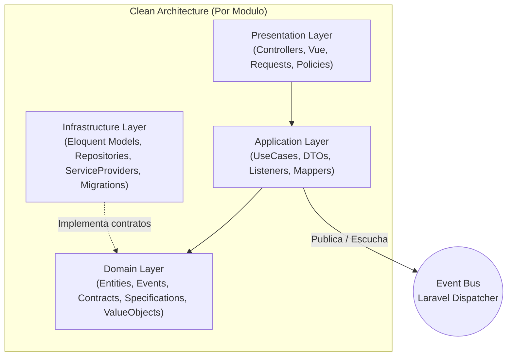

---

## 22. Errores comunes que debes evitar

| Error | Por que esta mal |
|-------|-----------------|
| `use Illuminate\\...` dentro de Domain/ | Rompe la regla de dependencia |
| Pasar un modelo Eloquent en un evento | Acopla modulos y falla al serializar en cola |
| Emitir el evento dentro de la transaccion | Si hay rollback, otorgas XP por algo que no paso |
| `env()` fuera de config/ | Devuelve null en produccion con config cacheada |
| Un INSERT de telemetria por cada accion | Satura los 128 IOPS del hosting |
| Guardar sesiones o cache en archivos | Consume inodos hasta agotarlos |
| Importar una clase de otro modulo directamente | Rompe la modularidad; usa eventos o un contrato compartido |
| Poner el ranking como widget siempre visible | Contamina la variable de control del estudio |
| Enviar datos personales a DeepSeek | Viola el expediente de etica del comite |
| Agregar endpoints de escritura al panel Admin | Compromete la integridad del dataset de investigacion |

---

## 23. Dominios y subdominios de produccion

| Dominio | Funcion |
|---------|---------|
| epycus.es | Landing page publica, buzon, sitemap, robots |
| app.epycus.es | Aplicacion web completa (dashboard, modulos) |
| mail.hostinger.com | Webmail para contacto@soltectos.com |

**SMTP de produccion:**
- Host: smtp.hostinger.com
- Puerto: 465 (SSL)
- Usuario: contacto@soltectos.com
- From: "Epycus" contacto@soltectos.com
