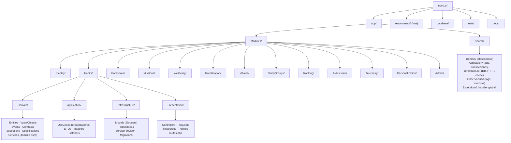
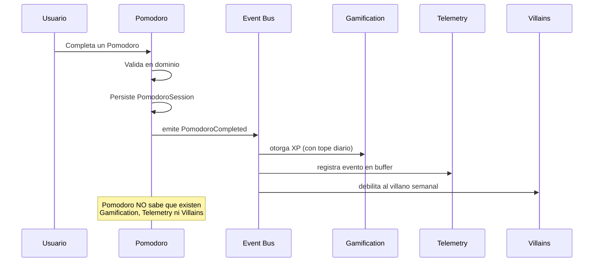

\
# 00 — Arquitectura

> Monolito modular con arquitectura limpia por módulo. Lee este documento entero antes de crear cualquier archivo.

---

## 1. Por qué esta arquitectura

No es sobre-ingeniería gratuita. Hay tres razones concretas:

1. **El alcance va a cambiar.** Después del análisis de encuestas y del documento de requisitos, van a aparecer módulos nuevos y cambios visuales. La modularidad permite agregar sin romper.
2. **Varias IA distintas van a escribir código aquí.** Las fronteras explícitas entre módulos evitan que una IA rompa lo que hizo otra.
3. **La telemetría debe ser inviolable.** Aislarla como módulo con contratos propios impide que un cambio en Pomodoro rompa el registro de eventos.

**Monolito, no microservicios.** Un solo despliegue, una sola base de datos, un solo repositorio. En hosting compartido con 1 núcleo, los microservicios serían absurdos.

---

## 2. Estructura de carpetas



### Árbol literal de un módulo

```
app/Modules/Habits/
├── Domain/
│   ├── Entities/
│   │   ├── Habit.php
│   │   └── HabitCompletion.php
│   ├── ValueObjects/
│   │   ├── HabitFrequency.php
│   │   └── HabitId.php
│   ├── Events/
│   │   ├── HabitCreated.php
│   │   └── HabitCompleted.php
│   ├── Contracts/
│   │   └── HabitRepositoryInterface.php
│   ├── Exceptions/
│   │   ├── HabitNotFoundException.php
│   │   └── DailyHabitLimitReachedException.php
│   ├── Specifications/
│   │   └── HabitCanBeCompletedToday.php
│   └── Services/
│       └── HabitStreakCalculator.php
├── Application/
│   ├── UseCases/
│   │   ├── CreateHabitUseCase.php
│   │   ├── CompleteHabitUseCase.php
│   │   └── ListUserHabitsUseCase.php
│   ├── DTOs/
│   │   ├── CreateHabitDTO.php
│   │   └── HabitDTO.php
│   ├── Mappers/
│   │   └── HabitMapper.php
│   └── Listeners/
│       └── (listeners de eventos de otros módulos)
├── Infrastructure/
│   ├── Models/
│   │   └── HabitModel.php
│   ├── Repositories/
│   │   └── EloquentHabitRepository.php
│   ├── Providers/
│   │   └── HabitsServiceProvider.php
│   └── Migrations/
│       └── 2026_08_01_000000_create_habits_table.php
└── Presentation/
    ├── Controllers/
    │   └── HabitController.php
    ├── Requests/
    │   ├── CreateHabitRequest.php
    │   └── CompleteHabitRequest.php
    ├── Resources/
    │   └── HabitResource.php
    ├── Policies/
    │   └── HabitPolicy.php
    └── routes.php
```

---

## 3. Regla de dependencia — la más importante

```
Presentation  →  Application  →  Domain
                                   ↑
                            Infrastructure
```

Las flechas indican *quién puede importar a quién*. Léelo así:

- **`Domain` no importa NADA.** Ni Laravel, ni Eloquent, ni Carbon, ni otro módulo. Solo PHP puro y clases de `Shared/Domain`. Si escribes `use Illuminate\...` dentro de `Domain/`, está mal.
- **`Application`** importa `Domain`. Orquesta. No sabe de HTTP ni de base de datos.
- **`Infrastructure`** implementa las interfaces que declara `Domain/Contracts`. Aquí sí vive Eloquent.
- **`Presentation`** importa `Application`. Traduce HTTP a llamadas de caso de uso.

**Prueba mental:** si borras la carpeta `Infrastructure/` de un módulo, `Domain/` debe seguir compilando. Si no, hay una dependencia mal puesta.

### Ejemplo correcto

```php
// Domain/Contracts/HabitRepositoryInterface.php
namespace App\Modules\Habits\Domain\Contracts;

use App\Modules\Habits\Domain\Entities\Habit;
use App\Modules\Habits\Domain\ValueObjects\HabitId;

interface HabitRepositoryInterface
{
    public function findById(HabitId $id): ?Habit;
    public function save(Habit $habit): void;
    /** @return Habit[] */
    public function findActiveByUser(int $userId): array;
    public function countCompletionsToday(int $userId): int;
}
```

```php
// Infrastructure/Repositories/EloquentHabitRepository.php
namespace App\Modules\Habits\Infrastructure\Repositories;

use App\Modules\Habits\Domain\Contracts\HabitRepositoryInterface;
use App\Modules\Habits\Domain\Entities\Habit;
use App\Modules\Habits\Domain\ValueObjects\HabitId;
use App\Modules\Habits\Infrastructure\Models\HabitModel;
use App\Modules\Habits\Application\Mappers\HabitMapper;

final class EloquentHabitRepository implements HabitRepositoryInterface
{
    public function __construct(private HabitMapper $mapper) {}

    public function findById(HabitId $id): ?Habit
    {
        $model = HabitModel::find($id->value());
        return $model ? $this->mapper->toDomain($model) : null;
    }

    public function save(Habit $habit): void
    {
        HabitModel::updateOrCreate(
            ['id' => $habit->id()->value()],
            $this->mapper->toPersistence($habit)
        );
    }
    // ...
}
```

El binding se registra en el ServiceProvider del módulo:

```php
// Infrastructure/Providers/HabitsServiceProvider.php
public function register(): void
{
    $this->app->bind(
        HabitRepositoryInterface::class,
        EloquentHabitRepository::class
    );
}

public function boot(): void
{
    $this->loadMigrationsFrom(__DIR__ . '/../Migrations');
    $this->loadRoutesFrom(__DIR__ . '/../../Presentation/routes.php');
}
```

Registra cada ServiceProvider en `bootstrap/providers.php`. **No registres rutas en `bootstrap/app.php`** — cada módulo carga las suyas.

---

## 4. Comunicación entre módulos: solo eventos

**Un módulo nunca importa clases de otro módulo.** Ni siquiera para "leer algo rápido". La única vía es el bus de eventos de Laravel.



### Cómo se declara un evento de dominio

```php
// Domain/Events/PomodoroCompleted.php
namespace App\Modules\Pomodoro\Domain\Events;

final readonly class PomodoroCompleted
{
    public function __construct(
        public int $userId,
        public int $sessionId,
        public int $focusMinutes,
        public ?int $missionId,
        public \DateTimeImmutable $completedAt,
    ) {}
}
```

Reglas para eventos:
- `final readonly`, solo tipos primitivos y objetos de valor inmutables. **Nunca pases modelos Eloquent en un evento.**
- Nombre en pasado: `HabitCompleted`, no `CompleteHabit`.
- Vive en `Domain/Events/` del módulo que lo emite.
- Los listeners viven en `Application/Listeners/` del módulo que lo escucha.

### Excepción a la regla

Si un módulo necesita **leer** datos de otro (por ejemplo, el Ranking necesita el nivel del usuario), no lo hagas por evento. Define un contrato de lectura en `Shared/Domain/Contracts/` y que el módulo dueño lo implemente:

```php
// Shared/Domain/Contracts/UserLevelReaderInterface.php
interface UserLevelReaderInterface
{
    public function getLevelFor(int $userId): int;
}
```

Implementado por `Gamification`, consumido por `Ranking`. Sin acoplar clases internas.

---

## 5. Casos de uso (orquestadores)

Un caso de uso hace **una** cosa. Recibe un DTO, orquesta dominio y repositorios, emite eventos, devuelve un DTO.

```php
// Application/UseCases/CompleteHabitUseCase.php
namespace App\Modules\Habits\Application\UseCases;

use App\Modules\Habits\Domain\Contracts\HabitRepositoryInterface;
use App\Modules\Habits\Domain\Events\HabitCompleted;
use App\Modules\Habits\Domain\Exceptions\HabitNotFoundException;
use App\Modules\Habits\Domain\Exceptions\DailyHabitLimitReachedException;
use App\Modules\Habits\Domain\Specifications\HabitCanBeCompletedToday;
use App\Shared\Application\TransactionManagerInterface;
use Illuminate\Contracts\Events\Dispatcher;

final readonly class CompleteHabitUseCase
{
    public function __construct(
        private HabitRepositoryInterface $habits,
        private TransactionManagerInterface $transaction,
        private Dispatcher $events,
        private HabitCanBeCompletedToday $canComplete,
    ) {}

    public function execute(CompleteHabitDTO $dto): HabitDTO
    {
        $habit = $this->habits->findById($dto->habitId)
            ?? throw new HabitNotFoundException($dto->habitId);

        // Regla de dominio: tope diario protege la validez de los datos del estudio
        if (! $this->canComplete->isSatisfiedBy($habit, $dto->userId)) {
            throw new DailyHabitLimitReachedException($dto->userId);
        }

        $completion = $this->transaction->run(function () use ($habit, $dto) {
            $completion = $habit->completeFor($dto->completedAt); // muta la entidad
            $this->habits->save($habit);
            return $completion;
        });

        $this->events->dispatch(new HabitCompleted(
            userId:      $dto->userId,
            habitId:     $habit->id()->value(),
            streakDays:  $habit->currentStreak(),
            completedAt: $dto->completedAt,
        ));

        return HabitDTO::fromDomain($habit);
    }
}
```

**El evento se emite FUERA de la transacción**, después del commit. Si lo emites dentro y la transacción hace rollback, ya otorgaste XP por algo que no ocurrió.

---

## 6. Transacciones

Nunca uses `DB::transaction()` directamente en un caso de uso. Usa el contrato compartido:

```php
// Shared/Application/TransactionManagerInterface.php
interface TransactionManagerInterface
{
    public function run(callable $operation): mixed;
}
```

```php
// Shared/Infrastructure/Persistence/DatabaseTransactionManager.php
final class DatabaseTransactionManager implements TransactionManagerInterface
{
    public function run(callable $operation): mixed
    {
        return DB::transaction($operation, attempts: 3);
    }
}
```

Esto mantiene `Application` libre de Laravel y hace testeable el caso de uso con un doble que ejecuta el callable sin base de datos.

---

## 7. Excepciones

Jerarquía en tres niveles:

```
Shared/Domain/Exceptions/DomainException.php          (abstracta, base de todas)
├── Shared/Domain/Exceptions/NotFoundException.php     → HTTP 404
├── Shared/Domain/Exceptions/ValidationException.php   → HTTP 422
├── Shared/Domain/Exceptions/ForbiddenException.php    → HTTP 403
└── Shared/Domain/Exceptions/ConflictException.php     → HTTP 409
```

Cada módulo extiende de la más específica:

```php
final class DailyHabitLimitReachedException extends ConflictException
{
    public function __construct(int $userId)
    {
        parent::__construct(
            message: 'Alcanzaste el máximo de hábitos que puedes completar hoy.',
            code: 'HABITS.DAILY_LIMIT_REACHED',
            context: ['user_id' => $userId],
        );
    }
}
```

**Todo mensaje de excepción visible al usuario va en español y sin jerga técnica.** El `code` es para logs y para el frontend; el `message` es para la persona.

El handler global (`Shared/Exceptions/Handler.php`) traduce `DomainException` a respuesta Inertia o JSON según el request, y loguea con el `context` **sin datos personales**.

---

## 8. Validación en dos capas

No es duplicación, son responsabilidades distintas:

| Capa | Qué valida | Ejemplo |
|---|---|---|
| **Form Request** (`Presentation`) | Forma del input | `title` es string, máx 120 caracteres, requerido |
| **Dominio** (`Domain`) | Reglas de negocio | No puedes completar un hábito dos veces el mismo día |

Un Form Request nunca consulta la base de datos para reglas de negocio. Si necesitas saber si el usuario ya llegó a su tope diario, eso es una **Specification** de dominio, no una regla de validación HTTP.

```php
// Domain/Specifications/HabitCanBeCompletedToday.php
final readonly class HabitCanBeCompletedToday
{
    public function __construct(private HabitRepositoryInterface $habits) {}

    public function isSatisfiedBy(Habit $habit, int $userId): bool
    {
        if ($habit->wasCompletedOn(today())) {
            return false;
        }
        return $this->habits->countCompletionsToday($userId) < Habit::DAILY_CAP;
    }
}
```

---

## 9. Políticas de autorización

Una Policy por entidad, en `Presentation/Policies/`. Se registran en el ServiceProvider del módulo.

**Regla base: un usuario solo accede a sus propios datos.** Salvo el rol `admin` y las vistas explícitamente públicas (ranking, sesiones grupales).

```php
final class HabitPolicy
{
    public function view(User $user, HabitModel $habit): bool
    {
        return $user->id === $habit->user_id;
    }

    public function complete(User $user, HabitModel $habit): bool
    {
        return $user->id === $habit->user_id && $habit->is_active;
    }
}
```

Detalle completo de roles y permisos en `docs/06-SEGURIDAD.md`.

---

## 10. Mappers

Traducen entre las tres representaciones de un mismo concepto. Viven en `Application/Mappers/`.

```php
final class HabitMapper
{
    /** Eloquent → Entidad de dominio */
    public function toDomain(HabitModel $model): Habit { /* ... */ }

    /** Entidad de dominio → array para persistir */
    public function toPersistence(Habit $habit): array { /* ... */ }

    /** Entidad de dominio → DTO de salida */
    public function toDTO(Habit $habit): HabitDTO { /* ... */ }
}
```

Nunca devuelvas un modelo Eloquent desde un caso de uso. Siempre un DTO.

---

## 11. Observabilidad

Tres canales separados, definidos en `Shared/Observability/`:

| Canal | Archivo | Para qué | Retención |
|---|---|---|---|
| `app` | `storage/logs/app-YYYY-MM-DD.log` | Errores y avisos de aplicación | 14 días |
| `domain` | `storage/logs/domain-YYYY-MM-DD.log` | Excepciones de dominio, para depurar reglas | 14 días |
| `telemetry_failure` | `storage/logs/telemetry-fail-YYYY-MM-DD.log` | **Fallos de registro de telemetría** | 90 días |

El tercero existe porque un fallo de telemetría es un fallo del estudio. Retención larga y revisión semanal obligatoria durante la intervención.

**Rotación diaria con borrado automático.** Sin esto, en 66 días te comes los inodos del hosting.

Nunca loguees: nombre, correo, WhatsApp, código de estudiante, contenido del diario de bienestar, ni contenido de mensajes de chat.

---

## 12. Configuración por entorno

Un archivo de config por módulo en `config/`, leído siempre con `config()`, **nunca con `env()` fuera de los archivos de config**. En producción se cachea la configuración y `env()` devuelve `null`.

```php
// config/gamification.php
return [
    'xp' => [
        'habit_completed'   => env('XP_HABIT', 10),
        'pomodoro_completed'=> env('XP_POMODORO', 15),
        'mission_easy'      => env('XP_MISSION_EASY', 20),
        'mission_medium'    => env('XP_MISSION_MEDIUM', 30),
        'mission_hard'      => env('XP_MISSION_HARD', 40),
        'subtask_completed' => env('XP_SUBTASK', 5),
        'journal_entry'     => env('XP_JOURNAL', 10),
        'villain_defeated'  => env('XP_VILLAIN', 100),
    ],
    'daily_caps' => [
        'habits'    => env('CAP_HABITS', 5),
        'pomodoros' => env('CAP_POMODOROS', 8),
        'missions'  => env('CAP_MISSIONS', 3),
        'journal'   => 1,
    ],
    'level_curve' => [
        'base'      => 100,
        'increment' => 45,
        'max_level' => 50,
    ],
    'phases' => [
        'total'            => 10,
        'levels_per_phase' => 5,
    ],
    'streak' => [
        'grace_days_per_month' => env('STREAK_GRACE', 3),
        'bonus_per_week'       => 0.10,
        'bonus_max'            => 0.50,
        'min_daily_actions'    => 1,
    ],
    'villains' => [
        'base_hp'            => 100,
        'damage_per_action'  => 10,
        'difficulty_by_week' => [/* 1.0 en semanas normales, 0.8 al inicio, 1.2 al final — ver docs/03-GAMIFICACION.md */],
    ],
    'wallet' => [
        'xp_per_coin' => 10,
    ],
];
```

Ejemplo verificado contra el archivo real en cada sesión — si difiere, el archivo real manda.

Los valores de gamificación son configurables **a propósito**: si durante el piloto se ve que la curva está mal calibrada, se ajusta sin tocar código. Una vez iniciada la intervención el 07/09, **estos valores se congelan** — cambiarlos a mitad del estudio invalida los datos.

---

## 13. Pruebas

| Tipo | Carpeta | Qué cubre | Obligatoriedad |
|---|---|---|---|
| Unitarias | `tests/Unit/Modules/{Modulo}/` | Entidades, objetos de valor, especificaciones, cálculo de XP | **Obligatorio** en Domain |
| Integración | `tests/Feature/Modules/{Modulo}/` | Casos de uso con base de datos real | **Obligatorio** en casos de uso que escriben |
| Telemetría | `tests/Feature/Telemetry/` | Que cada acción emita su evento | **Obligatorio, sin excepción** |
| HTTP | `tests/Feature/Http/` | Rutas, policies, validación | Recomendado |

**Cobertura mínima innegociable:** todo el módulo `Telemetry` y todo el cálculo de XP en `Gamification`. Si estos dos fallan silenciosamente, el estudio se pierde.

Usa PHPUnit (viene con Laravel 12) y base de datos SQLite en memoria para tests, salvo los de telemetría que corren contra MariaDB por el comportamiento de los inserts en lote.

---

## 14. Convenciones de código

- **PHP:** PSR-12. `declare(strict_types=1);` en todos los archivos. Clases `final` salvo que exista razón para extender.
- **Nombres:** clases en inglés (`Habit`, `PomodoroSession`). Textos visibles al usuario en español.
- **Tipado:** todo parámetro y retorno tipado. `mixed` solo cuando sea inevitable.
- **Inmutabilidad:** DTOs y eventos siempre `final readonly`.
- **Vue:** Composition API con `<script setup>`. Componentes en PascalCase. Un componente por archivo.
- **Commits:** `tipo(modulo): descripción` — por ejemplo `feat(habits): agregar tope diario de completado`.
- **Sin comentarios obvios.** Comenta el *porqué*, no el *qué*. Especialmente cuando una decisión responde a una restricción del estudio o del hosting.

---

## 15. Errores comunes que debes evitar

| Error | Por qué está mal |
|---|---|
| `use Illuminate\...` dentro de `Domain/` | Rompe la regla de dependencia |
| Pasar un modelo Eloquent en un evento | Acopla módulos y falla al serializar en cola |
| Emitir el evento dentro de la transacción | Si hay rollback, otorgas XP por algo que no pasó |
| `env()` fuera de `config/` | Devuelve `null` en producción con config cacheada |
| Un INSERT de telemetría por cada acción | Satura los 128 IOPS del hosting |
| Guardar sesiones o cache en archivos | Consume inodos hasta agotarlos |
| Importar una clase de otro módulo | Rompe la modularidad; usa eventos o un contrato compartido |
| Poner el ranking como widget siempre visible | Contamina la variable de control del estudio |
