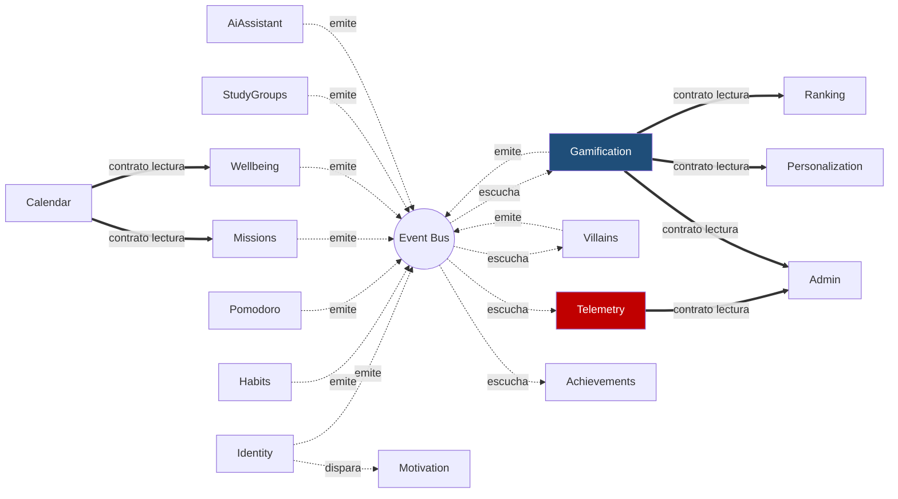
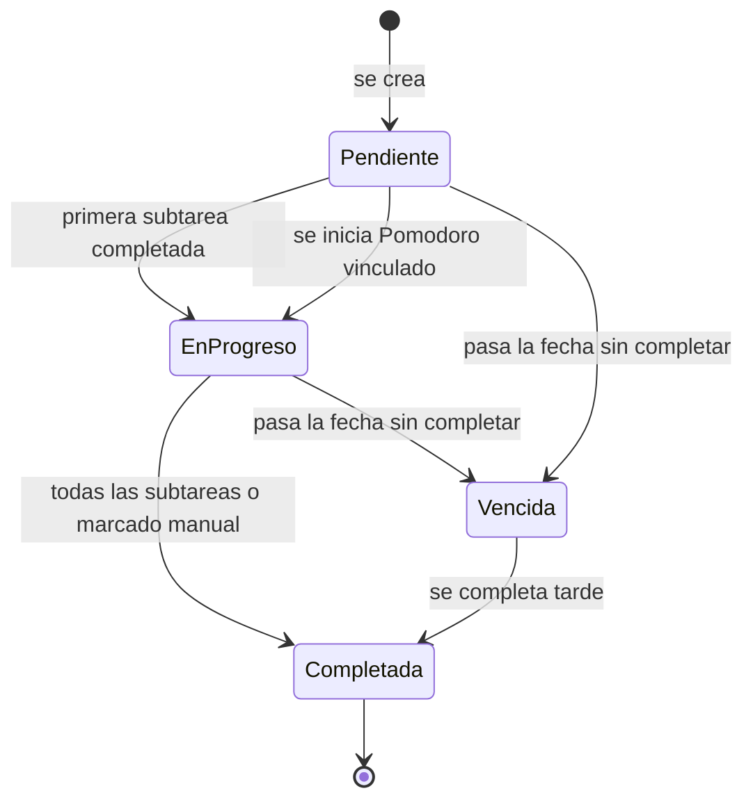
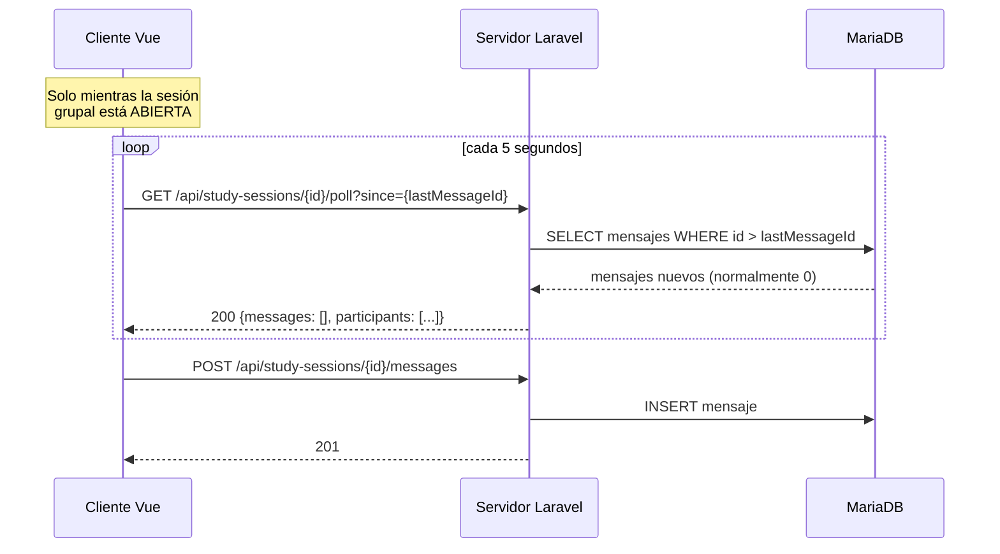

\
# 01 — Módulos

> **ESTADO: TODOS LOS 16 MÓDULOS ESTÁN 100% IMPLEMENTADOS Y COMPLETADOS.**
>
> Cada módulo sigue la estructura de `docs/00-ARQUITECTURA.md`. Aquí se define **qué** hace cada uno, sus entidades, sus contratos y sus eventos. No implementes módulos que no estén aquí.

---

## Mapa de dependencias por eventos



Los módulos rojo y azul son los críticos: si fallan, se pierde el estudio.

**Regla:** las flechas punteadas son eventos (asíncronos, sin acoplamiento). Las flechas gruesas son contratos de lectura declarados en `Shared/Domain/Contracts/`. Nada más está permitido.

---

## 1. Identity

Autenticación, perfil, consentimiento del participante e instrumentos de medición psicométrica y usabilidad.

**Entidades:** `User`, `Participant`, `UserPreferences`, `EpaEvaluation` (pre/postest), `SusEvaluation`

**Campos clave del perfil:**

| Campo | Tipo | Nota |
|---|---|---|
| `google_id` | string nullable | ID de Google OAuth 2.0 (si se autentica con cuenta Google) |
| `career` | enum cerrado | **Lista desplegable, NUNCA texto libre** (decisión D-16) — **Variable de Control** |
| `cycle` | enum 1–10 | Idem, cerrado — **Variable de Control** |
| `institution_type` | enum | `universidad` \| `instituto` |
| `gender_avatar` | enum | `m` \| `f` — solo para elegir el asset |
| `alias` | string | Nombre visible en ranking. No es el nombre real |
| `participant_code` | string único | **Código seudonimizado del estudio** |

El campo `career` alimenta directamente el estilo visual del avatar. La razón de que sea cerrado está documentada: en la encuesta 2 (Microsoft Forms, $n=31$) hubo 25 variantes de texto para 11 carreras reales, lo que hizo imposible agrupar. Ese error no se repite.

**Autenticación y Perfil:**
- Soporte para inicio de sesión clásico (correo / contraseña) y **Google OAuth 2.0**.
- Cuando el usuario se autentica mediante Google, el formulario de cambio de contraseña se oculta automáticamente en `/profile`, reemplazándose por un panel informativo de seguridad.
- Al completar el diagnóstico inicial EPA (`/epa`), se otorgan **+50 XP** con retroalimentación celebratoria (notificación flotante toast, animación de confeti a 60 FPS y timbre armónico Web Audio API).

**Instrumentos Psicométricos y de Usabilidad Incorporados:**
1. **Escala EPA (8 ítems seleccionados para Pretest / Postest - Variable Dependiente):**
   - Ítem 2: Generalmente me preparo por adelantado para los exámenes.
   - Ítem 5: Cuando tengo problemas para entender algo, inmediatamente trato de buscar ayuda.
   - Ítem 7: Trato de completar el trabajo asignado lo más pronto posible.
   - Ítem 10: Constantemente intento mejorar mis hábitos de estudio.
   - Ítem 11: Invierto el tiempo necesario en estudiar aun cuando el tema sea aburrido.
   - Ítem 12: Trato de motivarme para mantener mi ritmo de estudio.
   - Ítem 13: Trato de terminar mis trabajos importantes con tiempo de sobra.
   - Ítem 14: Me tomo el tiempo de revisar mis tareas antes de entregarlas.
2. **Escala SUS (10 ítems adaptados - Evaluación de Usabilidad / Objetivo Específico 3):**
   - Ítems 1 al 10 estandarizados para evaluar la usabilidad percibida post-intervención.

**Preferencias del usuario (`UserPreferences`, 1:1 obligatorio con `User`, se crea al registrar):**

| Campo | Tipo | Nota |
|---|---|---|
| `surface_mode` | enum | `neumorphism` \| `glass` — default `neumorphism`. Ver `docs/04-DISENO-VISUAL.md` §2 |
| `notifications_enabled` | boolean | Default `false`. Se activa solo cuando el usuario acepta el permiso del navegador, nunca antes |

No hay preferencia de idioma: toda la interfaz es en español, no existe selector ni se planea uno.

**Casos de uso:** `RegisterUser`, `LoginUser`, `CompleteProfile`, `RecordConsent`, `UpdatePreferences`, `RecordEpaPretest`, `RecordEpaPostest`, `RecordSusEvaluation`

**Eventos emitidos:** `UserRegistered`, `ProfileCompleted`, `ConsentGranted`, `EpaEvaluated`, `SusEvaluated`

> `participant_code` se genera al registrar. La tabla que mapea `participant_code` ↔ identidad real vive aparte y con acceso restringido. Ver `docs/06-SEGURIDAD.md`.

---

## 2. Habits

Hábitos diarios del estudiante con retroalimentación audiovisual inmediata al marcar (confeti canvas + chime melódico).

**Entidades:** `Habit`, `HabitCompletion`

**Objetos de valor:** `HabitFrequency` (diario, días específicos), `HabitCategory` (estudio, sueño, ejercicio, alimentación, otro)

**Reglas de dominio:**
- Máximo 5 completados con XP por día (tope configurable)
- No se puede completar el mismo hábito dos veces el mismo día
- Un hábito eliminado conserva su historial de completados (borrado lógico)
- Marcar fuera del día correspondiente marca `is_late: true` en telemetría

**Casos de uso:** `CreateHabit`, `CompleteHabit`, `UncompleteHabit`, `UpdateHabit`, `DeleteHabit`, `ListUserHabits`, `GetHabitStats`

**Eventos:** `HabitCreated`, `HabitCompleted`, `HabitUncompleted`, `HabitDeleted`

**Contrato:**
```php
interface HabitRepositoryInterface
{
    public function findById(HabitId $id): ?Habit;
    public function save(Habit $habit): void;
    public function delete(HabitId $id): void;
    /** @return Habit[] */
    public function findActiveByUser(int $userId): array;
    public function countCompletionsToday(int $userId): int;
    public function wasCompletedOn(HabitId $id, DateTimeImmutable $date): bool;
}
```

---

## 3. Pomodoro

Sesiones de enfoque cronometradas.

**Entidades:** `PomodoroSession`

**Objetos de valor:** `SessionState` (`running`, `paused`, `completed`, `abandoned`), `FocusDuration`

**Reglas de dominio:**
- Duración por defecto 25 min de foco, 5 min de descanso. Configurable por usuario entre 15 y 50 min
- Solo **una** sesión activa por usuario a la vez
- Una sesión cuenta como completada solo si alcanza el 100% del tiempo planificado
- Puede vincularse opcionalmente a una misión (`mission_id`)
- Máximo 8 sesiones con XP por día

> **Decisión técnica importante:** el temporizador corre en el **cliente**, con sincronización al servidor al iniciar, pausar y terminar. No mantener un temporizador en el servidor. Razón: el hosting tiene 1 núcleo y 40 PHP workers; un temporizador servidor obligaría a polling constante de todos los usuarios simultáneamente. El cliente envía `started_at` y `completed_at`, y el servidor valida que el intervalo sea coherente para detectar manipulación.

**Casos de uso:** `StartPomodoro`, `PausePomodoro`, `ResumePomodoro`, `CompletePomodoro`, `AbandonPomodoro`, `GetActiveSession`

**Eventos:** `PomodoroStarted`, `PomodoroCompleted`, `PomodoroAbandoned`, `PomodoroPaused`

### Ciclo completo, meta de estudio y música (agregado 2026-07-29)

Todo lo de esta subsección vive **exclusivamente en el cliente**
(`resources/js/Pages/Pomodoro/Index.vue`) — ninguna tabla nueva, ningún endpoint nuevo. El
servidor sigue sin saber nada de descansos, metas o música; solo ve `StartPomodoro` uno tras
otro, igual que antes. Esto es deliberado, no un atajo: mantiene válida la decisión técnica de
arriba (nada de estado nuevo en el servidor) y no le agrega superficie de ataque a un módulo ya
probado.

**Regla de ratio foco/descanso (anti-abuso), investigada, no inventada:** la Técnica Pomodoro
clásica de Cirillo es 25/5 (ratio 20%); las variantes documentadas en uso real son 50/10 (20%),
90/20 (~22%) y 52/17 (~33%, del estudio de productividad de DeskTime de 2014). Ninguna variante
conocida supera ~35%. Por eso el **tope duro es 40% del foco**: `maxBreakForFocus(focus) =
max(3, round(focus * 0.4))`. El `<select>` de descanso solo muestra las opciones (`[3,5,10,15,20]`
min) que pasan ese tope para el foco elegido — no es una validación que rechaza después, es que
la opción inválida ni aparece. Esto es lo que resuelve el caso que pidió el usuario explícitamente:
"no puedo poner que voy a estudiar 10 min y descansar 20". Si el foco cambia y el descanso elegido
deja de ser válido, se reajusta solo al mayor valor todavía permitido.

**Descanso largo automático cada 4 ciclos:** técnica clásica (Cirillo: descanso largo de 15-30 min
cada 4 pomodoros). El número de ciclo se calcula como `sesiones completadas hoy + 1` en el momento
de completar el foco (antes de pedir el reload de `todaySessions`, para no depender de una
respuesta async todavía no llegada). Si `ciclo % 4 === 0`, el descanso que arranca es largo:
`longBreakMinutes = clamp(descanso_corto * 3, 15, 30)` — con el descanso corto por defecto (5 min)
da exactamente 15, el mínimo clásico; con 10 min (variante 50/10) da 30, el máximo clásico. No hay
un selector aparte para el descanso largo a propósito (pedido explícito de mantener los selectores
pocos y chicos) — se deriva, no se elige.

**Meta de estudio del día (opcional):** el usuario puede elegir cuántos minutos de foco quiere
acumular hoy (`Sin meta` a `6 horas`). El progreso se calcula **siempre** contra `todaySessions`
(verdad del servidor, ya resuelto por `ResolveStaleSessionUseCase`), nunca contra un contador
propio del cliente — así una sesión que se autocompletó sola por cierre de navegador sigue
contando para la meta igual que una completada a mano. Al terminar cada descanso, si la meta ya
se alcanzó, el ciclo automático foco→descanso→foco **se corta** (no arranca otro foco solo) y se
muestra un estado de "meta cumplida" con un botón para seguir de todas formas. Sin meta elegida,
el comportamiento es exactamente el de antes: el ciclo nunca para solo, hasta que el usuario
presiona "Abandonar". La meta se guarda en `localStorage` (clave por usuario y por día, ver
comentario en el componente) — no es dato de investigación, no necesita persistir en la base de
datos ni sobrevivir a un cambio de navegador.

Como la meta cuenta minutos de **foco puro** (no de descanso) y el tope de XP es 8 sesiones/día,
el cliente avisa (sin bloquear) cuando la combinación de meta + foco elegido va a necesitar más de
8 sesiones para cumplirse — informativo nada más, el usuario puede seguir estudiando de todas
formas, solo no recibe XP extra a partir de la sesión 9 (regla ya existente, no una nueva).

**Música de fondo opcional (YouTube):** botón "Activar música" que embebe un `<iframe>` apuntando
a una playlist libre de copyright por defecto (verificada por `oEmbed` de YouTube antes de
usarla), con opción de pegar la playlist propia del usuario. **Nunca se carga sin un clic
explícito** y no se recuerda "encendido" entre visitas — ver la nota de privacidad completa en
`docs/06-SEGURIDAD.md §7` (activar la música sí comparte la IP del participante con Google
mientras está prendida, igual que mirar cualquier video de YouTube; por eso el aviso en pantalla
y el dominio `youtube-nocookie.com`). El CSP tuvo que ganar `frame-src
https://www.youtube-nocookie.com` para que el iframe no quedara bloqueado — sin eso, `default-src
'self'` lo mataba en silencio.


### Historial integrado

El historial vive **dentro del propio módulo Pomodoro**, no en una pantalla aparte. Tres bloques en la misma vista, debajo del temporizador:

**1. Sesiones de hoy** — lista compacta con hora de inicio, duración, misión vinculada y resultado:

```
Hoy: 3 de 8 sesiones                     75 min de foco
--------------------------------------------------------
09:15  25 min  Ensayo de Metodología     completada
11:40  25 min  Cálculo - práctica 4      completada
14:20   8 min  Cálculo - práctica 4      abandonada
```

**2. Resumen de la semana** — barras de minutos de foco por día, con la media marcada.

**3. Estadísticas del período** — cuatro números:

| Métrica | Cálculo |
|---|---|
| Sesiones completadas | conteo con estado `completed` |
| Tasa de finalización | completadas / iniciadas |
| Minutos de foco totales | suma de `focus_minutes` |
| Racha de días con al menos 1 Pomodoro | días consecutivos |

La **tasa de finalización** es la más informativa de las cuatro para el estudio: mide capacidad real de sostener el foco, no solo intención. Un participante que inicia 10 y termina 3 tiene un patrón muy distinto de uno que inicia 4 y termina 4, aunque el conteo de intentos se parezca.

**Filtros del historial:** hoy, últimos 7 días, últimos 30 días, todo el período.

**Rendimiento:** el historial se pagina de 20 en 20 y las estadísticas se cachean 10 minutos. Con un solo núcleo de CPU, recalcular agregados en cada visita es desperdicio.


**Validación anti-manipulación:**
```php
// El servidor rechaza sesiones imposibles
if ($completedAt->diff($startedAt)->i < $plannedMinutes * 0.95) {
    throw new InvalidPomodoroDurationException();
}
```

---

## 4. Missions — Gestión de tareas académicas

Sistema de gestión de tareas con descomposición en subtareas.

**Entidades:** `Mission`, `Subtask`

**Objetos de valor:** `Difficulty` (`easy`|`medium`|`hard`), `DueDate`, `MissionState`, `Priority`

### Estados



| Estado | Cuando | Color |
|---|---|---|
| `pending` | Creada, sin avance | neutro |
| `in_progress` | Al menos una subtarea hecha, o Pomodoro vinculado iniciado | primario |
| `completed` | Terminada | exito |
| `overdue` | Venció sin completarse | peligro |

El paso a `in_progress` es **automático**. No hay que marcarlo a mano: se deduce de actividad real, lo que da un dato de telemetría más fiable que un cambio de estado manual.

### Descomposición en subtareas

La función central del módulo: **partir una tarea grande en pasos manejables.**

| Regla | Valor |
|---|---|
| Subtareas por misión | 0 a 20 |
| Reordenables | Sí, arrastrando |
| Completar todas | Completa la misión automáticamente |
| Subtarea con fecha propia | No, la fecha es de la misión |

Al crear una misión difícil sin subtareas, el sistema **sugiere** dividirla, sin obligar:

> *"Las tareas grandes se sienten menos pesadas por partes. ¿Quieres dividirla?"*

Esta sugerencia responde al hallazgo del diagnóstico: el 14,3% de la muestra señaló "no sé por dónde empezar" como su mayor obstáculo. La descomposición es la respuesta directa a esa barrera, y por eso el módulo se llama Misiones y no Tareas.

### Prioridad y ordenamiento

Prioridad: `baja`, `normal`, `alta`. Por defecto `normal`.

Orden por defecto de la lista:

1. Vencidas (primero, más antigua arriba)
2. Vence hoy
3. Vence esta semana, por prioridad
4. Resto, por fecha
5. Completadas (al final, colapsadas)

El usuario puede reordenar por: fecha, prioridad, dificultad o creación.

### Vistas del módulo

| Vista | Contenido |
|---|---|
| **Lista** (principal) | Todas las misiones agrupadas por estado |
| **Detalle** | Misión con subtareas, botón de Pomodoro vinculado |
| **Calendario** | Misiones ubicadas por fecha de vencimiento |
| **Completadas** | Historial, con `days_early_or_late` visible |

### La métrica que importa

`days_early_or_late` se calcula al completar: negativo si fue antes del vencimiento, positivo si después.

> Es **la medida conductual de procrastinación más directa del sistema**. Se calcula siempre, se registra siempre, y **nunca se recalcula después**.

**Reglas de dominio:**
- Máximo 3 misiones con XP por día
- Una misión sin fecha de vencimiento no genera `days_early_or_late` ni puede vencer
- Eliminar conserva el historial (borrado lógico)
- Completar una subtarea de una misión ya completada no da XP

**Casos de uso:** `CreateMission`, `UpdateMission`, `DeleteMission`, `AddSubtask`, `UpdateSubtask`, `ReorderSubtasks`, `CompleteSubtask`, `CompleteMission`, `ListUserMissions`, `GetMissionDetail`, `GetMissionsCalendar`

**Eventos:** `MissionCreated`, `MissionStarted`, `MissionCompleted`, `SubtaskCompleted`, `MissionOverdue`

`MissionOverdue` lo emite un cron diario a las 00:05 hora de Lima.

---

## 5. Wellbeing — Diario de ánimo con calendario

Registro emocional del participante. **Es una de las tres fuentes de contexto del asistente de IA.**

**Entidades:** `JournalEntry`, `DayMood` (agregado del día)

**Objetos de valor:** `MoodScore` (1-5), `EntryTags`

### Modelo de uso

El participante escribe **cuando quiera**: puede ser una vez al día o cuatro. No hay obligación ni horario.

| Aspecto | Regla |
|---|---|
| Entradas por día | Ilimitadas |
| Texto | **Opcional**. Se puede registrar solo el ánimo |
| Ánimo | Obligatorio en cada entrada (1-5) |
| XP | Solo la **primera entrada de cada día** otorga XP |
| Visibilidad | Solo el autor. Ni el administrador |

El XP solo en la primera entrada evita acumular experiencia escribiendo veinte veces seguidas, sin impedir que alguien registre su ánimo varias veces al día, que es justamente lo que da riqueza al dato.

### El calendario

La vista principal del módulo es un **calendario mensual**. Cada día muestra el emoji del ánimo de ese día, y **ese emoji se queda de forma permanente**: al abrir el mes se ve de un vistazo como fue la racha emocional.

```
+-------------------------------------------------+
|  <    Octubre 2026    >                         |
+------+------+------+------+------+------+-------+
| Lun  | Mar  | Mie  | Jue  | Vie  | Sab  | Dom   |
+------+------+------+------+------+------+-------+
|      |      |      |  1   |  2   |  3   |  4    |
|      |      |      | :)   | :|   | :D   | :D    |
+------+------+------+------+------+------+-------+
|  5   |  6   |  7   |  8 * |  9   | 10   | 11    |
| :(   | :|   | :)   | :D   | :D   |  .   | :|    |
+------+------+------+------+------+------+-------+
      . = sin registro       * = feriado
```

**Cuando hay varias entradas en un día**, el emoji mostrado es el del **promedio redondeado** de ese día. Al tocar el día se abre el detalle con todas las entradas y sus horas.

Por qué el promedio y no la última: si alguien registra `2` por la mañana y `4` por la noche, el día no fue "un 4". El promedio representa mejor la jornada, y el detalle conserva la evolución.

### Escala de ánimo

| Valor | Emoji | Etiqueta |
|---|---|---|
| 1 | cara muy triste | Muy mal |
| 2 | cara triste | Mal |
| 3 | cara neutra | Normal |
| 4 | cara contenta | Bien |
| 5 | cara feliz | Muy bien |

Cinco puntos, no siete ni diez. Con más opciones la gente se concentra en el centro y se pierde varianza; con menos no se distingue "mal" de "muy mal".

Los emojis se sirven como SVG propios en `public/assets/moods/`, no como emoji de sistema: así se ven igual en Android, iOS y escritorio.

### Etiquetas

Catálogo cerrado, selección multiple, opcional: `estrés`, `motivado`, `cansado`, `tranquilo`, `agobiado`, `enfocado`, `disperso`, `satisfecho`.

Cerrado a propósito: con texto libre habría cientos de variantes y no se podria agrupar. Es el mismo error de la encuesta 2 que originó la decisión D-16.

### Vistas del módulo

| Vista | Contenido |
|---|---|
| **Calendario** (principal) | Mes con emoji por día. Navegación entre meses |
| **Detalle de día** | Todas las entradas de ese día, con hora, ánimo, texto y etiquetas |
| **Nueva entrada** | Selector de ánimo, texto opcional, etiquetas |
| **Tendencia** | Gráfico de línea de los últimos 30 días con el promedio diario |

### Contexto para el asistente de IA

Este módulo alimenta al asistente. **Lo que se le envía y lo que no:**

| Se envía | NO se envía |
|---|---|
| Promedio de ánimo de los últimos 7 días | El texto de las entradas |
| Tendencia (subiendo, estable, bajando) | Etiquetas individuales por entrada |
| Etiquetas más frecuentes del período | Fechas concretas |
| Número de días con registro | |

**El texto del diario nunca sale del sistema.** El asistente recibe un resumen numérico del tipo *"ánimo medio 2.8 en 7 días, tendencia a la baja, etiquetas frecuentes: cansado, agobiado"*. Con eso puede dar un consejo pertinente sin que el contenido personal viaje al proveedor de IA.

No es solo protección de datos: es lo que permite declarar en el expediente de ética que ningún contenido sensible se transfiere a un tercero.

**Casos de uso:** `CreateJournalEntry`, `EditJournalEntry`, `DeleteJournalEntry`, `GetMonthCalendar`, `GetDayDetail`, `GetMoodTrend`, `GetAiContextSummary`

**Eventos:** `JournalEntryCreated`, `JournalEntryEdited`

> **Protección de datos crítica:** el contenido se cifra en reposo, nunca aparece en telemetría (solo `mood_score` y longitud), ni en logs, ni en exportaciones. El panel de administración solo ve promedios agregados.

**Alerta de bienestar:** si el promedio diario es <=2 durante 5 días consecutivos, se muestra **solo al participante** el contacto de una ONG. No se notifica a administradores: violaría la confidencialidad y desincentivaría el uso honesto.

---

## 6. Gamification

Motor de XP, niveles, fases y rachas. **Módulo crítico.**

**Entidades:** `UserProgress`, `XpTransaction`, `Streak`, `UserWallet`

**Reglas:** todas en `docs/03-GAMIFICACION.md`.

**Contratos de lectura que expone a otros módulos:**
```php
// Shared/Domain/Contracts/UserProgressReaderInterface.php
interface UserProgressReaderInterface
{
    public function getLevelFor(int $userId): int;
    public function getPhaseFor(int $userId): int;
    public function getTotalXpFor(int $userId): int;
    public function getCurrentStreakFor(int $userId): int;
    public function getCoinsFor(int $userId): int;
}
```

`getCoinsFor` se agregó al implementar el módulo (Fase 4, 2026-07-28): `UserWallet` ya
figuraba en la lista de entidades de más arriba, pero la interfaz no tenía getter — sin él,
ningún módulo podía leer el saldo sin tocar clases internas de Gamification.

**Casos de uso:** `AwardXp`, `RecalculateLevel`, `ExtendStreak`, `BreakStreak`, `UseGraceDay`, `GetUserProgress`

**Eventos:** `XpAwarded`, `LevelUp`, `PhaseUnlocked`, `StreakExtended`, `StreakBroken`, `GraceDayUsed`

**Idempotencia obligatoria:** índice único en `xp_transactions(user_id, source_type, source_id)`. Un reintento de cola no debe otorgar XP dos veces.

---

## 7. Villains

Villano semanal temático que personifica obstáculos de autorregulación (Procrastinación, Distracción, Ansiedad, Desorden, Cansancio).

**Entidades:** `Villain`, `VillainInstance` (la instancia asignada a un usuario en una semana)

**Vulnerabilidades y Daño:**
- **Procrastinación:** Débil contra misiones (`mission`) y grupos de estudio (`study_group`).
- **Distracción:** Débil contra pomodoros (`pomodoro`).
- **Ansiedad:** Débil contra hábitos (`habit`) y diario de bienestar (`journal`). Al registrar una entrada en el diario (`JournalEntryCreated`), se aplica daño automáticamente (-10 HP).
- **Desorden:** Débil contra hábitos (`habit`) y misiones (`mission`).
- **Cansancio:** Débil contra pomodoros (`pomodoro`) y hábitos (`habit`).

**Casos de uso:** `AssignWeeklyVillain`, `ApplyDamage`, `CheckDefeat`, `ExpireVillain`, `GetCurrentVillain`

**Eventos escuchados:** `HabitCompleted`, `PomodoroCompleted`, `MissionCompleted`, `ParticipantJoined`, `GroupMessageSent`, `StudySessionCreated`, `JournalEntryCreated`.

**Eventos emitidos:** `VillainAssigned`, `VillainWeakened`, `VillainDefeated`, `VillainSurvived`

**Cron:** lunes 00:00 hora de Lima asigna el villano de la semana; domingo 23:59 expira el anterior.

---

## 8. StudyGroups

Sesiones de estudio grupal con Pomodoro compartido y chat.

**Entidades:** `StudySession`, `SessionParticipant`, `ChatMessage`

> **Restricción de infraestructura, no negociable.** El hosting compartido de Hostinger **no permite conexiones WebSocket entrantes**. Laravel Reverb no funciona ahí. El chat usa **polling AJAX**, igual que el módulo de chat de Moodle, que precisamente por eso funciona en cualquier hosting.

### Diseño del polling



**Parámetros obligatorios:**
- Intervalo: **5 segundos** (no menos; con 1 núcleo, 3 s triplica la carga sin beneficio perceptible)
- El polling **solo corre con la sesión abierta y la pestaña visible**. Si `document.visibilityState === 'hidden'`, se pausa
- Máximo 5 participantes por sesión
- Respuesta con solo los mensajes posteriores a `lastMessageId`, nunca el historial completo
- Los mensajes se purgan a los 7 días (son efímeros, no son dato del estudio)

**Cálculo de carga:** 2 sesiones simultáneas × 5 participantes ÷ 5 s = **2 req/s**. Con 40 PHP workers, es despreciable.

**Casos de uso:** `CreateStudySession`, `JoinSession`, `LeaveSession`, `SendMessage`, `PollSession`, `StartGroupPomodoro`

**Eventos:** `StudySessionCreated`, `ParticipantJoined`, `ParticipantLeft`, `GroupMessageSent`

**Moderación:** los mensajes pasan por un filtro básico de palabras prohibidas. Cualquier usuario puede reportar un mensaje; los reportes van a una cola que revisa el administrador. **El contenido de los mensajes nunca entra en telemetría, solo la longitud.**

---

## 9. Ranking

Tabla de posiciones. **Variable de control del estudio.**

**Entidades:** ninguna propia. Lee de `Gamification` por contrato.

**Reglas de implementación obligatorias** (ver `docs/03-GAMIFICACION.md` §7):
1. Vista dedicada en `/ranking`, nunca widget en el dashboard
2. Sin notificaciones de cambio de posición
3. Cada visita registra `ranking.viewed` con posición, total y tiempo en pantalla
4. Solo alias, nivel y posición. Nada más de otros usuarios
5. Se calcula por XP total acumulado

**Casos de uso:** `GetGlobalRanking`, `GetOwnPosition`

**Rendimiento:** el ranking completo se cachea 7 minutos. Con 70 usuarios no hace falta más, y evita recalcular en cada visita con 1 núcleo disponible.

---

## 10. AiAssistant

Asistente conversacional con la API de DeepSeek.

**Entidades:** `AiConversation`, `AiMessage`, `AiQuota`

**Reglas de dominio:**
- Cuota diaria por usuario, configurable. Por defecto **5 consultas/día**
- Las llamadas a DeepSeek van **en cola**, no síncronas (la API puede tardar segundos y bloquearía un PHP worker)
- La cuota se reinicia a las 00:00 hora de Lima
- Cada consulta se clasifica en una categoría cerrada antes de registrarse

> **Guardrails obligatorios.** El asistente toca temas de salud mental de estudiantes. El prompt de sistema debe:
> - Prohibir explícitamente dar consejo clínico, diagnóstico o recomendación farmacológica
> - Ante señales de crisis (ideación suicida, autolesión, angustia severa), responder con un mensaje de contención.
> - No prometer resultados académicos
> - Responder siempre en español peruano neutro
>
> Este requisito viene del expediente de comité de ética del proyecto y de ISO/IEC 23894. No es opcional ni negociable.

**Casos de uso:** `SendConsultation`, `GetConversationHistory`, `CheckQuota`, `RateAdvice`

**Eventos:** `AiConsulted`, `AiResponseReceived`, `AiQuotaExhausted`, `AdviceRated`

**Cola:** las llamadas se despachan a la cola `ai`, procesada por cron cada minuto con `--stop-when-empty` (el hosting no permite demonios). El usuario ve un estado "pensando..." y la respuesta llega por polling corto.

**Manejo de fallos:** si DeepSeek no responde en 30 s o devuelve error, el usuario ve un mensaje claro y **no se le descuenta la cuota**.

---

## 11. Telemetry

Registro de comportamiento. **Módulo más crítico del sistema.**

Especificación completa en `docs/02-TELEMETRIA.md`. Resumen:

**Entidades:** `TelemetryEvent`

**Casos de uso:** `RecordEventBatch`, `RecordDomainEvent`, `ExportDataset`, `GetEventStats`

**No emite eventos.** Solo escucha.

**Contrato de lectura para el panel de administración:**
```php
interface TelemetryReaderInterface
{
    public function countEventsFor(int $userId, string $eventName, DateRange $range): int;
    public function getDailyAggregates(DateRange $range): array;
    public function getActiveUsersOn(DateTimeImmutable $date): int;
}
```

---

## 12. Personalization

Temas visuales y fondos de pantalla.

**Entidades:** `UserPreferences`

**Campos:** `theme` (`light` \| `dark` \| `system`), `wallpaper_id`, `pomodoro_focus_minutes`, `pomodoro_break_minutes`, `notifications_enabled`

**Reglas:**
- Los fondos son un catálogo cerrado que provee el equipo. El usuario elige, no sube archivos propios
- Algunos fondos se desbloquean con monedas (`coins`) o al derrotar villanos
- El tema se aplica sin recargar la página

**Casos de uso:** `UpdateTheme`, `SelectWallpaper`, `UpdatePomodoroSettings`, `GetAvailableWallpapers`

**Eventos:** `ThemeChanged`, `WallpaperChanged`

Detalle visual en `docs/04-DISENO-VISUAL.md`.

---

## 13. Achievements

Logros e insignias desbloqueables.

**Entidades:** `Achievement` (catálogo), `UserAchievement` (desbloqueo)

**Categorías de logro:**

| Categoría | Ejemplos |
|---|---|
| Constancia | Primera racha de 7, 14, 30 días |
| Volumen | 10, 50, 100 pomodoros completados |
| Progresión | Alcanzar fase 3, 5, 8 del avatar |
| Villanos | Derrotar 1, 5, 10 villanos |
| Bienestar | 7, 30 entradas de diario |
| Puntualidad | 5 misiones entregadas antes del vencimiento |

**Reglas de dominio:**
- El catálogo es cerrado y se carga por seeder
- Un logro se desbloquea **una sola vez** por usuario (`UNIQUE (user_id, achievement_id)`)
- Desbloquear otorga XP fijo (20–100 según rareza) y puede desbloquear un fondo de pantalla
- **No hay logros negativos ni penalizaciones.** Nada de "rompiste tu racha"

> **Diseño alineado con el estudio:** los logros refuerzan la constancia y el progreso, que son las variables de interés. **Ningún logro premia comparación social** (nada de "llegaste al top 10"), porque eso reforzaría la variable de control en vez de la variable estudiada.

**Casos de uso:** `EvaluateAchievements`, `UnlockAchievement`, `ListUserAchievements`, `GetAchievementProgress`

**Eventos emitidos:** `AchievementUnlocked`

---

## 14. Motivation — Frases y consejos de uso

Dos tipos de contenido curado: citas célebres de científicos y pensadores, y sugerencias accionables de uso.

**Entidades:** `MotivationalQuote`, `UsageTip`, `UserQuoteView`, `UserTipView`

### 14.1 Frases motivacionales

Una frase al iniciar sesión mostrada en el Dashboard, rotada sin repetición inmediata mediante `NoRepeatPicker`. Incluye citas de científicos e investigadores destacados:
- Albert Einstein
- Marie Curie
- Richard Feynman
- Nikola Tesla
- Carl Sagan
- Ada Lovelace
- Louis Pasteur
- Isaac Newton
- Stephen Hawking
- Santiago Ramón y Cajal
- César Vallejo
- Paulo Freire
- Nelson Mandela
- Viktor Frankl

---

## 15. Calendar — Calendario y Gestión de Cursos

Servicio integral de agenda académica e institucional (`/calendar`).

**Entidades:** `Course`, `CourseSession`, `CourseNote`, `NoteImage`, `Holiday`

### Gestión de Cursos y Sesiones
- **Cursos:** `name`, `color` (`primary`, `accent`, `success`, `warning`, `secondary`), `starts_at` (fecha de inicio del curso, opcional) y `ends_at` (fecha de fin de ciclo/curso, opcional).
- **Sesiones:** Multi-horario por curso (`day_of_week` 1–7, `start_time`, `end_time`, `classroom`).
- **Filtrado temporal en cuadrícula:** Las clases se renderizan únicamente en los días del mes que se encuentren dentro del rango `[starts_at, ends_at]` del curso.
- **Apuntes Integrados y Carga de Imágenes:** Cada curso posee un bloc de notas enriquecido (`course_notes`) con capacidad de subir capturas e imágenes de pizarras / diapositivas (`note_images`).

### Feriados Nacionales del Perú
Catálogo oficial sembrado de 16 feriados por ley (D. Leg. 713 y leyes modificatorias 31530, 31701 y 31822) para los años 2025, 2026, 2027 y 2028:
- **1 de Enero:** Año Nuevo
- **Jueves Santo y Viernes Santo:** Semana Santa (fechas móviles)
- **1 de Mayo:** Día del Trabajo
- **7 de Junio:** Batalla de Arica y Día de la Bandera
- **29 de Junio:** San Pedro y San Pablo
- **23 de Julio:** Día de la Fuerza Aérea del Perú
- **28 y 29 de Julio:** Fiestas Patrias
- **6 de Agosto:** Batalla de Junín
- **30 de Agosto:** Santa Rosa de Lima
- **8 de Octubre:** Combate de Angamos
- **1 de Noviembre:** Día de Todos los Santos
- **8 de Diciembre:** Inmaculada Concepción
- **9 de Diciembre:** Batalla de Ayacucho
- **25 de Diciembre:** Navidad

### Contratos que expone
```php
interface CalendarRepositoryInterface
{
    public function getHolidaysInMonth(int $year, int $month): Collection;
    public function getCoursesForUser(int $userId): Collection;
    public function createCourse(int $userId, array $data): CourseModel;
    public function updateCourse(int $userId, int $courseId, array $data): CourseModel;
    public function deleteCourse(int $userId, int $courseId): bool;
}
```
    public function isHoliday(DateTimeImmutable $date): bool;
    public function isNonWorkingDay(DateTimeImmutable $date): bool;
    public function isExamWeek(DateTimeImmutable $date): bool;
    public function getHolidayName(DateTimeImmutable $date): ?string;
    public function interventionDayFor(DateTimeImmutable $date): ?int;
    /** @return Holiday[] */
    public function holidaysInMonth(int $year, int $month): array;
}
```

**Casos de uso:** `GetMonthCalendar`, `GetSchedulesForUser`, `CreateSchedule`, `DeleteSchedule`, `CheckDate`, `ListHolidaysInRange`

**No emite eventos.** Es un servicio de consulta y organización académica.

**Rendimiento:** los feriados del año se cargan una vez y se cachean 24 horas. Son 16 filas: no tiene sentido consultarlas en cada petición.

---

## 16. Admin

Panel de administración para el equipo de investigación.

**Sin entidades propias.** Lee de otros módulos por contratos.

**Funcionalidades:**

| Vista | Contenido |
|---|---|
| Dashboard | Usuarios activos hoy, adherencia media, sesiones Pomodoro totales, alertas |
| Participantes | Lista con `participant_code`, nivel, racha, último acceso. **Sin datos personales** |
| Deserción | Usuarios sin actividad en 3+ días — el indicador más importante durante la intervención |
| Telemetría | Volumen de eventos por día y por categoría, fallos de registro |
| Exportación | Genera los tres CSV del dataset |
| Salud del sistema | Estado de colas, errores recientes, uso de cuota de IA |

**Autorización:** rol `admin` exclusivamente. Doble factor obligatorio.

> **Lo que el panel NO puede hacer, nunca:**
> - Leer el contenido del diario de bienestar
> - Leer mensajes del chat grupal
> - Leer conversaciones con el asistente de IA
> - Ver el nombre real junto al `participant_code` (eso vive en una tabla separada con acceso restringido)
> - Modificar XP, niveles o datos de telemetría

La última es especialmente importante: si un administrador puede editar los datos, un revisor del artículo puede cuestionar la integridad del dataset completo. **El panel es de solo lectura sobre los datos del estudio.**

---

## 17. Estado de implementación (COMPLETADO)

Todos los 16 módulos del proyecto han sido **implementados y completados**. El siguiente fue el orden de construcción que se siguió:

| Orden | Módulo | Estado actual |
|---|---|---|
| 1 | `Shared` + `Identity` | **Completado** |
| 2 | **`Telemetry`** | **Completado** |
| 3 | `Calendar` | **Completado** |
| 4 | `Habits` | **Completado** |
| 5 | `Gamification` | **Completado** |
| 6 | `Pomodoro` | **Completado** |
| 7 | `Missions` | **Completado** |
| 8 | `Personalization` | **Completado** |
| 9 | `Motivation` | **Completado** |
| 10 | `Villains` | **Completado** |
| 11 | `Wellbeing` | **Completado** |
| 12 | `AiAssistant` | **Completado** |
| 13 | `Ranking` | **Completado** |
| 14 | `Achievements` | **Completado** |
| 15 | `StudyGroups` | **Completado** |
| 16 | `Admin` | **Completado** |

**Telemetry va en segundo lugar a propósito.** Es el error más común y más caro: construir toda la aplicación y agregar telemetría al final. Cuando se hace así, quedan huecos, se registran eventos inconsistentes y se descubre tarde. Si se construye primero, cada módulo posterior se conecta a algo que ya funciona y está probado.
