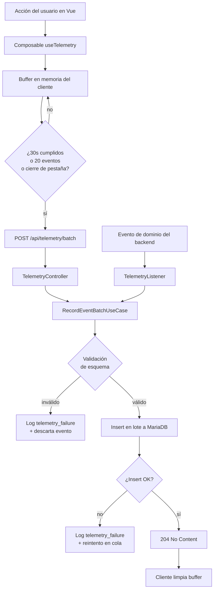

\
# 02 — Telemetría

> **Este es el documento más importante del repositorio.** La telemetría es la evidencia empírica del artículo científico. Los datos de los 66 días de intervención no se pueden reconstruir después: si un evento no se registra el 15 de octubre, esa información se perdió para siempre.

---

## 1. Qué sostiene la telemetría

El estudio tiene tres pilares. El tercero es la **triangulación**: contrastar lo que el estudiante *dice* en los cuestionarios psicométricos contra lo que *hace* de verdad en la aplicación.

| Fuente | Qué mide | Sensibilidad al cambio |
|---|---|---|
| Escala EPA / DASS-21 | Percepción declarada (rasgo) | Lenta — un rasgo es estable por definición |
| **Telemetría** | **Comportamiento real** | **Rápida — cambia día a día** |

Sin telemetría fiable, el estudio se reduce a autoinformes y pierde su aporte original. Con ella, se puede afirmar que el comportamiento cambió aunque la escala psicométrica se mueva poco.

**Consecuencia práctica:** ningún evento de este catálogo es opcional.

---

## 2. Principios de diseño

1. **La telemetría nunca rompe la experiencia.** Si falla el registro, la acción del usuario se completa igual. El fallo se loguea en el canal `telemetry_failure` y se reintenta.
2. **Escritura en lotes.** El hosting tiene 128 IOPS. Un INSERT por evento suelto lo satura. Se acumulan en buffer y se insertan de a bloques.
3. **Sin datos personales, nunca.** Solo `user_id` numérico. Jamás nombre, correo, WhatsApp, ni el contenido de un diario o un mensaje de chat.
4. **Inmutable.** Un evento registrado no se edita ni se borra. Si un dato salió mal, se corrige en el análisis, no en la base.
5. **Reloj del servidor.** `occurred_at` lo pone el cliente (para reconstruir el orden real), pero `recorded_at` lo pone el servidor. Si hay discrepancia grande, el servidor manda. Los relojes de los celulares mienten.

---

## 3. Flujo completo



Hay **dos entradas** al mismo sistema:

- **Frontend:** eventos de interacción (abrir pantalla, consultar ranking, iniciar Pomodoro). Van por buffer y lote.
- **Backend:** eventos de dominio (hábito completado, XP otorgado, nivel alcanzado). Se escuchan del bus de eventos y se registran directo, sin buffer, porque ya vienen de una acción persistida.

---

## 4. Esquema de la tabla

```sql
CREATE TABLE telemetry_events (
    id              BIGINT UNSIGNED AUTO_INCREMENT PRIMARY KEY,
    user_id         BIGINT UNSIGNED NOT NULL,
    event_name      VARCHAR(64)  NOT NULL,
    event_category  VARCHAR(32)  NOT NULL,
    payload         JSON         NULL,
    session_uuid    CHAR(36)     NULL,
    intervention_day SMALLINT    NULL,
    occurred_at     DATETIME(3)  NOT NULL,
    recorded_at     DATETIME(3)  NOT NULL DEFAULT CURRENT_TIMESTAMP(3),
    source          ENUM('web','backend') NOT NULL DEFAULT 'web',

    INDEX idx_user_time   (user_id, occurred_at),
    INDEX idx_event       (event_name, occurred_at),
    INDEX idx_day         (intervention_day),
    INDEX idx_category    (event_category, occurred_at),
    CONSTRAINT fk_telemetry_user FOREIGN KEY (user_id)
        REFERENCES users(id) ON DELETE RESTRICT
) ENGINE=InnoDB DEFAULT CHARSET=utf8mb4 COLLATE=utf8mb4_unicode_ci;
```

**`ON DELETE RESTRICT` es deliberado.** Si alguien intenta borrar un usuario, la base lo impide. Los datos del estudio no se borran por accidente. Para el derecho de supresión de la Ley 29733 existe un procedimiento manual documentado en `docs/06-SEGURIDAD.md`.

**`intervention_day`** es el día 1–66 de la intervención, calculado al insertar. Fuera del periodo va `NULL`. Esto ahorra cálculos costosos en el análisis posterior.

### Volumen estimado

70 participantes × ~120 eventos/día × 66 días ≈ **554.400 filas**. Con `payload` promedio de 100 bytes, son unos **250 MB**. Dentro del límite de 3 GB por base de datos del hosting. No requiere particionado.

---

## 5. Catálogo de eventos

**Este catálogo es cerrado.** No inventes eventos nuevos sin actualizar este documento. Cada evento aquí listado tiene un propósito analítico concreto.

### Categoría `habits`

| Evento | Cuándo | Payload | Para qué sirve |
|---|---|---|---|
| `habit.created` | Usuario crea un hábito | `{habit_id, frequency, category}` | Ver si personaliza o usa los sugeridos |
| `habit.completed` | Marca un hábito cumplido | `{habit_id, streak_days, is_late}` | **Métrica central de adherencia** |
| `habit.uncompleted` | Deshace el marcado | `{habit_id}` | Detectar marcado accidental o inflado |
| `habit.deleted` | Elimina un hábito | `{habit_id, days_alive}` | Abandono de hábitos concretos |
| `habit.daily_cap_reached` | Llega al tope de 5 | `{attempted_habit_id}` | Ver si el tope estorba |

### Categoría `pomodoro`

| Evento | Cuándo | Payload | Para qué sirve |
|---|---|---|---|
| `pomodoro.started` | Inicia el temporizador | `{session_id, planned_minutes, mission_id}` | Intención de enfoque |
| `pomodoro.completed` | Termina el ciclo completo | `{session_id, focus_minutes, mission_id}` | **Métrica central del Pilar 3** |
| `pomodoro.abandoned` | Cancela antes de terminar | `{session_id, elapsed_minutes, reason}` | Capacidad real de sostener el foco |
| `pomodoro.paused` | Pausa el temporizador | `{session_id, elapsed_minutes}` | Interrupciones |
| `pomodoro.break_started` | Inicia el descanso | `{session_id, break_minutes}` | Cumplimiento del método completo |

### Categoría `missions`

| Evento | Cuándo | Payload |
|---|---|---|
| `mission.created` | Crea una misión | `{mission_id, subtask_count, due_date, difficulty}` |
| `mission.subtask_completed` | Completa una subtarea | `{mission_id, subtask_id, remaining}` |
| `mission.completed` | Completa la misión | `{mission_id, days_early_or_late, subtask_count}` |
| `mission.overdue` | Vence sin completarse | `{mission_id, days_overdue}` |

`days_early_or_late` es **la medida conductual de procrastinación más directa** que tiene el sistema. Negativo = entregó antes; positivo = entregó tarde.

### Categoría `gamification`

| Evento | Cuándo | Payload |
|---|---|---|
| `xp.awarded` | Se otorga XP | `{amount, source, was_capped, total_xp}` |
| `level.up` | Sube de nivel | `{new_level, new_phase, days_since_start}` |
| `phase.unlocked` | Alcanza fase nueva del avatar | `{phase, style}` |
| `streak.extended` | Extiende la racha | `{days, bonus_multiplier}` |
| `streak.broken` | Pierde la racha | `{previous_days, grace_used}` |
| `streak.grace_used` | Usa día de gracia | `{remaining_grace}` |

`was_capped` permite detectar cuántos usuarios chocan con el tope diario. Si son muchos, la calibración está mal.

### Categoría `villains`

| Evento | Cuándo | Payload |
|---|---|---|
| `villain.assigned` | Se asigna el villano semanal | `{villain_id, villain_type, week_number}` |
| `villain.weakened` | Una acción lo debilita | `{villain_id, damage, remaining_hp}` |
| `villain.defeated` | Se derrota | `{villain_id, days_taken}` |
| `villain.survived` | Termina la semana sin derrotarlo | `{villain_id, remaining_hp_percent}` |

### Categoría `ai`

| Evento | Cuándo | Payload |
|---|---|---|
| `ai.consulted` | Envía consulta al asistente | `{prompt_category, prompt_length, quota_remaining}` |
| `ai.response_received` | Llega la respuesta | `{response_time_ms, token_count}` |
| `ai.quota_exhausted` | Agota la cuota diaria | `{}` |
| `ai.advice_marked_useful` | Marca un consejo como útil | `{advice_id, rating}` |

**Nunca registres el texto de la consulta ni de la respuesta.** Solo `prompt_category` (una clasificación cerrada: `planificacion`, `motivacion`, `tecnica_estudio`, `otro`) y la longitud. El contenido puede tener datos personales y temas de salud mental.

### Categoría `wellbeing`

| Evento | Cuándo | Payload |
|---|---|---|
| `journal.entry_created` | Escribe en el diario | `{mood_score, entry_length, tags}` |
| `journal.entry_edited` | Edita una entrada | `{entry_id}` |

**Solo el `mood_score` (1–5) y la longitud. Jamás el texto.** El contenido del diario es dato sensible de salud mental.

### Categoría `social` — variable de control

| Evento | Cuándo | Payload | Por qué existe |
|---|---|---|---|
| `ranking.viewed` | **Entra a la vista de ranking** | `{own_position, total_users, time_spent_ms}` | **Variable de control del estudio** |
| `group_session.joined` | Entra a sesión grupal | `{session_id, participant_count}` | Efecto de estudio acompañado |
| `group_session.left` | Sale de la sesión | `{session_id, duration_minutes}` | |
| `group_chat.message_sent` | Envía mensaje en el chat | `{session_id, message_length}` | Solo longitud, **nunca el texto** |

`ranking.viewed` es crítico. El ranking introduce comparación social, un mecanismo distinto al de identidad profesional que investiga el estudio. Al medir quién lo consulta y cuánto, se puede controlar estadísticamente ese efecto en el análisis.

**Por eso el ranking debe ser una vista a la que se entra deliberadamente**, nunca un widget visible por defecto en el dashboard. Si se muestra pasivamente, el evento pierde sentido: registraría exposición accidental en vez de decisión.

### Categoría `app`

| Evento | Cuándo | Payload |
|---|---|---|
| `app.session_started` | Abre la aplicación | `{device_type, theme, is_first_of_day}` |
| `app.session_ended` | Cierra o expira | `{duration_seconds, screens_visited}` |
| `screen.viewed` | Navega a una pantalla | `{screen_name, from_screen, time_spent_ms}` |
| `theme.changed` | Cambia claro/oscuro | `{from, to}` |
| `wallpaper.changed` | Cambia el fondo | `{wallpaper_id}` |
| `notification.opened` | Abre desde notificación | `{notification_type}` |

`is_first_of_day` marca la primera apertura del día: es la señal más limpia de **adherencia diaria**, mejor que contar sesiones totales.

---

## 6. Implementación en el frontend

```javascript
// resources/js/composables/useTelemetry.js
import { ref, onMounted, onBeforeUnmount } from 'vue'
import axios from 'axios'

const buffer = ref([])
const FLUSH_INTERVAL_MS = 30_000
const MAX_BUFFER_SIZE = 20

export function useTelemetry() {
    let timer = null

    function track(eventName, category, payload = {}) {
        buffer.value.push({
            event_name: eventName,
            event_category: category,
            payload,
            occurred_at: new Date().toISOString(),
            session_uuid: getSessionUuid(),
        })

        if (buffer.value.length >= MAX_BUFFER_SIZE) {
            flush()
        }
    }

    async function flush() {
        if (buffer.value.length === 0) return

        const batch = [...buffer.value]
        buffer.value = []

        try {
            await axios.post('/api/telemetry/batch', { events: batch })
        } catch (e) {
            // Reinserta al principio para no perder los eventos.
            // La telemetría NUNCA rompe la experiencia del usuario.
            buffer.value = [...batch, ...buffer.value]
        }
    }

    // Al cerrar la pestaña, sendBeacon sobrevive a la descarga de la página
    function flushOnUnload() {
        if (buffer.value.length === 0) return
        navigator.sendBeacon(
            '/api/telemetry/batch',
            new Blob([JSON.stringify({ events: buffer.value })],
                     { type: 'application/json' })
        )
        buffer.value = []
    }

    onMounted(() => {
        timer = setInterval(flush, FLUSH_INTERVAL_MS)
        window.addEventListener('beforeunload', flushOnUnload)
        document.addEventListener('visibilitychange', () => {
            if (document.visibilityState === 'hidden') flush()
        })
    })

    onBeforeUnmount(() => {
        clearInterval(timer)
        window.removeEventListener('beforeunload', flushOnUnload)
        flush()
    })

    return { track }
}
```

`navigator.sendBeacon` es esencial: garantiza el envío aunque el usuario cierre la pestaña de golpe. Sin esto se pierden los eventos del final de cada sesión, que son justamente los que indican si abandonó o terminó.

---

## 7. Implementación en el backend

```php
// app/Modules/Telemetry/Application/UseCases/RecordEventBatchUseCase.php
final readonly class RecordEventBatchUseCase
{
    public function __construct(
        private TelemetryRepositoryInterface $repository,
        private EventSchemaValidator $validator,
        private InterventionDayCalculator $dayCalculator,
        private LoggerInterface $failureLogger,
    ) {}

    public function execute(RecordEventBatchDTO $dto): void
    {
        $valid = [];

        foreach ($dto->events as $event) {
            if (! $this->validator->isValid($event)) {
                $this->failureLogger->warning('Evento de telemetría inválido', [
                    'event_name' => $event->eventName,
                    'user_id'    => $dto->userId,
                    'reason'     => $this->validator->lastError(),
                ]);
                continue; // se descarta, no se rompe el lote entero
            }

            $valid[] = [
                'user_id'          => $dto->userId,
                'event_name'       => $event->eventName,
                'event_category'   => $event->category,
                'payload'          => json_encode($event->payload),
                'session_uuid'     => $event->sessionUuid,
                'intervention_day' => $this->dayCalculator->dayFor($event->occurredAt),
                'occurred_at'      => $event->occurredAt,
                'recorded_at'      => now(),
                'source'           => 'web',
            ];
        }

        if ($valid !== []) {
            $this->repository->insertBatch($valid); // un solo INSERT múltiple
        }
    }
}
```

```php
// Infrastructure/Repositories/EloquentTelemetryRepository.php
public function insertBatch(array $rows): void
{
    // chunk de 100 para no exceder max_allowed_packet ni saturar IOPS
    foreach (array_chunk($rows, 100) as $chunk) {
        DB::table('telemetry_events')->insert($chunk);
    }
}
```

**Un solo INSERT con múltiples filas, no un INSERT por fila.** Esta es la diferencia entre funcionar y saturar los 128 IOPS del hosting.

---

## 8. Escucha de eventos de dominio

Los eventos que nacen en el backend se capturan con un listener genérico:

```php
// app/Modules/Telemetry/Application/Listeners/DomainEventTelemetryListener.php
final readonly class DomainEventTelemetryListener
{
    private const MAP = [
        HabitCompleted::class      => ['habit.completed', 'habits'],
        PomodoroCompleted::class   => ['pomodoro.completed', 'pomodoro'],
        MissionCompleted::class    => ['mission.completed', 'missions'],
        XpAwarded::class           => ['xp.awarded', 'gamification'],
        LevelUp::class             => ['level.up', 'gamification'],
        VillainDefeated::class     => ['villain.defeated', 'villains'],
        // ... el mapa completo cubre todo el catálogo de la sección 5
    ];

    public function handle(object $event): void
    {
        $definition = self::MAP[$event::class] ?? null;
        if ($definition === null) return;

        [$name, $category] = $definition;

        try {
            $this->recordEvent->execute(/* ... */);
        } catch (\Throwable $e) {
            // NUNCA propagar: un fallo de telemetría no rompe la acción del usuario
            $this->failureLogger->error('Fallo al registrar telemetría de dominio', [
                'event' => $event::class,
                'error' => $e->getMessage(),
            ]);
        }
    }
}
```

El `try/catch` que traga la excepción es intencional y **es la única parte del sistema donde tragar una excepción es correcto**. Está compensado por el log de larga retención.

---

## 9. Exportación para análisis

Comando artisan que genera el dataset del artículo:

```bash
php artisan telemetry:export --from=2026-09-07 --to=2026-11-11 --format=csv
```

Produce tres archivos en `storage/app/exports/`:

| Archivo | Contenido | Granularidad |
|---|---|---|
| `events_raw.csv` | Todos los eventos | Una fila por evento |
| `daily_per_user.csv` | Agregado diario | Una fila por usuario-día |
| `summary_per_user.csv` | Resumen del periodo | Una fila por usuario |

`daily_per_user.csv` es el que alimenta directamente el análisis estadístico. Columnas:

```
user_code, intervention_day, date,
habits_completed, habits_available, adherence_rate,
pomodoros_started, pomodoros_completed, focus_minutes_total,
missions_completed, missions_overdue, avg_days_early_or_late,
ai_consultations, journal_entries, mood_score_avg,
current_streak, xp_earned, current_level, current_phase,
ranking_views, group_session_minutes,
app_opens, total_session_minutes
```

**`user_code` es el código seudonimizado, no el `user_id` ni el nombre.** La tabla que mapea código real ↔ usuario vive separada, con acceso restringido, y nunca sale en un export.

**Ejecutar siempre fuera de horario de uso.** El hosting tiene 1 núcleo: generar este export en pleno pico degrada la aplicación para todos.

---

## 10. Verificación antes del día 43

La tarea 7.8 del proyecto es una **compuerta**: si no pasa, la intervención no arranca. Checklist obligatorio:

- [ ] Cada evento del catálogo de la sección 5 se registra al ejecutar su acción
- [ ] El buffer del cliente envía a los 30 s, a los 20 eventos y al cerrar la pestaña
- [ ] `sendBeacon` funciona al cerrar la pestaña de golpe (probado en Chrome y Firefox)
- [ ] Un fallo de red no pierde eventos (quedan en buffer y se reintentan)
- [ ] Un fallo de telemetría no impide completar la acción del usuario
- [ ] `intervention_day` se calcula bien en los bordes (día 1 y día 66)
- [ ] Los inserts son en lote, verificado con el log de consultas
- [ ] Ningún evento contiene datos personales, verificado por inspección manual
- [ ] El export genera los tres CSV correctamente con datos de prueba
- [ ] Prueba de carga: 70 usuarios simulados durante 1 hora sin pérdida de eventos
- [ ] El log `telemetry_failure` está vacío tras la prueba de carga

**Ninguna de estas casillas se marca sin evidencia.** Guarda las capturas y los logs de la prueba: van al anexo del artículo como respaldo de la calidad del dato (ISO/IEC 25012).
