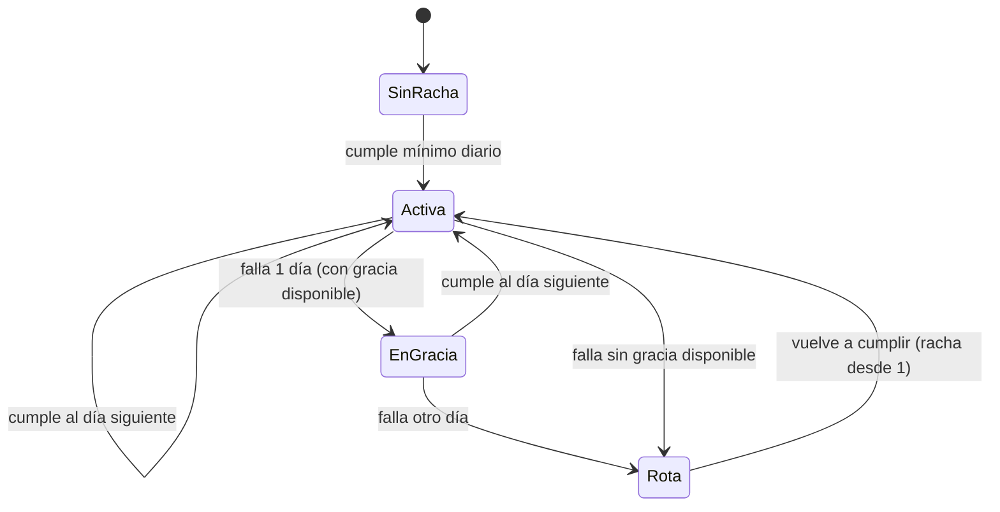
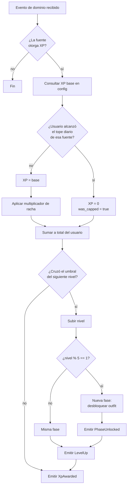

\
# 03 — Gamificación

> Toda constante numérica de este documento vive en `config/gamification.php`, nunca escrita a mano en el código. **A partir del 07/09/2026 estos valores se congelan**: cambiarlos a mitad de la intervención invalida los datos del estudio.

---

## 1. Principio de diseño: la gamificación protege el dato

Esto no es un juego comercial que busca maximizar el tiempo de uso. Es el mecanismo de una intervención científica. Dos consecuencias:

1. **Los topes diarios no son "balance", son validez de datos.** Si un usuario puede crear 40 hábitos falsos y marcarlos todos, la métrica de adherencia se corrompe y con ella el Pilar 3 del estudio.
2. **Nada da ventaja funcional.** La tienda es cosmética pura. Cualquier elemento que altere la mecánica introduce una variable no controlada.

---

## 2. Avatar y Progresión Visual Completa

Epycus combina la **personalización cosmética libre del usuario** con **4 mecánicas de evolución visual por código** (Fases 1 a 10, Niveles 1 a 50):

### 2.1 Identidad del Avatar (Open Peeps por Pablo Stanley)
* **Motor Procedural:** [@dicebear/open-peeps](file:///c:/Users/marco/Videos/Epycus/resources/js/Components/ProceduralAvatar.vue) con biblioteca vectorial dinámicamente renderizada.
* **Editor Personalizable (`/profile`):** [AvatarCustomizer.vue](file:///c:/Users/marco/Videos/Epycus/resources/js/Components/AvatarCustomizer.vue) permite al estudiante elegir libremente tono de piel (5 tonos), corte de cabello (15 estilos), expresión facial (8 emociones), lentes/accesorios (7 estilos), vello facial (5 estilos), color de ropa (8 colores) y color de fondo (6 tonos).
* **Persistencia:** Guardado en la columna `users.avatar_options` (JSON).

### 2.2 Las 4 Mecánicas de Evolución y Crecimiento Visual (Fases 1 a 10)
1. 🖼️ **Marcos Evolutivos de Avatar (`AvatarFrame.vue`):** Envoltorio de avatar que evoluciona de Fase 1 a 10 en 5 niveles de materiales metálicos (Bronce ➔ Plata Estelar ➔ Oro Reluciente ➔ Neón Esmeralda ➔ Diamante Mítico).
2. 📜 **Escalafón de Títulos por Carrera Individual (`careerRanks.js`):** 10 títulos evolutivos únicos para las 11 carreras profesionales (Medicina, Enfermería, Obstetricia, Adm. de Empresas, Contabilidad, Ing. Civil, Ing. Industrial, Ing. de Minas, Arquitectura, Ing. de Sistemas y Derecho).
3. 🎴 **Credencial Estudiantil Digital Holográfica (`StudentIdCard.vue`):** Tarjeta estilo credencial VIP con acabado de cristal (Glassmorphism), sellos metálicos de verificación, racha, nivel, XP, monedas y efecto holográfico 3D al hover.
4. ⚡ **Aura de Racha Activa (`StreakAura.vue`):** Anillo de energía luminosa en gradiente fuego/naranja que se activa al mantener 3+ días de racha.

### 2.3 GIFs Animados Contextuales en Módulos de Estudio
Para mantener una identidad visual enfocada, los módulos de estudio funcionales muestran GIFs animados temáticos en su cabecera:
* ⏱️ **Pomodoro:** `pomodoro.gif`
* 📅 **Hábitos:** `habits.gif`
* 🎯 **Misiones:** `missions.gif`
* 🏅 **Logros e Insignias:** `achievements.gif`
* 🤖 **Asistente IA:** `benny-typing-v2.gif`
public/assets/avatars/systems/m/fase-10/lateral-izq.png
```

Posiciones: `frontal`, `lateral-izq`, `lateral-der`, `espalda`.

**Convención estricta.** El frontend construye la ruta por concatenación; si un archivo no sigue el patrón, la imagen no carga. Optimiza cada PNG a ≤80 KB (TinyPNG o similar) — 400 assets a 80 KB son ~32 MB, aceptable para el hosting.

---

## 3. Fuentes de XP y topes diarios

| Acción | XP | Tope diario | XP máx/día |
|---|---|---|---|
| Hábito completado | 10 | 5 hábitos | 50 |
| Pomodoro completado (≥25 min) | 15 | 8 pomodoros | 120 |
| Misión completada — fácil | 20 | 3 misiones | 60–120 |
| Misión completada — media | 30 | (compartido) | |
| Misión completada — difícil | 40 | (compartido) | |
| Subtarea completada | 5 | dentro del tope de misión | — |
| Entrada de diario de bienestar | 10 | 1 por día | 10 |
| Villano semanal derrotado | 100 | 1 por semana | — |
| Logro desbloqueado | 20–100 según rareza | sin tope | — |

**Techo diario base: ~300 XP** (sin contar villano). Con bonus de racha máximo (+50%), el techo real es ~450 XP.

### Por qué existe cada tope

| Tope | Razón |
|---|---|
| 5 hábitos | Evita inflar la métrica de adherencia creando hábitos triviales |
| 8 pomodoros | 8 × 25 min = 200 min de foco. Más que eso en un día es improbable y sospechoso |
| 3 misiones | Evita fragmentar una tarea en 20 micro-misiones para farmear XP |
| 1 diario | Es reflexión, no una acción repetible |

Cuando un usuario choca con un tope se emite `habit.daily_cap_reached` y el XP se otorga con `was_capped: true`. **Si en el piloto muchos usuarios chocan con los topes, la calibración está mal y hay que ajustarla antes del día 43** — nunca después.

---

## 4. Curva de niveles

Fórmula lineal creciente, elegida por ser predecible y fácil de comunicar al usuario:

```
XP_para_subir_al_nivel(n) = 100 + (n - 1) × 45
```

| Nivel | XP para ese nivel | XP acumulado | Fase |
|---|---|---|---|
| 1 → 2 | 100 | 100 | 1 |
| 5 → 6 | 280 | 1.000 | 1 → 2 |
| 10 → 11 | 505 | 2.925 | 2 → 3 |
| 25 → 26 | 1.180 | 15.100 | 5 → 6 |
| 49 → 50 | 2.260 | 58.850 | 10 |

### Verificación contra los 40 días de intervención

| Perfil de usuario | XP/día | XP en 40 días | Nivel alcanzado | Fase |
|---|---|---|---|---|
| Bajo (1 hábito, 1 pomodoro) | ~25 | 1.000 | ~6 | 2 |
| Medio (3 hábitos, 3 pomodoros, 1 misión/sem) | ~110 | 4.400 | ~14 | 3 |
| Alto (topes casi completos + rachas) | ~280 | 11.200 | ~22 | 5 |
| Máximo teórico (todo al tope, racha perfecta) | ~450 | 18.000 | ~28 | 6 |

**Diseño intencional: nadie llega al nivel 50 en 40 días.** Razones:

- Mantiene la progresión aspiracional durante todo el periodo, sin techo alcanzable que desmotive.
- Las fases superiores quedan como contenido posterior a la intervención.
- El rango de niveles alcanzados (6–28) da **buena varianza para el análisis estadístico**, que es lo que se necesita para correlacionar progreso con cambio psicométrico en la Escala EPA (8 ítems). Si todos llegaran al tope, la variable sería inútil.

---

## 5. Rachas



**Mínimo diario para mantener la racha:** completar al menos 1 hábito **o** 1 pomodoro. Deliberadamente bajo — la racha mide constancia, no intensidad.

### Bonus por racha

```
multiplicador = 1 + min(0.50, floor(dias_racha / 7) × 0.10)
```

| Días de racha | Multiplicador |
|---|---|
| 0–6 | 1.00 |
| 7–13 | 1.10 |
| 14–20 | 1.20 |
| 21–27 | 1.30 |
| 28–34 | 1.40 |
| 35+ | 1.50 (tope) |

El tope en 35 días evita que quien arranca fuerte se despegue tanto que el resto abandone.

### Recuperación progresiva (decisión D-05)

**3 días de gracia por mes calendario, no acumulables entre meses.** Al usar uno, la racha se congela en vez de romperse:

- Racha de 20 días, falla el día 21 con gracia disponible → sigue en 20, gasta 1 gracia, emite `streak.grace_used`
- Cumple el día 22 → la racha pasa a 21
- Falla el día 22 también → la racha se rompe, emite `streak.broken` con `grace_used: true`

Esto ataca directamente el riesgo R-03 del proyecto (deserción): en los sistemas sin gracia, el usuario que rompe una racha larga suele abandonar del todo.

---

## 6. Villanos semanales

Un villano por semana, asignado automáticamente el lunes a las 00:00 (hora de Lima) por un cron.

| Villano | Código | Tema | Se debilita con |
|---|---|---|---|
| La Postergación | `procrastination` | Dejar todo para después | Misiones completadas antes del vencimiento |
| La Distracción | `distraction` | Celular y redes | Pomodoros completados sin abandonar |
| La Ansiedad | `anxiety` | Agobio ante la carga | Entradas de diario + hábitos cumplidos |
| El Desorden | `disorder` | No saber por dónde empezar | Misiones creadas con subtareas |
| El Cansancio | `fatigue` | Llegar agotado de clases | Hábitos de descanso y sueño |

Los cinco villanos salen directamente del **Diagrama de Pareto de Obstáculos (Fig. 1)** de la encuesta diagnóstica (Google Forms, 4–6 abr. 2026, $n=98$): falta de motivación (25,5 %), distracción por celular/redes (19,4 %), olvido de lo planificado (18,4 %), no saber por dónde empezar (14,3 %) y cansancio tras clases (12,2 %). **Eso es deliberado: conecta la mecánica del juego con el diagnóstico real de la población**, y es un argumento defendible ante el jurado.

### Mecánica

```
HP del villano = 100 × factor_dificultad
```

| Semana de intervención | Factor | HP |
|---|---|---|
| 1–2 | 0.8 | 80 |
| 3–6 | 1.0 | 100 |
| 7–10 | 1.2 | 120 |

Cada acción relevante al villano de la semana le quita **10 HP**. Derrotarlo otorga 100 XP y desbloquea un fondo de pantalla cosmético.

**Nunca hay castigo por no derrotarlo.** Si sobrevive la semana, solo emite `villain.survived` y se pasa al siguiente. Penalizar el fallo aumenta la deserción, y la deserción es el mayor riesgo del estudio.

---

## 7. Ranking — variable de control

Instrumentado según decisión del equipo. Reglas de implementación **obligatorias**:

1. **Vista dedicada.** El ranking vive en `/ranking`, a la que el usuario entra deliberadamente. **Prohibido mostrarlo como widget en el dashboard**, en un aside, o en cualquier lugar donde se vea sin decidirlo.
2. **Sin notificaciones.** Nada de "¡subiste al puesto 3!". Eso convierte la exposición en pasiva y arruina la variable.
3. **Cada visita se registra** con `ranking.viewed`, incluyendo `own_position`, `total_users` y `time_spent_ms`.
4. **Solo posición y nivel.** Nunca mostrar el detalle de hábitos o el diario de otro usuario.
5. **Nombre visible:** el que el usuario elija como alias, no su nombre real.

El motivo está explicado en el `README.md`: si el ranking se muestra pasivamente, no se puede separar su efecto del efecto de la identidad profesional, y el Pilar 2 del estudio pierde defensa ante un revisor.

---

## 8. Flujo de otorgamiento de XP



Nota sobre el umbral de fase: la fase cambia al alcanzar los niveles 1, 6, 11, 16, 21, 26, 31, 36, 41 y 46.

```
fase = floor((nivel - 1) / 5) + 1
```

### Idempotencia

El cálculo de XP **debe ser idempotente por evento**. Si por un reintento de cola llega dos veces `PomodoroCompleted` con el mismo `session_id`, solo se otorga XP una vez.

Implementación: tabla `xp_transactions` con índice único sobre `(user_id, source_type, source_id)`. Antes de otorgar, se intenta insertar; si viola la restricción única, se descarta silenciosamente.

Esto no es opcional. Sin idempotencia, un reintento infla el XP y corrompe la correlación entre progreso y comportamiento real.

---

## 8-bis. Logros e insignias (Achievements)

Catálogo cerrado de 13 logros dividido en 6 categorías, cargado por seeder (`AchievementsSeeder`). Se desbloquean **una sola vez** por usuario y la evaluación es estrictamente idempotente.

### Categorías de Logros
1. **Constancia:** Relacionados a las rachas (e.g. racha de 7, 30 o 60 días).
2. **Volumen:** Cantidad total acumulada (e.g. 10 o 100 Pomodoros).
3. **Progresión:** Alcanzar ciertos niveles o fases del avatar.
4. **Villanos:** Cantidad de villanos semanales derrotados.
5. **Bienestar:** Constancia en las entradas del diario.
6. **Puntualidad:** Misiones entregadas antes de su fecha de vencimiento.

### Recompensas y Rarezas
| Rareza | XP | Ejemplos del catálogo (13 en total) |
|---|---|---|
| Común | 20 | Primer hábito creado, primer Pomodoro |
| Poco común | 40 | Racha de 7 días, 10 Pomodoros |
| Rara | 60 | Racha de 30 días, fase 5 del avatar, 5 villanos derrotados |
| Épica | 100 | Racha de 60 días, fase 8, 100 Pomodoros |

**Reglas de diseño alineadas con el estudio:**

- **Ningún logro premia comparación social.** Nada de "entraste al top 10" o "mejor que el 80%". Eso reforzaría la variable de control (ranking) en lugar de la variable estudiada (identidad profesional).
- **Ningún logro negativo.** No existe "rompiste tu racha". Penalizar aumenta la deserción, que es el riesgo R-03.
- Sin tope diario: son hitos únicos, no una fuente repetible de XP.
- La evaluación corre **en cola**, no en la petición del usuario. Con 1 núcleo, evaluar 30 condiciones en cada acción bloquearía la respuesta.
- **Idempotencia estricta:** Un logro jamás puede ser otorgado dos veces al mismo usuario, incluso en caso de reintentos de cola.

Emite `AchievementUnlocked`, que Telemetry registra.

---

## 9. Moneda blanda (preparado para Fase 2)

La tienda es de Fase 2, pero la moneda **se acumula desde el MVP** para que quien participe en la intervención tenga saldo cuando se habilite.

```
monedas_ganadas = floor(xp_otorgado / 10)
```

Se guarda en `user_wallets`. En el MVP no hay nada que comprar; solo se muestra el saldo. No implementes la tienda sin confirmación escrita del equipo.

---

## 10. Qué NO implementar

| Elemento | Por qué está prohibido |
|---|---|
| Pérdida de XP o de nivel | Aumenta deserción, que es el riesgo R-03 |
| Ventajas compradas con dinero real | Decisión D-12: no hay monetización en la versión de campo |
| Comparación social pasiva | Contamina la variable de control (ver sección 7) |
| Notificaciones de que otro te superó | Igual que lo anterior |
| Elementos aleatorios tipo caja sorpresa | Introduce refuerzo variable, un mecanismo psicológico distinto que confunde el análisis |
| Ranking por carrera | Con 50–70 participantes, algunos grupos tendrían 2 personas: sin sentido estadístico y expone identidades |

---

## 11. Parámetros configurables

```php
// config/gamification.php
return [
    'xp' => [
        'habit_completed'    => env('XP_HABIT', 10),
        'pomodoro_completed' => env('XP_POMODORO', 15),
        'mission_easy'       => env('XP_MISSION_EASY', 20),
        'mission_medium'     => env('XP_MISSION_MEDIUM', 30),
        'mission_hard'       => env('XP_MISSION_HARD', 40),
        'subtask_completed'  => env('XP_SUBTASK', 5),
        'journal_entry'      => env('XP_JOURNAL', 10),
        'villain_defeated'   => env('XP_VILLAIN', 100),
    ],

    'daily_caps' => [
        'habits'    => env('CAP_HABITS', 5),
        'pomodoros' => env('CAP_POMODOROS', 8),
        'missions'  => env('CAP_MISSIONS', 3),
        'journal'   => 1,
    ],

    'level_curve' => [
        'base'      => 100,
        'increment' => 45,
        'max_level' => 50,
    ],

    'phases' => [
        'total'            => 10,
        'levels_per_phase' => 5,
    ],

    'streak' => [
        'grace_days_per_month' => env('STREAK_GRACE', 3),
        'bonus_per_week'       => 0.10,
        'bonus_max'            => 0.50,
        'min_daily_actions'    => 1,
    ],

    'villains' => [
        'base_hp'          => 100,
        'damage_per_action'=> 10,
        'difficulty_by_week' => [
            1 => 0.8, 2 => 0.8,
            3 => 1.0, 4 => 1.0, 5 => 1.0, 6 => 1.0,
            7 => 1.2, 8 => 1.2, 9 => 1.2, 10 => 1.2,
        ],
    ],

    'wallet' => [
        'xp_per_coin' => 10,
    ],
];
```

**Congelar el 07/09/2026.** Documenta en el repositorio el commit exacto que fija estos valores, para poder citarlo en la sección de métodos del artículo.
