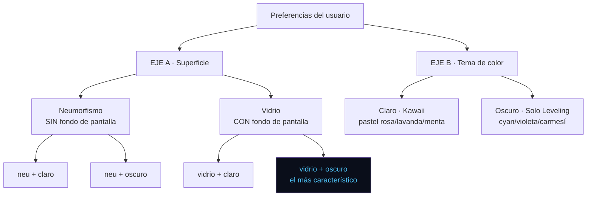
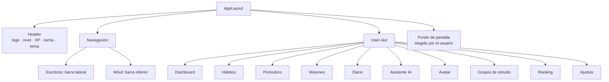

# 04 — Diseño visual

> **Para trabajar en cualquier cosa visual usa la skill `epycus-ui`** (en `.claude/skills/epycus-ui/`). Contiene la matemática del color, los umbrales de contraste y las reglas operativas. Este documento define el sistema; la skill dice cómo aplicarlo.

---

## 1. El sistema: dos ejes independientes

El usuario elige **dos cosas por separado**, lo que da 4 combinaciones:



### La regla que amarra los dos ejes

**El modo de superficie decide si hay fondo de pantalla.** No es preferencia estética, es requisito técnico:

| Modo | Fondo | Motivo técnico |
|---|---|---|
| **Neumorfismo** | Desactivado, forzado | El efecto necesita que fondo y elementos compartan color base para que las dobles sombras funcionen. Con una imagen detrás, el efecto desaparece |
| **Vidrio** | Obligatorio | `backdrop-filter` necesita algo que difuminar. Sin imagen se ve como una tarjeta translúcida sin sentido |

Al cambiar de modo la interfaz se reconfigura sola: neumorfismo oculta el selector de fondos, vidrio lo habilita y aplica uno por defecto.

> **Combinación estrella:** vidrio + oscuro. Las ventanas del sistema de Solo Leveling *son* glassmorphism — paneles translúcidos azul cyan con borde brillante sobre fondo oscuro. Con un fondo lo-fi de estudiante detrás, es la que mejor captura la identidad del producto.

### Implementación

```html
<html data-theme="dark" data-surface="glass">
```

Dos atributos independientes. Las variables CSS se resuelven por combinación.

---

## 2. Las dos paletas base

Definidas con sus valores y contrastes medidos en la skill `epycus-ui` §7. Resumen:

### Claro — Kawaii

Fundamento técnico: los pastel son **luminosidad alta con saturación baja**. Rango de referencia para UI pastel: saturación 14–21%, brillo 89–96%.

| Token | Hex | Contraste |
|---|---|---|
| `bg` | `#FFF8FB` | — |
| `content-primary` | `#3D2C3A` | 12.39:1 sobre bg ✅ AAA |
| `content-secondary` | `#6B5A67` | 6.11:1 ✅ AA |
| `primary` (pastel rosa) | `#F2B8D4` | texto oscuro encima: 7.77:1 ✅ |
| `primary-strong` | `#C4477E` | blanco encima: 4.62:1 ✅ |
| `secondary` (lavanda) | `#C9B8F2` | texto oscuro: 7.17:1 ✅ |
| `accent` (menta) | `#B8EDDC` | texto oscuro: 9.99:1 ✅ |

### Oscuro — Solo Leveling

Interpretación del estilo del anime: azul neón, violeta y carmesí sobre negro azulado. **No es una paleta oficial de la obra**, es una derivación de su aspecto.

| Token | Hex | Contraste |
|---|---|---|
| `bg` | `#0A0E1A` | azul casi negro |
| `surface` | `#131A2B` | elevación 1.11 ✅ |
| `surface-raised` | `#1C2540` | elevación 1.15 ✅ |
| `content-primary` | `#E8EDF7` | 16.40:1 ✅ AAA |
| `primary` (cyan sistema) | `#4FC3F7` | 9.61:1 ✅ AAA |
| `secondary` (violeta) | `#9D7BEA` | 5.92:1 ✅ AA |
| `accent` (dorado) | `#F5C85C` | 12.19:1 ✅ AAA |
| `danger` (carmesí) | `#F2555A` | 5.71:1 ✅ AA |

**Detalle de estilo:** en oscuro + vidrio, los bordes llevan un halo cyan sutil (1px al 30%) que evoca las ventanas del sistema del anime. Discreto: es un detalle, no un neón parpadeante.

> **Trampa del neón:** el cyan da 9.61 contra el fondo (excelente para texto), pero **blanco sobre ese cyan da 2.0 y falla**. En botones de acento neón el texto va en el color del fondo oscuro, no en blanco.

> **Trampa del borde (hallazgo del 2026-07-28, ver `docs/12-HISTORIAL.md`):** `border`/`border-strong` de las dos paletas no llegan al mínimo de 3:1 para elementos de interfaz — dan entre 1.25:1 y 2.21:1 contra `bg`, medido. Se agregó `border-interactive` a ambas paletas (`#B06A90` claro, 3.78:1; `#5A7EC0` oscuro, 4.75:1) para el borde de cualquier elemento interactivo. Detalle completo en la skill `epycus-ui` §4, Trampa 4.

---

## 3. Personalización de paletas

Está previsto que el usuario elija entre varias paletas de cada tema. La forma de crear una nueva sin romper accesibilidad está en la skill `epycus-ui` §8: se fija un matiz base y se derivan los tokens con **luminosidad OKLCH fija**.

Como OKLCH es perceptualmente uniforme, misma luminosidad implica mismo brillo percibido sin importar el matiz — así el contraste se mantiene aunque cambie el color. Esa es la razón técnica de que la personalización sea viable.

**Reglas de la personalización:**
- El usuario elige entre paletas **predefinidas y verificadas**, no un selector de color libre
- Cada paleta nueva pasa la verificación de contraste antes de entrar al catálogo
- Se registra `theme.changed` y `surface.changed` en telemetría

---

## 4. Regla fundamental: tokens, no colores

**Ningún componente escribe un color literal.**

```html
<!-- MAL -->
<div class="bg-pink-100 text-gray-900 border-pink-300">
<!-- BIEN -->
<div class="bg-surface text-content-primary border-border">
```

Con 2 temas × 2 superficies × N paletas futuras, los colores literales harían inmanejable cualquier cambio. Detalle de la implementación de tokens en la skill.

---

## 5. Modo oscuro: reglas basadas en evidencia

Estas decisiones no son estéticas, vienen de las buenas prácticas documentadas de diseño de modo oscuro.

**Nunca negro puro (`#000000`).** Produce contraste excesivo y provoca *smearing* en pantallas OLED al hacer scroll. El fondo base es `#121016`, un gris muy oscuro con matiz violeta que armoniza con el tema claro.

**La elevación se expresa con superposición de blanco, no con sombras.** En modo oscuro las sombras casi no se ven; lo que comunica jerarquía es que la superficie sea más clara. Sistema:

| Elevación | Uso | Superposición blanca | Token |
|---|---|---|---|
| 0 | Fondo de página | 0% | `bg` |
| 1 | Tarjetas, paneles | ~5% | `surface` |
| 2 | Modales, menús desplegables | ~8% | `surface-raised` |
| −1 | Campos de entrada, zonas hundidas | negativo | `surface-sunken` |

**Colores desaturados.** Un acento que funciona sobre blanco resulta agresivo sobre fondo oscuro. Por eso `--color-primary` pasa de `#E58BB4` (claro) a `#D194B4` (oscuro): mismo matiz, menor saturación y luminosidad ajustada.

**Texto en blanco roto, nunca blanco puro.** `#EDE9F0` en lugar de `#FFFFFF` reduce el deslumbramiento.

**Contraste mínimo:** 4.5:1 para texto normal, 3:1 para texto grande. Verificar con una herramienta antes de dar por buena cualquier combinación.

---

## 6. Modo claro kawaii: la trampa del pastel

El estilo pastel tiene un riesgo de accesibilidad concreto: **los colores pastel tienen luminosidad alta, y texto pastel sobre fondo pastel no alcanza el contraste mínimo.**

Reglas para evitarlo:

1. **El pastel es para superficies y acentos decorativos, jamás para texto.**
2. El texto principal es `#3D2C3A` — un violeta muy oscuro, no gris neutro. Mantiene la calidez del tema y alcanza contraste 11:1 sobre `#FFF9FB`.
3. Un botón primario `#E58BB4` con texto blanco **no pasa** contraste (2.4:1). Solución: texto oscuro sobre botón pastel, o un tono más profundo para botones con texto blanco.

```html
<!-- MAL: rosa pastel con texto blanco, contraste 2.4:1 -->
<button class="bg-primary text-white">Completar</button>

<!-- BIEN: rosa pastel con texto oscuro, contraste 7.1:1 -->
<button class="bg-primary text-content-primary">Completar</button>
```

**Toda combinación de color debe verificarse antes de darla por buena.** El público son estudiantes que van a usar esto 66 días seguidos; la fatiga visual es un problema real de adherencia.

---

## 7. Tipografía

| Rol | Fuente | Peso | Uso |
|---|---|---|---|
| Títulos | Quicksand | 600 | Encabezados. Geométrica y redondeada, coherente con lo kawaii |
| Cuerpo | Nunito | 400 / 600 | Texto general. Muy legible en pantalla |
| Números | Nunito | 700 | Contadores, XP, temporizador |

Ambas están en Google Fonts con licencia abierta. **Autoalojarlas en `public/fonts/`, no cargarlas desde el CDN de Google** — evita una dependencia externa y una posible implicación de protección de datos (el CDN registra la IP del usuario).

Escala tipográfica:

```
xs   12px    Etiquetas, metadatos
sm   14px    Texto secundario
base 16px    Cuerpo
lg   18px    Texto destacado
xl   20px    Título de tarjeta
2xl  24px    Título de sección
3xl  30px    Título de página
4xl  36px    Temporizador Pomodoro
```

Mínimo 16px para texto de cuerpo. Nunca bajar de 12px.

---

## 8. Espaciado y forma

Escala de 4px. Solo múltiplos: `4, 8, 12, 16, 24, 32, 48, 64`.

Radios de borde (redondeados, coherentes con el estilo kawaii):

| Token | Valor | Uso |
|---|---|---|
| `rounded-sm` | 8px | Etiquetas, chips |
| `rounded` | 12px | Botones, campos |
| `rounded-lg` | 16px | Tarjetas |
| `rounded-xl` | 24px | Modales, paneles grandes |
| `rounded-full` | 9999px | Avatares, insignias |

---

## 9. Estructura de pantallas



**Navegación principal (máximo 5 destinos visibles):**

| Icono | Destino |
|---|---|
| Casa | Inicio / Dashboard |
| Check | Hábitos |
| Reloj | Pomodoro |
| Lista | Misiones |
| Persona | Avatar y perfil |

Lo demás (diario, IA, grupos, ranking, ajustes) va en un menú secundario. **El ranking no aparece en la navegación principal**, por la razón explicada en `docs/03-GAMIFICACION.md` §7: debe requerir una decisión deliberada.

### Dashboard — orden de bloques

1. Saludo + avatar en su fase actual
2. Barra de progreso al siguiente nivel
3. Racha actual (con días de gracia restantes)
4. Villano de la semana con su barra de vida
5. Hábitos de hoy (acción rápida de marcar)
6. Pomodoro rápido (botón de iniciar)
7. Misiones próximas a vencer
8. Ánimo de hoy (acceso al diario)

**Sin widget de ranking. Sin notificaciones de posición.**

---

## 10. Componentes base

En `resources/js/components/ui/`:

```
ui/
├── BaseButton.vue          variantes: primary, secondary, ghost, danger
├── BaseCard.vue            elevaciones: flat, raised
├── BaseInput.vue
├── BaseSelect.vue          usado para carrera y ciclo (listas cerradas)
├── BaseModal.vue
├── BaseBadge.vue
├── ProgressBar.vue         XP, vida del villano, avance de misión
├── StreakFlame.vue         indicador de racha
├── AvatarDisplay.vue       muestra el PNG según estilo/género/fase/posición
├── MoodSelector.vue        escala 1–5
├── EmptyState.vue
└── LoadingSpinner.vue
```

### AvatarDisplay

```vue
<script setup>
const props = defineProps({
    style:    { type: String, required: true },  // health|business|technical|systems|law
    gender:   { type: String, required: true },  // m|f
    phase:    { type: Number, required: true },  // 1..10
    position: { type: String, default: 'frontal' },
})

const src = computed(() => {
    const phase = String(props.phase).padStart(2, '0')
    return `/assets/avatars/${props.style}/${props.gender}/fase-${phase}/${props.position}.png`
})
</script>
```

La ruta se construye por convención. Si un asset no sigue el patrón de `docs/03-GAMIFICACION.md` §2, la imagen no carga.

---

## 11. Fondos de pantalla

**Solo disponibles en modo vidrio.** En neumorfismo el selector se oculta.

Catálogo cerrado que provee el equipo. Incluye fondos tipo lo-fi de estudio, que son los que mejor funcionan con el efecto de vidrio. El usuario elige, **no sube archivos propios** (evita moderación de contenido y consumo de disco).

```
public/assets/wallpapers/
├── thumbs/    (300×200, ~20 KB, para el selector)
└── full/      (1920×1080, ~200 KB, WebP con respaldo JPG)
```

Algunos se desbloquean al derrotar villanos. El fondo se aplica con opacidad reducida y una capa de superficie encima para no comprometer la legibilidad:

```css
.app-background {
    background-image: var(--user-wallpaper);
    background-size: cover;
    background-attachment: fixed;
}
.app-background::before {
    content: '';
    position: fixed;
    inset: 0;
    background: var(--color-bg);
    opacity: 0.88;
}
```

Sin esa capa, el texto sobre un fondo con detalle se vuelve ilegible. **La legibilidad manda sobre la personalización.**

---

## 12. Movimiento

Discreto y breve. La animación acompaña, no protagoniza.

| Interacción | Duración | Curva |
|---|---|---|
| Hover de botón | 150 ms | ease-out |
| Apertura de modal | 200 ms | ease-out |
| Cambio de página | 250 ms | ease-in-out |
| Subida de nivel | 800 ms | spring |
| Marcar hábito | 300 ms | ease-out |

**Respetar `prefers-reduced-motion`.** No es opcional: hay personas con sensibilidad vestibular, y esto se usa 66 días seguidos.

```css
@media (prefers-reduced-motion: reduce) {
    *, *::before, *::after {
        animation-duration: 0.01ms !important;
        transition-duration: 0.01ms !important;
    }
}
```

---

## 13. Accesibilidad — mínimos obligatorios

- Contraste 4.5:1 en texto normal, 3:1 en texto grande y en elementos de interfaz
- Todo elemento interactivo alcanzable por teclado, con foco visible
- Áreas táctiles de al menos 44×44 px
- Textos alternativos en todas las imágenes con significado
- Formularios con `<label>` asociado, nunca solo `placeholder`
- Los errores se comunican con texto, no solo con color
- Estructura de encabezados correcta (`h1` → `h2` → `h3`, sin saltos)

Referencia: WCAG 2.1 nivel AA. Esto además respalda la evaluación de calidad bajo ISO 9241-210 e ISO/IEC 25010 (característica de capacidad de interacción) que exige el artículo.

---

## 14. Responsive: móvil y escritorio, ambos de primera

```
sm   640px   Móvil grande
md   768px   Tableta
lg   1024px  Escritorio
xl   1280px  Escritorio grande
2xl  1536px  Monitor amplio
```

**Se diseña móvil primero, pero escritorio no es una versión degradada.** La encuesta diagnóstica indica que la mayoría entra desde celular en el día a día, pero el estudio también se usa desde laptop en sesiones largas de trabajo académico — que es justo cuando el Pomodoro y las misiones se usan más.

### El error a evitar en escritorio

Estirar el diseño móvil a 1920px. Una columna de tarjetas de 1600px de ancho es ilegible y se siente vacío. Escritorio necesita **una composición distinta, no la misma escalada**.

### Estructura por tamaño

| Zona | Móvil (`<lg`) | Escritorio (`≥lg`) |
|---|---|---|
| Navegación | Barra inferior fija, 5 iconos | Barra lateral fija de 260px con etiquetas |
| Contenido | 1 columna, ancho completo | Centrado, `max-width: 1200px` |
| Dashboard | 1 columna apilada | Cuadrícula de 3 columnas |
| Cabecera | Compacta, solo nivel y racha | Completa: avatar, nivel, XP, racha, tema |
| Listas | Tarjetas apiladas | 2 columnas desde `xl` |
| Pomodoro | Pantalla completa | Centrado, con contexto lateral visible |
| Modales | Hoja inferior deslizable | Modal centrado |

### Composición del Dashboard en escritorio

```
┌──────────┬─────────────────────────────────────┬──────────────┐
│          │  Cabecera: saludo · nivel · XP      │              │
│  Barra   ├──────────────────┬──────────────────┤   Columna    │
│  lateral │  Avatar grande   │  Villano semanal │   derecha    │
│  260px   │  + progreso      │  + barra de vida │   (solo xl)  │
│          ├──────────────────┴──────────────────┤              │
│  Inicio  │  Hábitos de hoy (2 columnas)        │   Racha      │
│  Hábitos │                                     │   Próximas   │
│  Pomodoro├─────────────────────────────────────┤   misiones   │
│  Misiones│  Pomodoro rápido    │  Ánimo de hoy │   Últimos    │
│  Avatar  │                     │               │   logros     │
│  ···     └─────────────────────┴───────────────┘              │
└──────────┴─────────────────────────────────────┴──────────────┘
```

El avatar Funko se aprovecha mucho mejor en escritorio: en móvil se muestra pequeño en la cabecera, en escritorio ocupa una tarjeta propia donde se aprecia el detalle de la vestimenta de su fase. Es el elemento que sostiene el Pilar 2, así que merece protagonismo donde haya espacio.

**Regla de la columna derecha:** solo aparece desde `xl` (1280px). Contiene información de apoyo, nunca acciones exclusivas — todo lo que esté ahí debe ser alcanzable también en móvil.

### Pantallas que cambian más entre tamaños

| Pantalla | Diferencia |
|---|---|
| Sesión de estudio grupal | Móvil: chat a pantalla completa con temporizador arriba. Escritorio: temporizador a la izquierda, chat en panel derecho fijo |
| Panel de administración | **Solo escritorio.** Las gráficas y tablas de datos no funcionan en móvil. Mostrar aviso si se entra desde celular |
| Avatar / progresión | Móvil: una fase a la vez con deslizamiento. Escritorio: las 10 fases en cuadrícula, con las bloqueadas atenuadas |
| Ranking | Móvil: lista. Escritorio: tabla con más columnas |

---

## 15. Pendiente para los mockups

Este documento define la estructura y los tokens. Lo que se decide en la fase de mockups:

- Ilustraciones e iconografía concreta
- Diseño visual definitivo del avatar (los 5 estilos)
- Aspecto de los villanos
- Microcopy y tono de los mensajes
- Pantallas de estado vacío
- Animación de subida de nivel

**Nada de eso obliga a cambiar la arquitectura.** Los mockups ajustan valores de tokens y contenido de componentes, no la estructura. Ese es exactamente el motivo de trabajar con tokens desde el principio.
