\
# 05 — Base de datos

> MariaDB 10.11+, `utf8mb4_unicode_ci`, motor InnoDB. Cada módulo tiene sus migraciones en `app/Modules/{Modulo}/Infrastructure/Migrations/`.

---

## 1. Convenciones

- Tablas en plural y `snake_case`: `habit_completions`
- Claves foráneas: `{tabla_singular}_id`
- Timestamps `created_at` / `updated_at` en toda tabla salvo `telemetry_events` (que usa los suyos)
- Borrado lógico (`deleted_at`) solo donde se indique
- **Toda fecha se guarda en UTC.** La conversión a hora de Lima ocurre en presentación
- Índices explícitos en todo campo usado en `WHERE`, `JOIN` u `ORDER BY`

---

## 2. Modelo entidad-relación

Dos vistas del mismo modelo. La **lógica** es la que se lee para entender el dominio: todas
las entidades del sistema, sus atributos de negocio y cómo se relacionan, con tipos genéricos.
La **física** es la que se implementa: tipos y tamaños exactos de MariaDB, cada llave marcada,
y solo las relaciones que existen de verdad como `FOREIGN KEY` en el DDL de la sección 3 — no
todo lo que "debería" relacionarse está garantizado por la base, y eso importa.

### 2.1 Modelo lógico

```mermaid
erDiagram
    users ||--o{ habits : crea
    users ||--|| user_preferences : configura
    users ||--o| participants : "es"
    users ||--o{ missions : crea
    users ||--o{ pomodoro_sessions : ejecuta
    users ||--|| user_progress : tiene
    users ||--o{ xp_transactions : acumula
    users ||--o{ journal_entries : escribe
    users ||--o{ villain_instances : enfrenta
    users ||--o{ study_sessions : hospeda
    users ||--o{ session_participants : participa
    users ||--o{ chat_messages : escribe
    users ||--o{ ai_conversations : consulta
    users ||--o{ ai_quotas : consume
    users ||--o{ telemetry_events : genera
    users ||--o{ calendar_events : agenda
    users ||--o{ class_schedules : registra
    users ||--o{ user_achievements : gana
    users ||--o{ user_quote_views : ve
    users ||--o{ user_tip_views : ve

    habits ||--o{ habit_completions : registra
    missions ||--o{ subtasks : contiene
    missions ||--o{ pomodoro_sessions : "se enfoca en"
    pomodoro_sessions ||--o{ pomodoro_session_subtask : incluye
    subtasks ||--o{ pomodoro_session_subtask : "incluida en"
    study_sessions ||--o{ session_participants : reune
    study_sessions ||--o{ chat_messages : contiene
    study_sessions ||--o{ pomodoro_sessions : "aloja a"
    ai_conversations ||--o{ ai_messages : contiene
    villains ||--o{ villain_instances : instancia
    achievements ||--o{ user_achievements : "se otorga a"
    motivational_quotes ||--o{ user_quote_views : "se muestra en"
    usage_tips ||--o{ user_tip_views : "se muestra en"

    users {
        bigint id PK
        string email UK
        string alias UK
        string role
    }
    participants {
        bigint id PK
        string participant_code UK
    }
    user_preferences {
        bigint id PK
    }
    habits {
        bigint id PK
        string title
        string category
    }
    habit_completions {
        bigint id PK
        date completed_for
    }
    missions {
        bigint id PK
        string title
        string difficulty
    }
    subtasks {
        bigint id PK
        string title
    }
    pomodoro_sessions {
        bigint id PK
        string status
    }
    pomodoro_session_subtask {
        bigint id PK
    }
    user_progress {
        bigint user_id PK
    }
    xp_transactions {
        bigint id PK
        int amount
    }
    journal_entries {
        bigint id PK
        date date
    }
    villains {
        tinyint id PK
        string code UK
    }
    villain_instances {
        bigint id PK
    }
    study_sessions {
        bigint id PK
        string name
    }
    session_participants {
        bigint id PK
    }
    chat_messages {
        bigint id PK
    }
    ai_conversations {
        bigint id PK
    }
    ai_messages {
        bigint id PK
    }
    ai_quotas {
        bigint id PK
    }
    telemetry_events {
        bigint id PK
    }
    calendar_events {
        bigint id PK
    }
    achievements {
        bigint id PK
        string code UK
    }
    user_achievements {
        bigint id PK
    }
    motivational_quotes {
        bigint id PK
    }
    usage_tips {
        bigint id PK
    }
    user_quote_views {
        bigint id PK
    }
    user_tip_views {
        bigint id PK
    }
```



`session_participants`, `ai_conversations` y `ai_messages` aparecen porque sus módulos
(`StudyGroups`, `AiAssistant`) están planeados, pero sus columnas todavía no se decidieron —
no inventar un schema para ellas hasta que se implemente el módulo correspondiente.

### 2.2 Modelo físico

Transcripción fiel del DDL de la sección 3 (y de `telemetry_events`, definida completa en
`docs/02-TELEMETRIA.md` §4). Salvo que se indique `(signed)`, todo `bigint`/`int`/`tinyint`/
`smallint` es `UNSIGNED`, igual que en el DDL real.

```mermaid
erDiagram
    users ||--o{ ai_conversations : ""
    users ||--o{ ai_quotas : ""
    users ||--o{ calendar_events : ""
    users ||--o{ chat_messages : ""
    users ||--o{ habit_completions : ""
    users ||--o{ habits : ""
    users ||--o{ journal_entries : ""
    users ||--o{ missions : ""
    users ||--o| participants : ""
    users ||--o{ pomodoro_sessions : ""
    users ||--o{ session_participants : ""
    users ||--o{ study_sessions : ""
    users ||--o{ telemetry_events : ""
    users ||--o{ user_achievements : ""
    users ||--|| user_preferences : ""
    users ||--|| user_progress : ""
    users ||--o{ user_quote_views : ""
    users ||--o{ user_tip_views : ""
    users ||--o{ villain_instances : ""
    users ||--o{ xp_transactions : ""

    achievements ||--o{ user_achievements : ""
    ai_conversations ||--o{ ai_messages : ""
    habits ||--o{ habit_completions : ""
    missions ||--o{ pomodoro_sessions : ""
    missions ||--o{ subtasks : ""
    motivational_quotes ||--o{ user_quote_views : ""
    pomodoro_sessions ||--o{ pomodoro_session_subtask : ""
    study_sessions ||--o{ chat_messages : ""
    study_sessions ||--o{ pomodoro_sessions : ""
    study_sessions ||--o{ session_participants : ""
    subtasks ||--o{ pomodoro_session_subtask : ""
    usage_tips ||--o{ user_tip_views : ""
    villains ||--o{ villain_instances : ""

    achievements {
        bigint id PK
        varchar_40 code UK
        varchar_80 name
        varchar_255 description
        varchar_30 category
        varchar_10 icon
        smallint xp_reward
        varchar_255 wallpaper_reward_key
        timestamp created_at
        timestamp updated_at
    }
    ai_conversations {
        bigint id PK
        bigint user_id FK
        varchar_120 title
        timestamp created_at
        timestamp updated_at
    }
    ai_messages {
        bigint id PK
        bigint conversation_id FK
        enum role "user,assistant"
        text content
        int tokens_used
        timestamp created_at
        timestamp updated_at
    }
    ai_quotas {
        bigint id PK
        bigint user_id FK
        date date
        tinyint used_count
        timestamp created_at
        timestamp updated_at
    }
    calendar_events {
        bigint id PK
        bigint user_id FK
        varchar_120 title
        varchar_20 event_type
        date date
        tinyint_1 repeats_yearly
        timestamp created_at
        timestamp updated_at
    }
    class_schedules {
        bigint id PK
        bigint user_id FK
        varchar_120 course_name
        tinyint day_of_week
        time start_time
        time end_time
        varchar_60 classroom
        varchar_30 color
        timestamp created_at
        timestamp updated_at
    }
    chat_messages {
        bigint id PK
        bigint session_id FK
        bigint user_id FK
        varchar_500 body
        datetime sent_at
    }
    habit_completions {
        bigint id PK
        bigint habit_id FK
        bigint user_id FK
        date completed_for
        datetime completed_at
        timestamp created_at
    }
    habits {
        bigint id PK
        bigint user_id FK
        varchar_120 title
        varchar_60 category
        varchar_10 icon
        json frequency
        tinyint_1 is_active
        datetime archived_at
        timestamp created_at
        timestamp updated_at
    }
    journal_entries {
        bigint id PK
        bigint user_id FK
        date date
        tinyint mood_score
        tinyint energy
        tinyint stress
        decimal_3_1 sleep_hours
        longtext physical_activity
        text content
        longtext tags
        timestamp created_at
        timestamp updated_at
    }
    missions {
        bigint id PK
        bigint user_id FK
        varchar_160 title
        text description
        enum difficulty "easy,medium,hard"
        enum priority "baja,normal,alta"
        date due_date
        datetime completed_at
        smallint days_early_or_late
        tinyint_1 is_overdue
        smallint xp_awarded
        timestamp created_at
        timestamp updated_at
        timestamp deleted_at
    }
    motivational_quotes {
        bigint id PK
        text text
        varchar_255 author
        tinyint_1 is_verified
        timestamp created_at
        timestamp updated_at
    }
    participants {
        bigint id PK
        bigint user_id UK, FK
        varchar_20 participant_code UK
        varchar_40 student_code
        varchar_30 whatsapp
        timestamp consent_granted_at
        timestamp enrolled_at
        timestamp withdrawn_at
        timestamp created_at
        timestamp updated_at
    }
    pomodoro_session_subtask {
        bigint id PK
        bigint pomodoro_session_id FK
        bigint subtask_id FK
        datetime completed_at
        timestamp created_at
        timestamp updated_at
    }
    pomodoro_sessions {
        bigint id PK
        bigint user_id FK
        bigint mission_id FK
        bigint study_group_session_id FK
        tinyint planned_minutes
        datetime started_at
        datetime paused_at
        int total_paused_seconds
        datetime ended_at
        varchar_12 status
        smallint focus_minutes
        timestamp created_at
        timestamp updated_at
    }
    session_participants {
        bigint id PK
        bigint session_id FK
        bigint user_id FK
        datetime joined_at
        datetime left_at
    }
    study_sessions {
        bigint id PK
        bigint host_id FK
        varchar_80 name
        tinyint max_seats
        tinyint focus_minutes
        tinyint break_minutes
        tinyint cycles
        tinyint current_cycle
        varchar_20 phase
        datetime phase_started_at
        datetime phase_ends_at
        enum state "open,running,closed"
        datetime started_at
        datetime closed_at
        timestamp created_at
        timestamp updated_at
    }
    subtasks {
        bigint id PK
        bigint mission_id FK
        varchar_160 title
        tinyint_1 is_completed
        datetime completed_at
        tinyint sort_order
        timestamp created_at
        timestamp updated_at
    }
    telemetry_events {
        bigint id PK
        bigint user_id FK
        varchar_64 event_name
        varchar_32 event_category
        longtext payload
        char_36 session_uuid
        smallint intervention_day
        datetime_3 occurred_at
        datetime_3 recorded_at
        enum source "web,backend"
    }
    usage_tips {
        bigint id PK
        varchar_30 module_key
        text content
        timestamp created_at
        timestamp updated_at
    }
    user_achievements {
        bigint id PK
        bigint user_id UK, FK
        bigint achievement_id UK, FK
        timestamp unlocked_at
    }
    user_preferences {
        bigint id PK
        bigint user_id UK, FK
        varchar_20 surface_mode
        tinyint_1 notifications_enabled
        timestamp created_at
        timestamp updated_at
    }
    user_progress {
        bigint user_id PK, FK
        int total_xp
        tinyint current_level
        tinyint current_phase
        smallint current_streak
        smallint longest_streak
        tinyint grace_days_left
        char_7 grace_month
        date grace_pending_since
        date last_activity_on
        int coins
        timestamp created_at
        timestamp updated_at
    }
    user_quote_views {
        bigint id PK
        bigint user_id FK
        bigint quote_id FK
        timestamp created_at
    }
    user_tip_views {
        bigint id PK
        bigint user_id FK
        bigint tip_id FK
        tinyint_1 is_dismissed
        timestamp created_at
    }
    users {
        bigint id PK
        varchar_255 name
        varchar_255 email UK
        timestamp email_verified_at
        varchar_255 password
        varchar_40 alias UK
        varchar_20 role
        varchar_60 career
        varchar_20 avatar_style
        varchar_1 avatar_gender
        tinyint cycle
        varchar_20 institution_type
        varchar_100 remember_token
        timestamp created_at
        timestamp updated_at
    }
    villain_instances {
        bigint id PK
        bigint user_id FK
        tinyint villain_id FK
        smallint week_number
        smallint total_hp
        smallint remaining_hp
        enum status "active,defeated,survived"
        datetime assigned_at
        datetime expires_at
        datetime defeated_at
        timestamp created_at
        timestamp updated_at
    }
    villains {
        tinyint id PK
        varchar_32 code UK
        varchar_100 name
        text description
        text weakness_description
        timestamp created_at
        timestamp updated_at
    }
    xp_transactions {
        bigint id PK
        bigint user_id FK
        smallint amount
        smallint base_amount
        decimal_3_2 multiplier
        varchar_32 source_type
        bigint source_id
        tinyint_1 was_capped
        timestamp created_at
    }
```



Notación: `varchar_120`, `decimal_3_2`, `char_36`, `datetime_3` usan guion bajo donde el tipo
real de MariaDB lleva paréntesis (`VARCHAR(120)`, `DECIMAL(3,2)`, `CHAR(36)`, `DATETIME(3)`) —
es solo para que Mermaid no confunda el paréntesis con sintaxis propia. El tipo real, con su
paréntesis, está siempre en el DDL de la sección 3.

**Por qué faltan líneas que uno esperaría ver:** varias columnas se relacionan semánticamente
con otra tabla pero **no tienen `FOREIGN KEY` declarada** en el DDL de la sección 3 —
`habit_completions.user_id`, `user_quote_views.quote_id`, `user_tip_views.tip_id`,
`villain_instances.villain_id`, `chat_messages.user_id`, `study_sessions.host_id`. Están
marcadas "sin FK declarada" arriba en vez de dibujarse como relación, porque el modelo físico
tiene que reflejar lo que la base de datos realmente impone, no lo que el nombre de la columna
sugiere.

`session_participants`, `ai_conversations` y `ai_messages` quedan fuera del modelo físico
porque no tienen DDL todavía (ver la nota correspondiente en el modelo lógico) — inventar
tipos de columna para ellas antes de implementar el módulo correspondiente sería lo mismo que
ya costó un hallazgo de auditoría: no se adivina un schema, se pregunta.

---

## 3. Tablas principales

### Identity

```sql
CREATE TABLE users (
    id                BIGINT UNSIGNED AUTO_INCREMENT PRIMARY KEY,
    name              VARCHAR(255) NOT NULL,
    email             VARCHAR(255) NOT NULL UNIQUE,
    password          VARCHAR(255) NOT NULL,
    alias             VARCHAR(40)  NOT NULL UNIQUE,
    role              VARCHAR(20)  NOT NULL DEFAULT 'participant',
    career            VARCHAR(60)  NULL,
    avatar_style      VARCHAR(20)  NULL,
    avatar_gender     VARCHAR(1)   NULL,
    cycle             TINYINT UNSIGNED NULL,
    institution_type  VARCHAR(20)  NULL,
    email_verified_at TIMESTAMP NULL,
    remember_token    VARCHAR(100) NULL,
    created_at        TIMESTAMP NULL,
    updated_at        TIMESTAMP NULL
) ENGINE=InnoDB;
```

`role`, `avatar_style`, `avatar_gender` e `institution_type` son `VARCHAR`, no `ENUM`: la migración real (`app/Modules/Identity/Infrastructure/Migrations/2026_08_01_000002_update_users_table.php`) los declara como string con longitud fija. El valor cerrado se valida en el dominio (value objects) y contra `config/careers.php`, no a nivel de motor de base de datos — así un cambio en la lista de valores válidos no exige una migración de esquema.

`career`, `cycle` e `institution_type` se pueblan **solo desde listas cerradas** definidas en `config/careers.php`. El backend valida contra esa lista. Decisión D-16 del proyecto.

```sql
-- Tabla de seudonimización: acceso restringido
CREATE TABLE participants (
    id                BIGINT UNSIGNED AUTO_INCREMENT PRIMARY KEY,
    user_id           BIGINT UNSIGNED NOT NULL UNIQUE,
    participant_code  VARCHAR(20) NOT NULL UNIQUE,
    student_code      VARCHAR(40) NULL,
    whatsapp          VARCHAR(30) NULL,
    consent_granted_at TIMESTAMP NULL,
    enrolled_at       TIMESTAMP NULL,
    withdrawn_at      TIMESTAMP NULL,
    created_at        TIMESTAMP NULL,
    updated_at        TIMESTAMP NULL,
    CONSTRAINT fk_participant_user FOREIGN KEY (user_id)
        REFERENCES users(id) ON DELETE RESTRICT
) ENGINE=InnoDB;
```

> Esta tabla es la única que vincula identidad real con el código del estudio. **Nunca aparece en exportaciones.** `student_code` y `whatsapp` se cifran con `Crypt::encryptString()`. Ver `docs/06-SEGURIDAD.md`.

```sql
CREATE TABLE user_preferences (
    id                     BIGINT UNSIGNED AUTO_INCREMENT PRIMARY KEY,
    user_id                BIGINT UNSIGNED NOT NULL UNIQUE,
    surface_mode           VARCHAR(20) NOT NULL DEFAULT 'neumorphism',  -- 'neumorphism' | 'glass'
    notifications_enabled  BOOLEAN NOT NULL DEFAULT FALSE,
    created_at             TIMESTAMP NULL,
    updated_at             TIMESTAMP NULL,
    CONSTRAINT fk_preferences_user FOREIGN KEY (user_id)
        REFERENCES users(id) ON DELETE CASCADE
) ENGINE=InnoDB;
```

> Se crea automáticamente al registrar (relación 1:1 obligatoria con `users`, ver diagrama
> arriba), con `surface_mode = 'neumorphism'` por defecto — ver `docs/04-DISENO-VISUAL.md` §2
> para los dos modos de superficie. `notifications_enabled` empieza en `false`: se activa
> explícitamente cuando el usuario acepta el permiso del navegador, nunca antes. **No hay
> campo de idioma**: toda la interfaz es en español, no existe selector (decisión del
> 2026-07-28, ver `docs/12-HISTORIAL.md`).

### Habits

```sql
CREATE TABLE habits (
    id          BIGINT UNSIGNED AUTO_INCREMENT PRIMARY KEY,
    user_id     BIGINT UNSIGNED NOT NULL,
    title       VARCHAR(120) NOT NULL,
    category    ENUM('estudio','sueno','ejercicio','alimentacion','otro') NOT NULL,
    frequency   JSON NOT NULL,          -- {"type":"daily"} | {"type":"weekly","days":[1,3,5]}
    icon        VARCHAR(40) NULL,
    is_active   BOOLEAN NOT NULL DEFAULT TRUE,
    created_at  TIMESTAMP NULL,
    updated_at  TIMESTAMP NULL,
    deleted_at  TIMESTAMP NULL,
    INDEX idx_user_active (user_id, is_active),
    CONSTRAINT fk_habit_user FOREIGN KEY (user_id)
        REFERENCES users(id) ON DELETE CASCADE
) ENGINE=InnoDB;

CREATE TABLE habit_completions (
    id            BIGINT UNSIGNED AUTO_INCREMENT PRIMARY KEY,
    habit_id      BIGINT UNSIGNED NOT NULL,
    user_id       BIGINT UNSIGNED NOT NULL,
    completed_for DATE NOT NULL,        -- día al que corresponde, no cuándo se marcó
    completed_at  DATETIME NOT NULL,    -- momento real del marcado
    is_late       BOOLEAN NOT NULL DEFAULT FALSE,
    xp_awarded    SMALLINT UNSIGNED NOT NULL DEFAULT 0,
    was_capped    BOOLEAN NOT NULL DEFAULT FALSE,
    created_at    TIMESTAMP NULL,
    UNIQUE KEY uq_habit_day (habit_id, completed_for),
    INDEX idx_user_date (user_id, completed_for),
    CONSTRAINT fk_completion_habit FOREIGN KEY (habit_id)
        REFERENCES habits(id) ON DELETE CASCADE
) ENGINE=InnoDB;
```

La restricción `uq_habit_day` impone en la base de datos la regla "no se puede completar el mismo hábito dos veces el mismo día". **No confíes solo en la validación de aplicación**: una condición de carrera con doble clic la burlaría.

### Pomodoro

```sql
CREATE TABLE pomodoro_sessions (
    id               BIGINT UNSIGNED AUTO_INCREMENT PRIMARY KEY,
    user_id          BIGINT UNSIGNED NOT NULL,
    mission_id       BIGINT UNSIGNED NULL,
    planned_minutes  TINYINT UNSIGNED NOT NULL,
    focus_minutes    TINYINT UNSIGNED NULL,
    state            ENUM('running','paused','completed','abandoned') NOT NULL,
    started_at       DATETIME NOT NULL,
    completed_at     DATETIME NULL,
    paused_seconds   SMALLINT UNSIGNED NOT NULL DEFAULT 0,
    xp_awarded       SMALLINT UNSIGNED NOT NULL DEFAULT 0,
    was_capped       BOOLEAN NOT NULL DEFAULT FALSE,
    created_at       TIMESTAMP NULL,
    updated_at       TIMESTAMP NULL,
    INDEX idx_user_state (user_id, state),
    INDEX idx_user_date  (user_id, started_at),
    CONSTRAINT fk_pomodoro_user FOREIGN KEY (user_id)
        REFERENCES users(id) ON DELETE CASCADE,
    CONSTRAINT fk_pomodoro_mission FOREIGN KEY (mission_id)
        REFERENCES missions(id) ON DELETE SET NULL
) ENGINE=InnoDB;
```

### Missions

```sql
CREATE TABLE missions (
    id                 BIGINT UNSIGNED AUTO_INCREMENT PRIMARY KEY,
    user_id            BIGINT UNSIGNED NOT NULL,
    title              VARCHAR(160) NOT NULL,
    description        TEXT NULL,
    difficulty         ENUM('easy','medium','hard') NOT NULL DEFAULT 'medium',
    due_date           DATE NULL,
    completed_at       DATETIME NULL,
    days_early_or_late SMALLINT NULL,   -- negativo = antes, positivo = tarde
    is_overdue         BOOLEAN NOT NULL DEFAULT FALSE,
    xp_awarded         SMALLINT UNSIGNED NOT NULL DEFAULT 0,
    created_at         TIMESTAMP NULL,
    updated_at         TIMESTAMP NULL,
    deleted_at         TIMESTAMP NULL,
    INDEX idx_user_due (user_id, due_date),
    INDEX idx_overdue  (is_overdue, due_date),
    CONSTRAINT fk_mission_user FOREIGN KEY (user_id)
        REFERENCES users(id) ON DELETE CASCADE
) ENGINE=InnoDB;

CREATE TABLE subtasks (
    id           BIGINT UNSIGNED AUTO_INCREMENT PRIMARY KEY,
    mission_id   BIGINT UNSIGNED NOT NULL,
    title        VARCHAR(160) NOT NULL,
    is_completed BOOLEAN NOT NULL DEFAULT FALSE,
    completed_at DATETIME NULL,
    sort_order   TINYINT UNSIGNED NOT NULL DEFAULT 0,
    created_at   TIMESTAMP NULL,
    updated_at   TIMESTAMP NULL,
    INDEX idx_mission (mission_id, sort_order),
    CONSTRAINT fk_subtask_mission FOREIGN KEY (mission_id)
        REFERENCES missions(id) ON DELETE CASCADE
) ENGINE=InnoDB;
```

`days_early_or_late` es la medida conductual de procrastinación más directa del sistema. Se calcula al completar y **no se recalcula nunca después**.

### Gamification

```sql
CREATE TABLE user_progress (
    user_id          BIGINT UNSIGNED PRIMARY KEY,
    total_xp         INT UNSIGNED NOT NULL DEFAULT 0,
    current_level    TINYINT UNSIGNED NOT NULL DEFAULT 1,
    current_phase    TINYINT UNSIGNED NOT NULL DEFAULT 1,
    current_streak   SMALLINT UNSIGNED NOT NULL DEFAULT 0,
    longest_streak   SMALLINT UNSIGNED NOT NULL DEFAULT 0,
    grace_days_left  TINYINT UNSIGNED NOT NULL DEFAULT 3,
    grace_month      CHAR(7) NULL,           -- 'YYYY-MM'
    last_activity_on DATE NULL,
    coins            INT UNSIGNED NOT NULL DEFAULT 0,
    created_at       TIMESTAMP NULL,
    updated_at       TIMESTAMP NULL,
    INDEX idx_xp (total_xp DESC),            -- para el ranking
    CONSTRAINT fk_progress_user FOREIGN KEY (user_id)
        REFERENCES users(id) ON DELETE CASCADE
) ENGINE=InnoDB;

CREATE TABLE xp_transactions (
    id           BIGINT UNSIGNED AUTO_INCREMENT PRIMARY KEY,
    user_id      BIGINT UNSIGNED NOT NULL,
    amount       SMALLINT UNSIGNED NOT NULL,
    base_amount  SMALLINT UNSIGNED NOT NULL,
    multiplier   DECIMAL(3,2) NOT NULL DEFAULT 1.00,
    source_type  VARCHAR(32) NOT NULL,       -- habit|pomodoro|mission|journal|villain
    source_id    BIGINT UNSIGNED NOT NULL,
    was_capped   BOOLEAN NOT NULL DEFAULT FALSE,
    created_at   TIMESTAMP NOT NULL DEFAULT CURRENT_TIMESTAMP,
    UNIQUE KEY uq_idempotency (user_id, source_type, source_id),
    INDEX idx_user_date (user_id, created_at),
    CONSTRAINT fk_xp_user FOREIGN KEY (user_id)
        REFERENCES users(id) ON DELETE CASCADE
) ENGINE=InnoDB;
```

> **`uq_idempotency` es obligatoria.** Impide que un reintento de cola otorgue XP dos veces por la misma acción. Sin ella, el XP se infla y se corrompe la correlación entre progreso y comportamiento real, que es el núcleo del Pilar 3.

### Wellbeing

```sql
CREATE TABLE journal_entries (
    id          BIGINT UNSIGNED AUTO_INCREMENT PRIMARY KEY,
    user_id     BIGINT UNSIGNED NOT NULL,
    mood_score  TINYINT UNSIGNED NOT NULL,   -- 1..5
    content     TEXT NULL,                   -- CIFRADO
    tags        JSON NULL,
    entry_date  DATE NOT NULL,
    xp_awarded  SMALLINT UNSIGNED NOT NULL DEFAULT 0,
    created_at  TIMESTAMP NULL,
    updated_at  TIMESTAMP NULL,
    INDEX idx_user_date (user_id, entry_date),
    CONSTRAINT fk_journal_user FOREIGN KEY (user_id)
        REFERENCES users(id) ON DELETE CASCADE
) ENGINE=InnoDB;
```

`content` se cifra en la aplicación con el cast `encrypted` de Laravel. **Es dato sensible de salud mental**: no sale en exportaciones, no aparece en el panel de administración, no se loguea. Solo `mood_score` se usa en agregados.


### Motivation

```sql
CREATE TABLE motivational_quotes (
    id                      TINYINT UNSIGNED AUTO_INCREMENT PRIMARY KEY,
    text_es                 VARCHAR(280) NOT NULL,
    author                  VARCHAR(80)  NOT NULL,
    attribution_confidence  ENUM('documentada','atribuida') NOT NULL DEFAULT 'atribuida',
    is_active               BOOLEAN NOT NULL DEFAULT TRUE,
    created_at              TIMESTAMP NULL
) ENGINE=InnoDB;

CREATE TABLE usage_tips (
    id          SMALLINT UNSIGNED AUTO_INCREMENT PRIMARY KEY,
    module_code VARCHAR(32) NOT NULL,      -- 'habits','pomodoro','missions', etc.
    text_es     VARCHAR(200) NOT NULL,
    is_active   BOOLEAN NOT NULL DEFAULT TRUE,
    created_at  TIMESTAMP NULL,
    INDEX idx_module (module_code, is_active)
) ENGINE=InnoDB;

CREATE TABLE user_quote_views (
    id         BIGINT UNSIGNED AUTO_INCREMENT PRIMARY KEY,
    user_id    BIGINT UNSIGNED NOT NULL,
    quote_id   TINYINT UNSIGNED NOT NULL,
    shown_at   TIMESTAMP NOT NULL DEFAULT CURRENT_TIMESTAMP,
    INDEX idx_user_quote (user_id, quote_id),
    CONSTRAINT fk_uqv_user FOREIGN KEY (user_id) REFERENCES users(id) ON DELETE CASCADE
) ENGINE=InnoDB;

CREATE TABLE user_tip_views (
    id           BIGINT UNSIGNED AUTO_INCREMENT PRIMARY KEY,
    user_id      BIGINT UNSIGNED NOT NULL,
    tip_id       SMALLINT UNSIGNED NOT NULL,
    shown_at     TIMESTAMP NOT NULL DEFAULT CURRENT_TIMESTAMP,
    dismissed_at TIMESTAMP NULL,
    INDEX idx_user_tip (user_id, tip_id),
    CONSTRAINT fk_utv_user FOREIGN KEY (user_id) REFERENCES users(id) ON DELETE CASCADE
) ENGINE=InnoDB;
```

`user_quote_views` y `user_tip_views` guardan el historial completo, no solo el ultimo estado — de ahi se deriva que falta por mostrar en el ciclo actual (`NoRepeatPicker`, ver `01-MODULOS.md` #15). Volumen despreciable: 70 usuarios x 1 frase por login x 120 dias son unas 8.400 filas como mucho.

### Villains, StudyGroups, AI

```sql
CREATE TABLE villains (
    id          TINYINT UNSIGNED AUTO_INCREMENT PRIMARY KEY,
    code        VARCHAR(32) NOT NULL UNIQUE,   -- procrastination|distraction|...
    name        VARCHAR(60) NOT NULL,
    description TEXT NOT NULL,
    image_path  VARCHAR(180) NOT NULL,
    weakness    JSON NOT NULL                   -- qué acciones le hacen daño
) ENGINE=InnoDB;

CREATE TABLE villain_instances (
    id          BIGINT UNSIGNED AUTO_INCREMENT PRIMARY KEY,
    user_id     BIGINT UNSIGNED NOT NULL,
    villain_id  TINYINT UNSIGNED NOT NULL,
    week_number TINYINT UNSIGNED NOT NULL,
    max_hp      SMALLINT UNSIGNED NOT NULL,
    current_hp  SMALLINT UNSIGNED NOT NULL,
    starts_on   DATE NOT NULL,
    ends_on     DATE NOT NULL,
    defeated_at DATETIME NULL,
    UNIQUE KEY uq_user_week (user_id, week_number),
    CONSTRAINT fk_vi_user FOREIGN KEY (user_id) REFERENCES users(id) ON DELETE CASCADE
) ENGINE=InnoDB;

CREATE TABLE study_sessions (
    id          BIGINT UNSIGNED AUTO_INCREMENT PRIMARY KEY,
    host_id     BIGINT UNSIGNED NOT NULL,
    name        VARCHAR(80) NOT NULL,
    max_seats   TINYINT UNSIGNED NOT NULL DEFAULT 8,
    state       ENUM('open','running','closed') NOT NULL DEFAULT 'open',
    started_at  DATETIME NULL,
    closed_at   DATETIME NULL,
    created_at  TIMESTAMP NULL,
    INDEX idx_state (state, created_at)
) ENGINE=InnoDB;

CREATE TABLE chat_messages (
    id         BIGINT UNSIGNED AUTO_INCREMENT PRIMARY KEY,
    session_id BIGINT UNSIGNED NOT NULL,
    user_id    BIGINT UNSIGNED NOT NULL,
    body       VARCHAR(500) NOT NULL,
    created_at TIMESTAMP NOT NULL DEFAULT CURRENT_TIMESTAMP,
    INDEX idx_session_id (session_id, id),   -- clave para el polling incremental
    CONSTRAINT fk_msg_session FOREIGN KEY (session_id)
        REFERENCES study_sessions(id) ON DELETE CASCADE
) ENGINE=InnoDB;

CREATE TABLE ai_quotas (
    user_id       BIGINT UNSIGNED NOT NULL,
    quota_date    DATE NOT NULL,
    used_count    TINYINT UNSIGNED NOT NULL DEFAULT 0,
    PRIMARY KEY (user_id, quota_date),
    CONSTRAINT fk_quota_user FOREIGN KEY (user_id)
        REFERENCES users(id) ON DELETE CASCADE
) ENGINE=InnoDB;
```

El índice `idx_session_id (session_id, id)` es el que hace barato el polling: `WHERE session_id = ? AND id > ?` se resuelve con una búsqueda por rango en el índice.

**Los mensajes de chat se purgan a los 7 días** con un cron. Son efímeros y no son dato del estudio; conservarlos consume espacio y añade riesgo de protección de datos sin aportar nada.

---

## 4. Telemetría

Esquema completo en `docs/02-TELEMETRIA.md` §4. Resumen: `telemetry_events` con índices sobre `(user_id, occurred_at)`, `(event_name, occurred_at)` e `(intervention_day)`.

Volumen estimado: ~554.000 filas, ~250 MB. **Cabe en el límite de 3 GB por base del hosting.** No requiere particionado.

---

## 5. Sesiones y cache en base de datos

Obligatorio por la restricción de inodos del hosting (400.000 totales, 151.585 ya usados):

```env
SESSION_DRIVER=database
CACHE_STORE=database
QUEUE_CONNECTION=database
```

```bash
php artisan session:table
php artisan cache:table
php artisan queue:table
```

Si se dejan en `file`, cada sesión y cada entrada de cache es un archivo. En 66 días con 70 usuarios eso son decenas de miles de inodos consumidos para nada.

---

## 6. Reglas de integridad

| Regla | Implementación |
|---|---|
| Un hábito, un completado por día | `UNIQUE (habit_id, completed_for)` |
| XP idempotente | `UNIQUE (user_id, source_type, source_id)` |
| Un villano por usuario y semana | `UNIQUE (user_id, week_number)` |
| Una cuota de IA por usuario y día | `PRIMARY KEY (user_id, quota_date)` |
| No borrar usuarios con telemetría | `ON DELETE RESTRICT` en `telemetry_events` |
| No borrar participantes | `ON DELETE RESTRICT` en `participants` |

Las dos últimas son deliberadas: protegen el dataset del estudio de un borrado accidental.

---

## 7. Semillas

```bash
php artisan db:seed --class=VillainSeeder        # los 5 villanos
php artisan db:seed --class=WallpaperSeeder      # catálogo de fondos
php artisan db:seed --class=CareerSeeder         # lista cerrada de carreras
php artisan db:seed --class=SuggestedHabitSeeder # hábitos sugeridos al registrarse
```

Solo en desarrollo:

```bash
php artisan db:seed --class=DemoParticipantSeeder  # 70 usuarios con 66 días de datos falsos
```

`DemoParticipantSeeder` es indispensable: permite probar el export, el ranking y el panel de administración con volumen realista **antes** del día 43, y sirve para la prueba de carga del checklist de telemetría.

---

## 8. Copias de seguridad durante la intervención

Del 07/09 al 11/11 es innegociable:

| Frecuencia | Qué | Dónde |
|---|---|---|
| Diaria, 03:00 | `mysqldump` completo comprimido | Servidor + descarga a Drive |
| Semanal | Export CSV de telemetría | Drive del equipo |

```bash
# cron diario 03:00
0 3 * * * cd /home/u897008619/domains/app.epycus.es && \
  mysqldump -u USER -pPASS DB | gzip > storage/backups/$(date +\%F).sql.gz && \
  find storage/backups -name "*.sql.gz" -mtime +14 -delete
```

Los datos de los 66 días no se pueden reconstruir. **Una copia local en el mismo servidor no es una copia de seguridad**: si el hosting falla, se pierde todo. Descarga semanal obligatoria al Drive del equipo.
