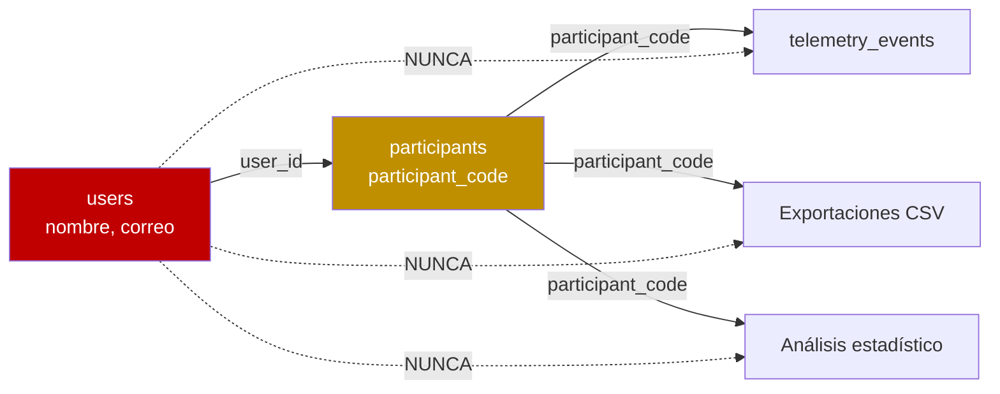
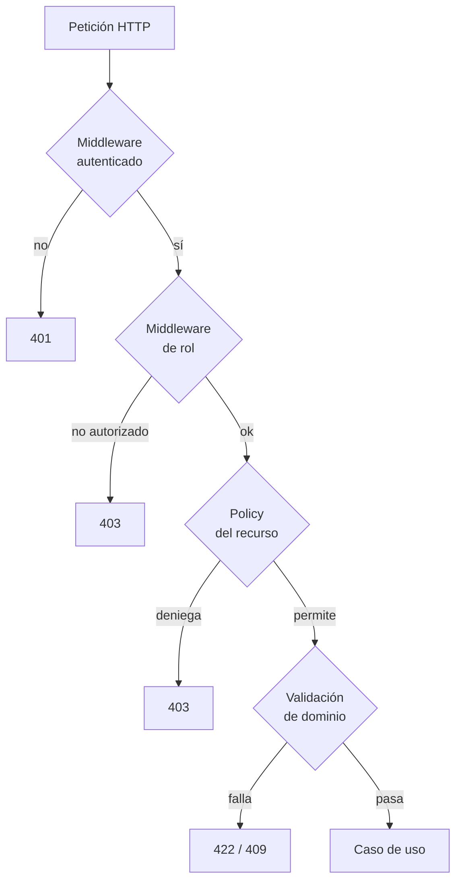

\
# 06 — Seguridad por diseño

> La seguridad no es una capa que se agrega al final. Cada decisión de este documento condiciona cómo se escribe el código desde el primer módulo.
>
> Marco legal aplicable: **Ley N.º 29733** (Protección de Datos Personales, Perú) y su reglamento **DS 016-2024-JUS**, vigente desde el 30/03/2025. El reglamento anterior (DS 003-2013-JUS) fue derogado — no lo cites.

---

## 1. Clasificación de los datos

No todos los datos merecen la misma protección. Esta tabla manda sobre todo lo demás.

| Nivel | Datos | Tratamiento |
|---|---|---|
| **Crítico** | Contenido del diario de bienestar, conversaciones con IA | Cifrado en reposo. Nadie más que el autor puede leerlo, ni el administrador |
| **Sensible** | Nombre, correo, código de estudiante, WhatsApp | Tabla separada, cifrado en campos de contacto, acceso restringido |
| **Interno** | Hábitos, misiones, sesiones Pomodoro, XP | Solo el dueño y el administrador (agregado) |
| **Seudonimizado** | Telemetría, agregados diarios | Solo `participant_code`. Base del dataset del artículo |
| **Público** | Alias, nivel, posición en ranking | Visible a otros participantes |

**Regla de oro:** un dato de nivel crítico o sensible **nunca** cruza a un log, a la telemetría o a una exportación. Si dudas de dónde poner algo, ponlo un nivel más arriba.

---

## 2. Seudonimización



`participant_code` se genera al registrar, con formato `EPY-XXXX` (4 caracteres alfanuméricos aleatorios, sin ambigüedad entre `0/O` ni `1/I`).

**La tabla `participants` es la única que vincula identidad real con código de estudio.** No sale nunca en una exportación. Al analizar los datos del artículo se trabaja exclusivamente con `participant_code`.

```php
// Al generar exportaciones, SIEMPRE:
$row['participant_code'] = $participant->participant_code;
// JAMÁS:
$row['name']  = $user->name;   // prohibido
$row['email'] = $user->email;  // prohibido
```

---

## 3. Cifrado en reposo

Campos cifrados con el cast `encrypted` de Laravel (AES-256-CBC con `APP_KEY`):

```php
// JournalEntryModel.php
protected $casts = [
    'content' => 'encrypted',
];

// ParticipantModel.php
protected $casts = [
    'student_code' => 'encrypted',
    'whatsapp'     => 'encrypted',
];

// AiMessageModel.php
protected $casts = [
    'body' => 'encrypted',
];
```

> **`APP_KEY` es la llave de todo.** Si se pierde, esos datos son irrecuperables. Guárdala en un gestor de contraseñas del equipo, **fuera del repositorio y fuera del servidor**. Nunca la subas a Git, ni siquiera en un `.env.example`.

Consecuencia técnica que hay que aceptar: **no se puede hacer `WHERE` ni `LIKE` sobre un campo cifrado.** Si necesitas buscar por WhatsApp, guarda además un hash determinista en una columna aparte y busca por él.

---

## 4. Autenticación

| Medida | Configuración |
|---|---|
| Hash de contraseña | bcrypt con `cost = 12` |
| Longitud mínima | 10 caracteres |
| Contraseñas filtradas | Rechazadas con la regla `Password::uncompromised()` de Laravel |
| Límite de intentos | 5 por minuto por IP (login tradicional y Google OAuth) |
| Bloqueo temporal | 15 min tras 10 intentos fallidos |
| Sesión | Expira a los 120 min de inactividad |
| 2FA | **Obligatorio para el rol `admin`** |
| Autenticación externa | **Google OAuth** integrado y preparado (pendiente de CLIENT_ID en producción) |
| Correo verificado | Requerido antes de participar en el estudio |

```php
// Regla de contraseña
Password::min(10)
    ->letters()
    ->numbers()
    ->uncompromised();  // consulta HaveIBeenPwned por k-anonimato, sin enviar la contraseña
```

El 2FA en administradores no es exceso: esa cuenta puede exportar el dataset completo del estudio.

---

## 5. Autorización

Tres capas, todas obligatorias:



**La Policy nunca se omite, ni siquiera en rutas "obvias".**

```php
// En el controlador, SIEMPRE
$this->authorize('complete', $habit);
```

Para el panel de administración, el middleware `EnsureUserIsAdmin` es la primera línea de defensa. Protege estrictamente todas las rutas de este módulo validando que el usuario autenticado posea el rol `admin` o bandera `is_admin`, rechazando la petición inmediatamente si no cumple.

Regla base: **un usuario solo accede a sus propios recursos.** Excepciones explícitas y limitadas:

| Recurso | Quién más puede verlo |
|---|---|
| Alias, nivel, posición | Todos los participantes (ranking) |
| Sesiones de estudio abiertas | Todos los participantes |
| Mensajes de una sesión | Solo participantes de esa sesión |
| Agregados estadísticos | Solo administradores |

**Nunca:** el diario, las conversaciones con IA, los hábitos concretos o las misiones de otro usuario. Ni siquiera para administradores.

---

## 6. Lo que el administrador NO puede hacer

Esto es tanto una medida de privacidad estricta conforme a la **Ley N.° 29733** (protegiendo los datos personales e información sensible - PII) como de **integridad científica**:

| Prohibido | Por qué |
|---|---|
| Leer contenido del diario | Dato sensible de salud mental |
| Leer mensajes del chat | Privacidad entre participantes |
| Leer conversaciones con IA | Puede contener información personal delicada |
| Ver nombre real junto al `participant_code` en el panel | Rompe la seudonimización del análisis |
| Modificar XP, niveles o telemetría | **Comprometería la integridad del dataset del artículo** |
| Borrar eventos de telemetría | Idem |

La última fila importa especialmente: si un administrador puede editar los datos, un revisor puede cuestionar todo el dataset. **El panel es de solo lectura sobre datos del estudio.** No implementes endpoints de escritura ahí.

---

## 7. Protección de la aplicación web

| Vector | Mitigación |
|---|---|
| Inyección SQL | Eloquent y consultas parametrizadas siempre. **Nunca** concatenar en `DB::raw()` |
| XSS | Vue escapa por defecto. **Prohibido `v-html`** con contenido de usuario |
| CSRF | Middleware de Laravel activo en todas las rutas con estado |
| Secuestro de sesión | Cookies `HttpOnly`, `Secure`, `SameSite=Lax` |
| Clickjacking | Cabecera `X-Frame-Options: DENY` |
| Sniffing de tipo MIME | `X-Content-Type-Options: nosniff` |
| Fuerza bruta | Rate limiting por ruta |
| Enumeración de IDs | Policies en cada recurso; considerar UUID públicos en rutas sensibles |
| Subida de archivos | **No hay subida de archivos en el MVP.** Los fondos son catálogo cerrado |

La última fila elimina de raíz toda una familia de vulnerabilidades. Es una decisión de diseño deliberada, no una limitación.

### Cabeceras de seguridad

```php
// Shared/Infrastructure/Http/Middleware/SecurityHeaders.php
$response->headers->set('X-Frame-Options', 'DENY');
$response->headers->set('X-Content-Type-Options', 'nosniff');
$response->headers->set('Referrer-Policy', 'strict-origin-when-cross-origin');
$response->headers->set('Permissions-Policy', 'geolocation=(), microphone=(), camera=()');
$response->headers->set('Strict-Transport-Security', 'max-age=31536000; includeSubDomains');
$response->headers->set('Content-Security-Policy',
    "default-src 'self'; " .
    "img-src 'self' data:; " .
    "font-src 'self'; " .              // fuentes autoalojadas, sin CDN de Google
    "connect-src 'self' https://api.deepseek.com; " .
    "frame-src https://www.youtube-nocookie.com; " .  // música opcional de Pomodoro, ver nota abajo
    "frame-ancestors 'none';"
);
```

La política de contenido no incluye CDN externos porque las fuentes están autoalojadas (ver `docs/04-DISENO-VISUAL.md` §5). Eso además evita que Google registre la IP de los participantes, lo que sería un tratamiento de datos no declarado en el consentimiento.

**Excepción deliberada — música opcional de Pomodoro (agregada 2026-07-29):** `Pomodoro/Index.vue`
embebe un reproductor de YouTube (playlist libre de copyright) detrás de un botón explícito
("Activar música") — nunca se carga solo, ni se recuerda "encendido" entre visitas (ver el
comentario en el propio componente). Mientras el reproductor está activo, **sí** genera el mismo
tipo de tratamiento de IP que el CSP de arriba evita para las fuentes: es tráfico real hacia
Google. Se mitigó con dos decisiones, no con evitarlo del todo (la función la pidió el usuario
explícitamente):

1. Dominio `youtube-nocookie.com` (modo "sin cookies" de YouTube), no `youtube.com` — reduce el
   tracking, no lo elimina.
2. Aviso visible en la propia pantalla antes de que el iframe exista en el DOM, explicando que
   activar la música comparte la IP con Google.

**Pendiente real, no resuelto por código:** si el consentimiento informado que firman los
participantes no menciona explícitamente "servicios de terceros opcionales que el propio
participante puede activar", conviene revisarlo antes de day 1 de recolección de datos — es
exactamente el tipo de tratamiento no declarado que este documento ya identificó como problema
una vez (Google Fonts). El código avisa en pantalla; el documento de consentimiento es una
decisión de producto/legal que no le corresponde a esta sesión resolver.

---

## 8. Límites de peticiones

```php
// Presentation/routes.php de cada módulo
RateLimiter::for('telemetry', fn($r) => Limit::perMinute(120)->by($r->user()->id));
RateLimiter::for('ai',        fn($r) => Limit::perMinute(5)->by($r->user()->id));
RateLimiter::for('chat',      fn($r) => Limit::perMinute(30)->by($r->user()->id));
RateLimiter::for('polling',   fn($r) => Limit::perMinute(20)->by($r->user()->id));
RateLimiter::for('auth',      fn($r) => Limit::perMinute(5)->by($r->ip()));
```

El límite de `polling` (20/min) tolera el intervalo de 5 s con margen, pero corta un cliente defectuoso que entre en bucle. Con 1 solo núcleo de CPU, eso protege a todos los demás usuarios.

---

## 9. Seguridad del asistente de IA

Riesgos específicos, alineados con ISO/IEC 23894:

| Riesgo | Mitigación |
|---|---|
| Inyección de prompt | Instrucciones del sistema separadas del input del usuario; nunca concatenar directamente |
| Fuga de datos personales al proveedor | No enviar nombre, correo ni contenido del diario a DeepSeek. Solo métricas agregadas |
| Consejo clínico inapropiado | Prompt del sistema prohíbe diagnóstico y tratamiento; protocolo de derivación |
| Contenido dañino | Filtro de la respuesta antes de mostrarla |
| Costo descontrolado | Cuota diaria por usuario, presupuesto global con alerta al 70% |
| Indisponibilidad del proveedor | Tiempo de espera 30 s, mensaje claro, **no se descuenta cuota** |

### Protocolo de derivación

Si el mensaje del usuario contiene señales de crisis (ideación suicida, autolesión, angustia severa), el sistema **no envía la consulta a DeepSeek**. Responde con un mensaje de contención escrito previamente y aprobado por el comité de ética, derivando al usuario a la **Línea 113 MINSA** (Ministerio de Salud) y al servicio de bienestar de la UPN.

Se registra `wellbeing.support_shown` **sin el motivo ni el texto**. No se notifica a administradores: eso violaría la confidencialidad y desincentivaría el uso honesto de la herramienta.

Este requisito viene del expediente del comité de ética del proyecto. **No es negociable ni se puede posponer a Fase 2.**

---

## 10. Derechos ARCO (Ley 29733)

El consentimiento informado promete estos derechos. Deben ser ejecutables:

| Derecho | Implementación |
|---|---|
| **Acceso** | El usuario descarga todos sus datos en JSON desde Ajustes |
| **Rectificación** | Edita su perfil directamente |
| **Cancelación** | Solicita retiro del estudio. Ver procedimiento abajo |
| **Oposición** | Puede dejar de participar en cualquier momento sin justificación |

### Procedimiento de retiro

**No se ejecuta un `DELETE`.** Al retirarse un participante:

1. Se marca `participants.withdrawn_at`
2. Se anonimizan los datos de identidad: `name`, `email`, `student_code`, `whatsapp` → `NULL`
3. Se conserva la telemetría asociada al `participant_code`, ya seudonimizada
4. Se registra el retiro en la bitácora del estudio

La razón: **la telemetría ya no es dato personal una vez desvinculada de la identidad.** Es dato de investigación anonimizado, y conservarlo es legítimo y necesario para la integridad del estudio. Esto debe estar explicado en el consentimiento informado que firman.

Si el participante exige el borrado total incluyendo sus datos anonimizados, se hace y se documenta la baja en la muestra. Ese caso se declara en las limitaciones del artículo.

---

## 11. Secretos y configuración

```
Nunca en el repositorio:
  APP_KEY
  DB_PASSWORD
  DEEPSEEK_API_KEY
  GOOGLE_CLIENT_SECRET
  MAIL_PASSWORD
```

`.env` en `.gitignore`. `.env.example` con claves vacías. Los secretos reales viven en el gestor de contraseñas del equipo y se configuran en el servidor.

**Seguridad de API Keys:**
**Rotar `DEEPSEEK_API_KEY` o `GOOGLE_CLIENT_SECRET` si alguna vez se pegan en un chat, en un issue o en una captura de pantalla.** Considerando que varias IA distintas van a trabajar en este repositorio, este riesgo es real. Nunca se deben enviar credenciales reales al LLM ni en los prompts.

---

## 12. Auditoría

Tabla `audit_log` para acciones administrativas:

```sql
CREATE TABLE audit_log (
    id          BIGINT UNSIGNED AUTO_INCREMENT PRIMARY KEY,
    admin_id    BIGINT UNSIGNED NOT NULL,
    action      VARCHAR(64) NOT NULL,
    target_type VARCHAR(64) NULL,
    target_id   BIGINT UNSIGNED NULL,
    ip_address  VARCHAR(45) NOT NULL,
    created_at  TIMESTAMP NOT NULL DEFAULT CURRENT_TIMESTAMP,
    INDEX idx_admin_date (admin_id, created_at)
) ENGINE=InnoDB;
```

Se registran: inicios de sesión de administrador, exportaciones de datos, consultas al panel de participantes y cualquier cambio de configuración.

**Las exportaciones se auditan siempre.** Es el momento en que los datos del estudio salen del sistema, y hay que poder responder quién, cuándo y qué exportó.

---

## 13. Verificación antes del despliegue

- [ ] `APP_DEBUG=false` en producción
- [ ] `APP_ENV=production`
- [ ] HTTPS forzado, HSTS activo
- [ ] Cabeceras de seguridad presentes (verificar con securityheaders.com)
- [ ] Sin credenciales en el repositorio (`git log -p | grep -i "password\|api_key"`)
- [ ] Rate limiting activo en todas las rutas de API
- [ ] Policies cubriendo cada recurso
- [ ] Campos sensibles cifrados y verificado en la base de datos
- [ ] Ningún dato personal en telemetría (inspección manual de 100 eventos reales)
- [ ] El panel de administración no expone diario, chat ni conversaciones de IA
- [ ] Protocolo de derivación de crisis probado con frases de prueba
- [ ] Copia de seguridad automática funcionando y **restauración probada**
- [ ] `APP_KEY` respaldada fuera del servidor

La penúltima casilla es la que más se olvida: **una copia de seguridad que nunca se probó restaurar no es una copia de seguridad.** Prueba la restauración completa en staging antes del día 43.
