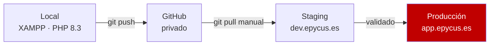

\
# 07 — Entornos y despliegue

> Hosting compartido Hostinger Premium. Las restricciones de este documento no son preferencias: son límites físicos de la plataforma que condicionan cómo se escribe el código.

---

## 1. Recursos disponibles

Datos reales de la cuenta:

| Recurso | Valor | Implicación |
|---|---|---|
| Disco | 100 GB (2,35 GB usados) | De sobra. Los assets van aquí, no en CDN externo |
| RAM | 2.048 MB | Suficiente |
| **Núcleos de CPU** | **1** | **Nada pesado en horario de uso** |
| Inodos | 400.000 (**151.585 ya usados**) | Sesiones y cache en base de datos, logs rotados |
| Procesos máx. | 80 | |
| **PHP workers** | **40** | Suficiente para la carga prevista |
| **IOPS** | **128** | **Telemetría en lotes, obligatorio** |
| E/S | 12.288 KB/s | Suficiente |
| Ancho de banda | Ilimitado | |
| Sitios web | 100 | **Permite tener staging sin costo extra** |
| SSH | Activo, puerto 65002 | Habilita Composer, artisan y despliegue por Git |
| Ubicación del servidor | **São Paulo, Brasil** | ~40-60 ms de latencia a Cajamarca. Muy bueno |

---

## 2. Lo que el hosting NO permite

| No disponible | Consecuencia | Solución adoptada |
|---|---|---|
| **WebSockets entrantes** | Laravel Reverb no funciona | Chat por **polling AJAX** cada 5 s |
| **Procesos demonio** | `queue:work` no puede correr permanente | Cron cada minuto con `--stop-when-empty` |
| Bind a puertos locales | Ningún servicio propio escuchando | — |
| Control del servidor | Sin systemd, sin supervisor | Todo por cron |

Hostinger permite conexiones WebSocket **salientes**, pero no que un proceso se quede escuchando conexiones **entrantes**. Por eso Reverb queda descartado; no es un problema de configuración.

**Nota sobre Moodle:** su módulo de chat funciona en cualquier hosting compartido precisamente porque no usa WebSockets, sino que los clientes consultan al servidor periódicamente. Es el mismo enfoque que adopta este proyecto.

---

## 3. Gotchas conocidos de Hostinger PHP-FPM

### ❌ `response()->stream()` / `StreamedResponse` no funciona
PHP-FPM con output buffering activo. `StreamedResponse` causa `ERR_INVALID_RESPONSE` porque los headers están enviados cuando PHP hace flush.

**Solución:** Construir en memoria con `php://temp` y devolver `response()` normal:
```php
$handle = fopen('php://temp', 'r+');
// ... escribir al handle ...
rewind($handle); $content = stream_get_contents($handle); fclose($handle);
return response($content, 200, ['Content-Type' => 'text/csv', ...]);
```

### ❌ `chunk()` requiere `orderBy()` obligatorio
MariaDB 11.x en Hostinger lanza `"You must specify an orderBy clause when using this function"` si se usa `chunk()` sin `orderBy()`. Siempre añadir `->orderBy('tabla.id')` antes de `->chunk()`.

### ⚠️ bfcache móvil muestra JSON crudo de Inertia
Chrome/Safari móvil restaura páginas desde bfcache con Vue congelado. Al navegar, el servidor devuelve JSON de Inertia que se muestra como texto plano (bug visual, no pérdida de datos).

**Solución aplicada (2026-08-13):**
1. `resources/js/app.js`: listener `pageshow` + `event.persisted` → `location.reload()`
2. `HandleInertiaRequests.php`: header `Vary: X-Inertia` en todas las respuestas

---

## 4. Carga prevista

Escenario pico ampliado (capacidad teórica comprobada de 1500-3000 DAU):

| Fuente | Cálculo | req/s |
|---|---|---|
| Navegación (300 usuarios concurrentes) | 1 req cada 30 s | 10,0 |
| Telemetría en lotes | 1 lote cada 30 s por usuario | 10,0 |
| Sincronización de Pomodoro | 1 req cada 25 min | 0,2 |
| Chat (30 sesiones × 5 personas, polling 5 s)| 150 ÷ 5 | 30,0 |
| **Total** | | **~50,2 req/s** |

Con 40 PHP workers y respuestas promedio de ~100 ms, el servidor en Hostinger Premium soporta teóricamente hasta 400 req/s, por lo que una concurrencia de 150-300 usuarios (1500-3000 DAU) operará sin saturar los recursos de 1 CPU y 2GB de RAM.

**El cuello de botella del proyecto no es el hosting, es el tiempo de desarrollo.**

---

## 4. Entornos



| Entorno | URL | Base de datos | Propósito |
|---|---|---|---|
| Local | `epycus.test` | `epycus_local` | Desarrollo |
| Staging | `dev.epycus.es` | `epycus_staging` | Pruebas con datos falsos |
| Producción | `app.epycus.es` | `epycus_prod` | **Los 66 días de intervención** |

> **Staging es obligatorio, no opcional.** El plan permite 100 sitios, así que no cuesta nada extra. Durante los 66 días, producción se congela y todo desarrollo continúa en staging. Sin esta separación, un despliegue a mitad de la intervención puede corromper los datos del estudio de forma irreversible.

---

## 5. Congelamiento de producción

**Del 07/09/2026 al 11/11/2026 no se despliega a `app.epycus.es`.**

Única excepción: un fallo que impida a los participantes usar la aplicación. En ese caso:

1. Reproducir el fallo en staging
2. Corregir y probar en staging
3. Registrar el incidente en la bitácora del proyecto: fecha, hora, qué falló, qué se cambió
4. Desplegar en horario de baja actividad (madrugada)
5. Verificar que la telemetría siguió registrando durante la ventana

El paso 3 no es burocracia: **cualquier cambio durante la intervención debe declararse en la sección de limitaciones del artículo.** Un revisor puede preguntar si el sistema fue idéntico para todos los participantes durante los 66 días.

---

## 6. Estructura en el servidor

Hostinger sirve desde `public_html`. Laravel espera servir desde `public/`. Estructura correcta:

```
/home/u897008619/
├── domains/
│   └── app.epycus.es/
│       ├── public_html/          ← raíz web (contenido de public/)
│       │   ├── index.php         (modificado, ver abajo)
│       │   ├── .htaccess
│       │   ├── build/            (salida de Vite)
│       │   └── assets/           (avatares, fondos)
│       └── laravel/              ← el resto de la aplicación, FUERA de la raíz web
│           ├── app/
│           ├── bootstrap/
│           ├── config/
│           ├── database/
│           ├── resources/
│           ├── routes/
│           ├── storage/
│           ├── vendor/
│           └── .env              ← nunca accesible por web
```

`public_html/index.php` ajustado:

```php
require __DIR__ . '/../laravel/vendor/autoload.php';
$app = require_once __DIR__ . '/../laravel/bootstrap/app.php';
```

**El código de la aplicación y el `.env` quedan fuera de la raíz web.** Si estuvieran dentro, una mala configuración del servidor podría exponer el `.env` con todas las credenciales.

---

## 7. Despliegue

```bash
# 1. En local: construir los assets
npm run build

# 2. Subir (rsync por SSH, excluyendo lo que no debe ir)
rsync -avz --delete \
  --exclude 'node_modules' \
  --exclude '.git' \
  --exclude '.env' \
  --exclude 'storage/logs/*' \
  --exclude 'storage/framework/cache/*' \
  -e "ssh -p 65002" \
  ./ u897008619@46.202.145.111:~/domains/app.epycus.es/laravel/

# 3. En el servidor
ssh -p 65002 u897008619@46.202.145.111
cd ~/domains/app.epycus.es/laravel

composer install --no-dev --optimize-autoloader
php artisan migrate --force
php artisan db:seed --class=AchievementsSeeder --force
php artisan db:seed --class=MotivationSeeder --force
php artisan config:cache
php artisan route:cache
php artisan view:cache
php artisan optimize
```

> **`node_modules` nunca se sube.** Son ~30.000 archivos: te comería casi el 20% de los inodos disponibles para nada. El build se hace en local y solo se sube `public/build`.

### Comandos de caché

`config:cache` es obligatorio en producción por rendimiento. Efecto secundario que hay que conocer: **`env()` devuelve `null` fuera de los archivos de configuración**. Por eso la regla de `docs/00-ARQUITECTURA.md` §12 de usar siempre `config()`.

---

## 8. Cron

Configurar en hPanel de Hostinger:

```bash
# Programador de Laravel — cada minuto
* * * * * cd ~/domains/app.epycus.es/laravel && php artisan schedule:run >> /dev/null 2>&1
```

Todo lo demás se declara en `routes/console.php`, no como crons separados:

```php
// routes/console.php
use Illuminate\Support\Facades\Schedule;

// Colas: sin demonio, procesar y salir
Schedule::command('queue:work --stop-when-empty --max-time=50')
    ->everyMinute()
    ->withoutOverlapping();

// Villano semanal, lunes 00:00 hora de Lima
Schedule::command('villains:assign-weekly')
    ->weeklyOn(1, '00:00')
    ->timezone('America/Lima');

// Misiones vencidas
Schedule::command('missions:mark-overdue')
    ->dailyAt('00:05')
    ->timezone('America/Lima');

// Reinicio de cuotas de IA
Schedule::command('ai:reset-quotas')
    ->dailyAt('00:00')
    ->timezone('America/Lima');

// Purga de mensajes de chat (efímeros, 7 días)
Schedule::command('chat:purge-old')->dailyAt('03:30');

// Copia de seguridad
Schedule::command('backup:database')->dailyAt('03:00');

// Agregados de telemetría — MADRUGADA, nunca en horario de uso
Schedule::command('telemetry:aggregate-daily')
    ->dailyAt('03:15')
    ->timezone('America/Lima');

// Limpieza de logs
Schedule::command('log:prune --days=14')->weeklyOn(7, '04:00');
```

**`--max-time=50` en la cola es deliberado:** el proceso termina antes de que el siguiente cron lo lance, evitando solapamiento. Junto con `withoutOverlapping()`, previene acumulación de procesos huérfanos que consumirían el límite de 80.

**Todo lo pesado a las 03:00–04:00.** Con 1 núcleo, generar agregados o copias de seguridad en horario de uso degrada la aplicación para todos.

---

## 9. Variables de entorno de producción

```env
APP_NAME=Epycus
APP_ENV=production
APP_DEBUG=false
APP_URL=https://app.epycus.es
APP_TIMEZONE=UTC          # UTC en base de datos; se convierte a Lima en presentación

DB_CONNECTION=mysql
DB_HOST=localhost
DB_DATABASE=u897008619_epycus
DB_USERNAME=u897008619_epycus
DB_PASSWORD=              # gestor de contraseñas del equipo, NUNCA en Git

# Obligatorio por el límite de inodos
SESSION_DRIVER=database
CACHE_STORE=database
QUEUE_CONNECTION=database

LOG_CHANNEL=daily
LOG_LEVEL=warning         # 'debug' llenaría el disco en días
LOG_DAILY_DAYS=14

DEEPSEEK_API_KEY=
DEEPSEEK_TIMEOUT=30
AI_DAILY_QUOTA=5

GOOGLE_CLIENT_ID=
GOOGLE_CLIENT_SECRET=
GOOGLE_REDIRECT_URI=https://app.epycus.es/auth/google/callback

# Fechas de la intervención — usadas para calcular intervention_day
INTERVENTION_START=2026-09-07
INTERVENTION_END=2026-11-11
```

`APP_DEBUG=false` es crítico: en `true`, un error muestra la traza completa con rutas del servidor y fragmentos de configuración.

---

## 10. Control de inodos

Ya hay 151.585 usados de 400.000. Presupuesto:

| Elemento | Inodos estimados |
|---|---|
| Laravel + `vendor/` | ~22.000 |
| Assets del avatar (400 PNG) | 400 |
| Fondos de pantalla | ~60 |
| Salida de Vite | ~50 |
| Logs (14 días × 3 canales) | ~42 |
| **Total del proyecto** | **~23.000** |

Queda margen amplio. Pero hay que vigilar:

```bash
# Contar inodos usados por carpeta
find ~/domains/app.epycus.es -type f | wc -l

# Los sospechosos habituales
find ~/domains/app.epycus.es/laravel/storage -type f | wc -l
```

Riesgos de crecimiento descontrolado: sesiones en archivo (por eso van en base de datos), cache en archivo (idem), logs sin rotar, y copias de seguridad acumuladas sin límite.

---

## 11. Assets: por qué se quedan en el hosting

Se evaluó Cloudflare R2. Decisión: **no usarlo.**

| Criterio | Hosting | R2 |
|---|---|---|
| Peso total de assets | ~42 MB | igual |
| Espacio disponible | 100 GB | 10 GB gratis |
| Latencia a Cajamarca | ~40-60 ms (São Paulo) | ~20 ms (PoP en Lima) |
| Consumo de PHP workers | **Cero** — LiteSpeed sirve estáticos | Cero |
| Dependencia externa | Ninguna | Una más |
| Configuración | Ninguna | Credenciales, SDK, bucket |

La ganancia sería ~20 ms de latencia a cambio de una dependencia externa adicional. **No compensa para 70 usuarios.** Los assets van en `public_html/assets/`.

Si en el futuro los assets crecieran mucho (por ejemplo con los objetos 3D de la tienda en Fase 2), se reevalúa.

---

## 12. Monitoreo durante la intervención

Revisión **diaria** del 07/09 al 11/11:

| Qué | Dónde | Alerta si |
|---|---|---|
| Usuarios activos hoy | Panel admin | < 60% de la muestra |
| Eventos de telemetría | Panel admin | Caída brusca respecto al día anterior |
| **Fallos de telemetría** | `storage/logs/telemetry-fail-*.log` | **Cualquier línea** |
| Errores de aplicación | `storage/logs/app-*.log` | Más de 10 al día |
| Cola atascada | `SELECT COUNT(*) FROM jobs` | > 50 pendientes |
| Espacio e inodos | hPanel | Inodos > 350.000 |
| Copia de seguridad del día | `storage/backups/` | Falta el archivo del día |

**Un fallo de telemetría es una alerta de nivel máximo.** Cada evento perdido es un dato irrecuperable del estudio.

Revisión **semanal**: descargar la copia de seguridad al Drive del equipo y ejecutar el export de telemetría como verificación de que el pipeline completo funciona.

---

## 13. Plan de contingencia

| Escenario | Acción |
|---|---|
| El hosting cae varias horas | Documentar la ventana exacta; declarar en limitaciones del artículo |
| Base de datos corrupta | Restaurar la copia de la noche anterior; se pierde 1 día como máximo |
| DeepSeek caído | La aplicación sigue funcionando sin el asistente; se registra la ventana |
| Se agotan los inodos | Purgar logs y cache antiguos; `php artisan optimize:clear` |
| Un participante pide su borrado | Procedimiento de `docs/06-SEGURIDAD.md` §10 |
| Fallo crítico a mitad de intervención | Corregir en staging, desplegar de madrugada, **documentar en la bitácora** |

Toda incidencia durante los 66 días va a la bitácora del proyecto con fecha, hora, duración y efecto sobre los datos. Ese registro es parte del anexo de calidad del dato del artículo (ISO/IEC 25012).

---

## 14. Antes del día 43

---

## 15. Guía de Pruebas Locales y Despliegue mediante SSH (Paso a Paso)

### A. Flujo de Desarrollo y Pruebas en Entorno Local

Para continuar realizando pruebas locales antes de enviar cualquier cambio a producción:

1. **Iniciar el servidor local backend:**
   ```bash
   php artisan serve
   ```
   *Acceso:* `http://127.0.0.1:8000`

2. **Iniciar el servidor de desarrollo frontend (Vite Hot Reload):**
   ```bash
   npm run dev
   ```

3. **Ejecutar la suite completa de pruebas unitarias e integración (100 tests):**
   ```bash
   php vendor/bin/phpunit --testdox
   ```

4. **Verificar formato de código con Laravel Pint:**
   ```bash
   vendor/bin/pint
   ```

---

### B. Procedimiento de Despliegue a Hostinger mediante SSH (`pscp` / `plink`)

Cuando tus pruebas locales pasen al 100% y desees publicar las actualizaciones en Hostinger:

#### Paso 1: Compilar los Assets Frontend en Local
```bash
npm run build
```
*(Esto genera la carpeta optimizada `public/build/` con el manifest e imágenes)*.

#### Paso 2: Subir los Archivos Modificados al Servidor
Utiliza `pscp` desde la consola de Windows (PowerShell/CMD):

- **Subir carpeta de assets compilados (`public/build`):**
  ```bash
  pscp -r -batch -hostkey "SHA256:5NPmo7Lsf5dX4VteyZJK2tpslJ3r/zQxyZbWxhjS5+k" -P 65002 -pw "Marco123:)" public/build u897008619@46.202.145.111:/home/u897008619/domains/epycus.es/public_html/app/public/
  ```

- **Subir un controlador o archivo PHP específico:**
  ```bash
  pscp -batch -hostkey "SHA256:5NPmo7Lsf5dX4VteyZJK2tpslJ3r/zQxyZbWxhjS5+k" -P 65002 -pw "Marco123:)" app/Http/Controllers/Auth/GoogleAuthController.php u897008619@46.202.145.111:/home/u897008619/domains/epycus.es/public_html/app/app/Http/Controllers/Auth/GoogleAuthController.php
  ```

- **Subir el archivo de configuración `.env.production` como `.env`:**
  ```bash
  pscp -batch -hostkey "SHA256:5NPmo7Lsf5dX4VteyZJK2tpslJ3r/zQxyZbWxhjS5+k" -P 65002 -pw "Marco123:)" .env.production u897008619@46.202.145.111:/home/u897008619/domains/epycus.es/public_html/app/.env
  ```

#### Paso 3: Limpiar y Reconstruir Caché en Producción mediante `plink`
Ejecuta el siguiente comando remoto para aplicar los cambios de inmediato en Hostinger:

```bash
plink -batch -hostkey "SHA256:5NPmo7Lsf5dX4VteyZJK2tpslJ3r/zQxyZbWxhjS5+k" -P 65002 -pw "Marco123:)" u897008619@46.202.145.111 "cd /home/u897008619/domains/epycus.es/public_html/app && php artisan view:clear && php artisan route:clear && php artisan cache:clear && php artisan config:cache && php artisan route:cache && php artisan view:cache"
```

---

### C. Manejo de Archivos `.zip` y Respaldos (Uso de deploy.bat)

Para usar el script `deploy.bat` y enviar las compilaciones rápidamente al servidor:

1. **Atención crítica al empaquetar `build.zip`:**
   **NUNCA** comprimas la carpeta `build` completa desde la interfaz de Windows (click derecho -> Comprimir), ya que creará una ruta anidada (`build/build/manifest.json`), lo cual romperá la lectura de assets en producción.
   Para que el script `unzip` del servidor descomprima los archivos en la raíz correcta, **comprime únicamente el contenido interno**.

   Usa este comando exacto en **PowerShell**:
   ```powershell
   cd public
   Compress-Archive -Path "build\*" -DestinationPath "..\build.zip" -Force
   cd ..
   ```

2. Ejecuta tu script `deploy.bat`. Este se encargará de:
   - Subir `build.zip` mediante `pscp`.
   - Conectarse mediante `plink` y ejecutar la extracción de manera segura (`unzip -o ../build.zip`).
   - Limpiar toda la caché de vistas y rutas de Laravel (`artisan optimize:clear`).

- *Nota:* Los archivos `.zip` en la raíz (`epycus-app.zip`, `build.zip`) están incluidos en `.gitignore` para no sobrecargar el repositorio Git. Puedes conservarlos o eliminarlos localmente si deseas liberar espacio.

