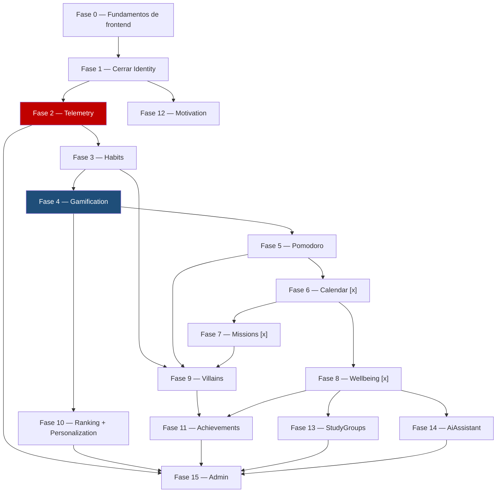

\
# 13 — Hoja de ruta de desarrollo

> Plan de fases para construir el sistema completo. Este documento es el **plan**, no la
> bitácora — qué se hizo, qué decisiones se tomaron y cómo se verificó cada sesión va en
> `docs/12-HISTORIAL.md`, no acá. Actualiza solo el checkbox de estado de cada fase a medida
> que se completa.

---

## Cómo usar este documento

1. Antes de programar, mira qué fase está en curso (`[~]`) y léela completa.
2. No saltes de fase sin que el usuario lo pida explícitamente — el orden no es arbitrario,
   está explicado en cada sección.
3. Al terminar una fase: marca su checkbox `[x]`, y agrega la entrada correspondiente en
   `docs/12-HISTORIAL.md` (regla ya existente en `docs/11-ESTANDAR-CODIGO.md`).
4. Si una fase revela que el orden debía ser otro, actualiza este documento y explica por qué
   en el historial — no lo cambies en silencio.

---

## Por qué el orden es así

Con Inertia, backend y frontend no se separan por capas: cada pantalla necesita ruta +
controlador + página Vue a la vez. Por eso este plan no es "todo el backend, después todo el
frontend" — es una base visual que se construye una sola vez, seguida de **un módulo completo
a la vez, de punta a punta** (Domain → Application → Infrastructure → Presentation + páginas
Vue), en el orden que impone el mapa de eventos de `docs/01-MODULOS.md`.

Rojo y azul son los módulos que `docs/01-MODULOS.md` marca como críticos — Telemetry y
Gamification. Todo lo que viene después depende de que esos dos estén sólidos, no al revés.

**Nota sobre esta versión del diagrama (2026-07-29):** las fases 6 en adelante se reordenaron y
completaron respecto a la versión anterior de este documento, que solo tenía 7 fases pendientes
(Missions, Wellbeing, Villains, Ranking+Personalization, StudyGroups, AiAssistant, Admin) pese a
que `docs/01-MODULOS.md` documenta 16 módulos en total. Se agregaron `Calendar`, `Achievements`
y `Motivation`, que ya estaban descritos en `01-MODULOS.md` pero no tenían fila propia acá — ver
el razonamiento completo de cada posición en `docs/14-HISTORIAS-USUARIO.md` ("Orden recomendado").
Si volvés a renumerar, actualizá los dos documentos juntos.

---

## Fase 0 — Fundamentos de frontend

**Estado:** `[x]` Completa (2026-07-28)

Se construye **una sola vez**. Saltarla significa rehacer cada pantalla de Identity cuando
llegue el sistema de diseño real.

- [x] Tokens de diseño en Tailwind (paleta OKLCH, `data-theme` claro/oscuro, `data-surface`
      neumorfismo/vidrio) — `resources/css/app.css` + `tailwind.config.js`
- [x] Componentes base que reemplazan los de Breeze: `BaseButton`, `BaseCard`, `BaseInput`,
      `BaseSelect`, `BaseModal`, `BaseBadge`, `EmptyState`, `LoadingSpinner` en
      `resources/js/Components/ui/`. `ProgressBar`/`StreakFlame`/`AvatarDisplay`/`MoodSelector`
      quedan para sus fases (Gamification, Wellbeing) — no se inventó su forma final ahora.
- [x] Layout autenticado principal (`AppLayout.vue`) — barra lateral desktop, barra inferior
      móvil, reemplaza `AuthenticatedLayout.vue` de Breeze (borrado)
- [x] Selector de `surface_mode` conectado a `UserPreferences` (`SurfaceModeToggle.vue` +
      `PATCH /preferences`)

**Hallazgo importante de esta fase:** las rutas de Identity (`/consent`, `/preferences`,
`/profile/complete`) no tenían el middleware `web` — se cargan vía
`IdentityServiceProvider::loadRoutesFrom()`, que no hereda el grupo `web` que
`bootstrap/app.php` aplica solo a `routes/web.php`. Sin `web` no hay sesión/CSRF real y
`auth()` fallaba en silencio con 401, **pese a que el usuario estuviera logueado de verdad**.
Ningún test con `actingAs()` lo detectaba porque ese helper no pasa por el middleware de
sesión basado en cookies — solo lo reveló probar contra un navegador real. Corregido, y se
agregó `tests/Feature/Identity/RoutesHaveWebMiddlewareTest.php` para que no vuelva a pasar
desapercibido. Detalle completo en `docs/12-HISTORIAL.md`.

---

## Fase 1 — Cerrar el círculo de Identity

**Estado:** `[x]` Completa (2026-07-28)

El backend de Identity está completo y probado (`docs/12-HISTORIAL.md`, sesiones del
2026-07-28). Lo que falta es exclusivamente frontend:

- `resources/js/Pages/Identity/CompleteProfile.vue` — **`ProfileController::edit()` ya intenta
  renderizar esta página y no existe todavía; hoy esa ruta rompe.**
- Pantalla de consentimiento (conecta a `POST /consent`, ya implementado)
- Pantalla de preferencias (conecta a `PATCH /preferences`, ya implementado)
- Restyling de Login/Register/Dashboard con los componentes de la Fase 0

---

## Fase 2 — Telemetry

**Estado:** `[x]` Completa (2026-07-28)

Backend únicamente. Es el módulo crítico: "si falla, se pierde el estudio" (`docs/01-MODULOS.md`).
Va antes que Habits a propósito — todos los módulos de contenido van a llamar a
`useTelemetry().track(...)` desde el primer commit, así que el composable y el endpoint de
inserción por lotes tienen que existir antes de que se necesiten, no después como parche.

Detalle completo del esquema y las reglas en `docs/02-TELEMETRIA.md`.

---

## Fase 3 en adelante — un módulo completo por vez

A partir de acá, cada fase es un módulo entero (Domain → Presentation + Vue), copiando
estructuralmente a `Identity` como referencia (`docs/11-ESTANDAR-CODIGO.md` §1, "Regla cero").

| Fase | Módulo | Por qué en este orden |
|---|---|---|
| 3 | **Habits** `[x]` (2026-07-28, expandido 2026-08-17) | El mas simple. Primer contenido real, sienta el patron que copian los demas. Expandido con: plantillas atomicas rapidas (1-clic fill), Habit Stacking (`cue_trigger`), filtros por momento del dia (`time_of_day`), vista dual semanal (tira 7 dias) + heatmap mensual, coaching anti-frustracion y conexion directa con Pomodoro. |
| 4 | **Gamification** `[x]` (2026-07-28) 🔵 crítico | XP, niveles, fases, racha con gracia y monedero — completo y con tests. Achievements y Villains NO se tocaron: van en sus propias fases (§17 de docs/01-MODULOS.md los ubica después de Ranking). Los 400 assets Funko Pop del avatar tampoco existen (encargo de arte, no de código) — el Dashboard muestra el progreso en texto/números, sin imagen. |
| 5 | **Pomodoro** `[x]` (2026-07-29, ampliado 2026-08-15) | Temporizador en el cliente con sincronización multi-pestaña y recarga resiliente (`activeSession` / `localStorage`). Soporte universal para cualquier enlace o playlist de YouTube (`youtube-nocookie.com`), shorts, mixes o embeds. |
| 6 | **Calendar** `[x]` (2026-07-29, ampliado 2026-08-15) | Vista dedicada en `/calendar`. Modelo relacional de Cursos (`courses`) multi-sesión con fecha de inicio y fin (`starts_at` a `ends_at`), bloc de apuntes integrados con subida de imágenes (`note_images`) y sembrado oficial de 16 Feriados Peruanos (2025–2028). |
| 7 | **Missions** `[x]` (2026-07-29, expandido 2026-08-17) | Trae `subtasks`, mas complejidad de UI que Pomodoro. Usa Calendar para vencimientos. Expandido con: Tablero Kanban de 4 columnas (Lista, En Proceso, En Revision, Terminado) con post-its interactivos, Matriz de Eisenhower (Q1-Q4) con cuadrantes estilizados, `ChangeQuadrantUseCase`, subtareas en post-its con `+ Anadir paso...`, tips pedagogicos sobre Q2 y priorizacion, integracion de badges de cuadrante en Pomodoro y contexto enriquecido para Edy IA. |
| 8 | **Wellbeing** `[x]` (2026-07-29) | Diario + mood score + health fields (energía, estrés, sueño, actividad física, consejos). Dato crítico (cifrado). Usa Calendar para marcar feriados/exámenes en su vista de calendario. Conectado a Pomodoro vía tabla pivote `pomodoro_session_subtask`. |
| 9 | **Villains** `[x]` (2026-07-29, expandido 2026-08-17) | Consume eventos de Habits, Pomodoro y Missions para danar HP — necesita que los tres ya emitan sus eventos de dominio. Expandido de 5 a 10 bosses academicos (nuevos: Sindrome del Impostor, Perfeccionismo Paralizante, Aislamiento Academico, Sobrecarga/Burnout, Ilusion de la Ultima Noche). Nuevas features: Bestiario / Sala de Trofeos con victorias acumuladas, Botones de Ataque Directo inter-modulo, Playbook Estrategico con 3 tecnicas psicologicas por villano, Battle Log semanal en vivo. |
| 10 | **Ranking + Personalization** `[x]` (2026-07-30) | Módulo Ranking completo en `/ranking` con podio, telemetría (`ranking.viewed`), caché 7 min y posición propia. Catálogo de paletas implementado (`PaletteToggle.vue`). Selector de wallpapers pospuesto por decisión de equipo. |
| 11 | **Achievements** `[x]` (2026-07-30) | Módulo completo en `/achievements`. Catálogo de insignias sin comparación social ni penalizaciones (regla ética de investigación). Desbloqueos idempotentes en `EvaluateAchievementsUseCase` con recompensas de XP. |
| 12 | **Motivation** `[x]` (2026-07-30) | Frases de inicio de sesión rotadas con `NoRepeatPicker` (con honestidad de atribución), tips contextuales por módulo con `<UsageTipBanner />` y registro de telemetría (`quote.shown`, `tip.shown`, `tip.dismissed`). |
| 13 | **StudyGroups** `[x]` (2026-07-29) | Salas + chat con polling (nunca WebSocket — hosting compartido); autocontenido pero más trabajo de infraestructura (rate limiting, purga a 7 días). |
| 14 | **AiAssistant** `[x]` (2026-07-30) | Integrado con DeepSeek API (`deepseek-v4-flash`), cuota diaria (5/día), inyección de contexto anónimo (sin PII), protocolo de crisis con Línea 113 MINSA y valoraciones de respuesta. |
| 15 | **Admin** `[x]` (2026-07-30) | Panel de administración para investigadores en `/admin` de solo lectura (6 pestañas: Dashboard, Participantes sin PII, Deserción, Telemetría, Exportación CSV y Salud del Sistema) con middleware `EnsureUserIsAdmin` y botón de acceso en Login. |

**A partir de la Fase 6, antes de programar cada módulo leer también su bloque completo en
`docs/14-HISTORIAS-USUARIO.md`** (historias de usuario + criterios de aceptación Given/When/Then,
citando siempre la regla exacta de `docs/01-MODULOS.md` de la que sale — y marcando
explícitamente con ⚠️ las decisiones de producto que todavía no están tomadas, para no
inventarlas a ciegas).

---

## Backlog / fuera de alcance por ahora

- **Fase 2 (post-intervencion):** Tienda interna cosmetica con three.js y objetos 3D.
- Todos los modulos del MVP estan implementados, verificados (131 tests / 419 assertions) y desplegados en produccion (`app.epycus.es`).
- Expansiones futuras de catalogo (frases, tips, logros) permitidas durante la intervencion como unica excepcion al congelamiento de despliegue.
