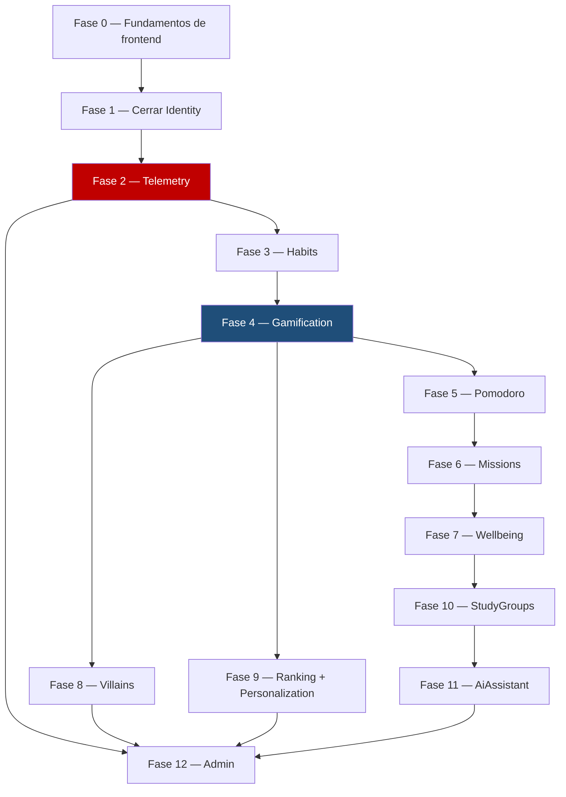

\
# 13 — Hoja de ruta de desarrollo

> Plan de fases para construir el sistema completo. Este documento es el **plan**, no la
> bitácora — qué se hizo, qué decisiones se tomaron y cómo se verificó cada sesión va en
> `docs/12-HISTORIAL.md`, no acá. Actualiza solo el checkbox de estado de cada fase a medida
> que se completa.

---

## Cómo usar este documento

1. Antes de programar, mira qué fase está en curso (`[~]`) y léela completa.
2. No saltes de fase sin que el usuario lo pida explícitamente — el orden no es arbitrario,
   está explicado en cada sección.
3. Al terminar una fase: marca su checkbox `[x]`, y agrega la entrada correspondiente en
   `docs/12-HISTORIAL.md` (regla ya existente en `docs/11-ESTANDAR-CODIGO.md`).
4. Si una fase revela que el orden debía ser otro, actualiza este documento y explica por qué
   en el historial — no lo cambies en silencio.

---

## Por qué el orden es así

Con Inertia, backend y frontend no se separan por capas: cada pantalla necesita ruta +
controlador + página Vue a la vez. Por eso este plan no es "todo el backend, después todo el
frontend" — es una base visual que se construye una sola vez, seguida de **un módulo completo
a la vez, de punta a punta** (Domain → Application → Infrastructure → Presentation + páginas
Vue), en el orden que impone el mapa de eventos de `docs/01-MODULOS.md`.

Rojo y azul son los módulos que `docs/01-MODULOS.md` marca como críticos — Telemetry y
Gamification. Todo lo que viene después depende de que esos dos estén sólidos, no al revés.

---

## Fase 0 — Fundamentos de frontend

**Estado:** `[ ]` No empezada

Se construye **una sola vez**. Saltarla significa rehacer cada pantalla de Identity cuando
llegue el sistema de diseño real.

- Tokens de diseño en Tailwind (paleta OKLCH, `data-theme` claro/oscuro, `data-surface`
  neumorfismo/vidrio) — ver `docs/04-DISENO-VISUAL.md` y cargar la skill `epycus-ui`
- Componentes base que reemplazan los de Breeze (`BaseButton`, `BaseInput`, `BaseCard`, etc. —
  nomenclatura de `docs/11-ESTANDAR-CODIGO.md` §3)
- Layout autenticado principal
- Selector de `surface_mode` conectado a `UserPreferences` (backend ya existe, ver
  `PATCH /preferences`)

---

## Fase 1 — Cerrar el círculo de Identity

**Estado:** `[ ]` No empezada

El backend de Identity está completo y probado (`docs/12-HISTORIAL.md`, sesiones del
2026-07-28). Lo que falta es exclusivamente frontend:

- `resources/js/Pages/Identity/CompleteProfile.vue` — **`ProfileController::edit()` ya intenta
  renderizar esta página y no existe todavía; hoy esa ruta rompe.**
- Pantalla de consentimiento (conecta a `POST /consent`, ya implementado)
- Pantalla de preferencias (conecta a `PATCH /preferences`, ya implementado)
- Restyling de Login/Register/Dashboard con los componentes de la Fase 0

---

## Fase 2 — Telemetry

**Estado:** `[ ]` No empezada

Backend únicamente. Es el módulo crítico: "si falla, se pierde el estudio" (`docs/01-MODULOS.md`).
Va antes que Habits a propósito — todos los módulos de contenido van a llamar a
`useTelemetry().track(...)` desde el primer commit, así que el composable y el endpoint de
inserción por lotes tienen que existir antes de que se necesiten, no después como parche.

Detalle completo del esquema y las reglas en `docs/02-TELEMETRIA.md`.

---

## Fase 3 en adelante — un módulo completo por vez

A partir de acá, cada fase es un módulo entero (Domain → Presentation + Vue), copiando
estructuralmente a `Identity` como referencia (`docs/11-ESTANDAR-CODIGO.md` §1, "Regla cero").

| Fase | Módulo | Por qué en este orden |
|---|---|---|
| 3 | **Habits** | El más simple. Primer contenido real, sienta el patrón que copian los demás. |
| 4 | **Gamification** 🔴 crítico | Escucha los eventos de Habits — no tiene sentido construirlo antes de tener algo que emita XP. |
| 5 | **Pomodoro** | Independiente; se vincula opcionalmente a una misión (`mission_id` nullable). |
| 6 | **Missions** | Trae `subtasks`, más complejidad de UI que Pomodoro. |
| 7 | **Wellbeing** | Diario + mood score; dato crítico (cifrado), conviene que Gamification ya esté maduro antes de otorgarle XP. |
| 8 | **Villains** | Consume el bus de eventos de Gamification/Habits para dañar HP. |
| 9 | **Ranking + Personalization** | Solo *leen* de Gamification por contrato (`docs/01-MODULOS.md`) — no pueden ir antes que su fuente. |
| 10 | **StudyGroups** | Salas + chat con polling; autocontenido pero más trabajo de infraestructura (rate limiting, purga a 7 días). |
| 11 | **AiAssistant** | Depende de presupuesto/cuota de DeepSeek y del protocolo de derivación de crisis (`docs/06-SEGURIDAD.md` §9) — el más sensible, va casi al final a propósito. |
| 12 | **Admin** | Panel de solo lectura sobre todos los módulos anteriores. No puede ir antes que ellos. |

---

## Backlog / fuera de alcance por ahora

- `session_participants`, `ai_conversations`, `ai_messages`: sin schema físico todavía (ver
  `docs/05-BASE-DATOS.md` §2.1). Se define recién en la Fase 10/11, cuando corresponde — no
  antes.
- `UserPreferences`/`RecordConsent` ya implementados (Fase de Identity, sesión 2026-07-28).
