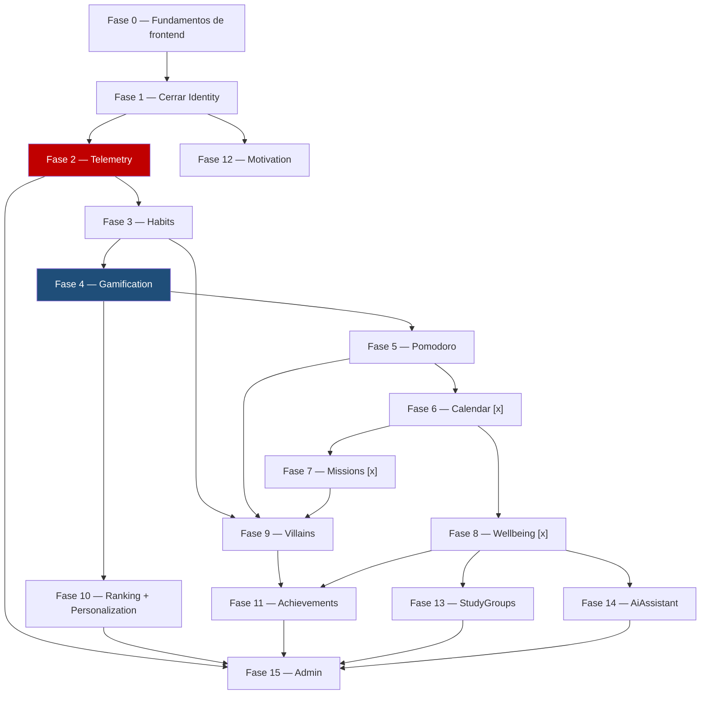

\
# 13 — Hoja de ruta de desarrollo

> Plan de fases para construir el sistema completo. Este documento es el **plan**, no la
> bitácora — qué se hizo, qué decisiones se tomaron y cómo se verificó cada sesión va en
> `docs/12-HISTORIAL.md`, no acá. Actualiza solo el checkbox de estado de cada fase a medida
> que se completa.

---

## Cómo usar este documento

1. Antes de programar, mira qué fase está en curso (`[~]`) y léela completa.
2. No saltes de fase sin que el usuario lo pida explícitamente — el orden no es arbitrario,
   está explicado en cada sección.
3. Al terminar una fase: marca su checkbox `[x]`, y agrega la entrada correspondiente en
   `docs/12-HISTORIAL.md` (regla ya existente en `docs/11-ESTANDAR-CODIGO.md`).
4. Si una fase revela que el orden debía ser otro, actualiza este documento y explica por qué
   en el historial — no lo cambies en silencio.

---

## Por qué el orden es así

Con Inertia, backend y frontend no se separan por capas: cada pantalla necesita ruta +
controlador + página Vue a la vez. Por eso este plan no es "todo el backend, después todo el
frontend" — es una base visual que se construye una sola vez, seguida de **un módulo completo
a la vez, de punta a punta** (Domain → Application → Infrastructure → Presentation + páginas
Vue), en el orden que impone el mapa de eventos de `docs/01-MODULOS.md`.

Rojo y azul son los módulos que `docs/01-MODULOS.md` marca como críticos — Telemetry y
Gamification. Todo lo que viene después depende de que esos dos estén sólidos, no al revés.

**Nota sobre esta versión del diagrama (2026-07-29):** las fases 6 en adelante se reordenaron y
completaron respecto a la versión anterior de este documento, que solo tenía 7 fases pendientes
(Missions, Wellbeing, Villains, Ranking+Personalization, StudyGroups, AiAssistant, Admin) pese a
que `docs/01-MODULOS.md` documenta 16 módulos en total. Se agregaron `Calendar`, `Achievements`
y `Motivation`, que ya estaban descritos en `01-MODULOS.md` pero no tenían fila propia acá — ver
el razonamiento completo de cada posición en `docs/14-HISTORIAS-USUARIO.md` ("Orden recomendado").
Si volvés a renumerar, actualizá los dos documentos juntos.

---

## Fase 0 — Fundamentos de frontend

**Estado:** `[x]` Completa (2026-07-28)

Se construye **una sola vez**. Saltarla significa rehacer cada pantalla de Identity cuando
llegue el sistema de diseño real.

- [x] Tokens de diseño en Tailwind (paleta OKLCH, `data-theme` claro/oscuro, `data-surface`
      neumorfismo/vidrio) — `resources/css/app.css` + `tailwind.config.js`
- [x] Componentes base que reemplazan los de Breeze: `BaseButton`, `BaseCard`, `BaseInput`,
      `BaseSelect`, `BaseModal`, `BaseBadge`, `EmptyState`, `LoadingSpinner` en
      `resources/js/Components/ui/`. `ProgressBar`/`StreakFlame`/`AvatarDisplay`/`MoodSelector`
      quedan para sus fases (Gamification, Wellbeing) — no se inventó su forma final ahora.
- [x] Layout autenticado principal (`AppLayout.vue`) — barra lateral desktop, barra inferior
      móvil, reemplaza `AuthenticatedLayout.vue` de Breeze (borrado)
- [x] Selector de `surface_mode` conectado a `UserPreferences` (`SurfaceModeToggle.vue` +
      `PATCH /preferences`)

**Hallazgo importante de esta fase:** las rutas de Identity (`/consent`, `/preferences`,
`/profile/complete`) no tenían el middleware `web` — se cargan vía
`IdentityServiceProvider::loadRoutesFrom()`, que no hereda el grupo `web` que
`bootstrap/app.php` aplica solo a `routes/web.php`. Sin `web` no hay sesión/CSRF real y
`auth()` fallaba en silencio con 401, **pese a que el usuario estuviera logueado de verdad**.
Ningún test con `actingAs()` lo detectaba porque ese helper no pasa por el middleware de
sesión basado en cookies — solo lo reveló probar contra un navegador real. Corregido, y se
agregó `tests/Feature/Identity/RoutesHaveWebMiddlewareTest.php` para que no vuelva a pasar
desapercibido. Detalle completo en `docs/12-HISTORIAL.md`.

---

## Fase 1 — Cerrar el círculo de Identity

**Estado:** `[x]` Completa (2026-07-28)

El backend de Identity está completo y probado (`docs/12-HISTORIAL.md`, sesiones del
2026-07-28). Lo que falta es exclusivamente frontend:

- `resources/js/Pages/Identity/CompleteProfile.vue` — **`ProfileController::edit()` ya intenta
  renderizar esta página y no existe todavía; hoy esa ruta rompe.**
- Pantalla de consentimiento (conecta a `POST /consent`, ya implementado)
- Pantalla de preferencias (conecta a `PATCH /preferences`, ya implementado)
- Restyling de Login/Register/Dashboard con los componentes de la Fase 0

---

## Fase 2 — Telemetry

**Estado:** `[x]` Completa (2026-07-28)

Backend únicamente. Es el módulo crítico: "si falla, se pierde el estudio" (`docs/01-MODULOS.md`).
Va antes que Habits a propósito — todos los módulos de contenido van a llamar a
`useTelemetry().track(...)` desde el primer commit, así que el composable y el endpoint de
inserción por lotes tienen que existir antes de que se necesiten, no después como parche.

Detalle completo del esquema y las reglas en `docs/02-TELEMETRIA.md`.

---

## Fase 3 en adelante — un módulo completo por vez

A partir de acá, cada fase es un módulo entero (Domain → Presentation + Vue), copiando
estructuralmente a `Identity` como referencia (`docs/11-ESTANDAR-CODIGO.md` §1, "Regla cero").

| Fase | Módulo | Por qué en este orden |
|---|---|---|
| 3 | **Habits** `[x]` (2026-07-28) | El más simple. Primer contenido real, sienta el patrón que copian los demás. |
| 4 | **Gamification** `[x]` (2026-07-28) 🔵 crítico | XP, niveles, fases, racha con gracia y monedero — completo y con tests. Achievements y Villains NO se tocaron: van en sus propias fases (§17 de docs/01-MODULOS.md los ubica después de Ranking). Los 400 assets Funko Pop del avatar tampoco existen (encargo de arte, no de código) — el Dashboard muestra el progreso en texto/números, sin imagen. |
| 5 | **Pomodoro** `[x]` (2026-07-29, ampliado 2026-07-29) | Temporizador en el cliente, sincronizado con el servidor solo en las transiciones (`docs/01-MODULOS.md §3`). Sesión vencida mientras el usuario no estaba se resuelve sola al volver a abrir el módulo (`ResolveStaleSessionUseCase`) — no hay timer en el servidor. `mission_id` queda nullable, sin usar todavía (Missions no existe). **Ampliado el mismo día** con meta de estudio diaria, validación de ratio foco/descanso (tope 40%, investigado contra la técnica real), descanso largo automático cada 4 ciclos, y música de fondo opcional vía YouTube (opt-in, `youtube-nocookie.com`) — todo documentado en `docs/01-MODULOS.md §3` "Ciclo completo, meta de estudio y música". |
| 6 | **Calendar** `[x]` (2026-07-29) | Sin interfaz propia. `Missions` y `Wellbeing` ya lo necesitan (`docs/01-MODULOS.md §15`); `CalendarReaderInterface` ya existe en `app/Shared/Domain/Contracts/` sin implementación real todavía. Historias de usuario en `docs/14-HISTORIAS-USUARIO.md`. |
| 7 | **Missions** `[x]` (2026-07-29) | Trae `subtasks`, más complejidad de UI que Pomodoro. Usa Calendar para vencimientos. |
| 8 | **Wellbeing** `[x]` (2026-07-29) | Diario + mood score + health fields (energía, estrés, sueño, actividad física, consejos). Dato crítico (cifrado). Usa Calendar para marcar feriados/exámenes en su vista de calendario. Conectado a Pomodoro vía tabla pivote `pomodoro_session_subtask`. |
| 9 | **Villains** | Consume eventos de Habits, Pomodoro y Missions para dañar HP — necesita que los tres ya emitan sus eventos de dominio. |
| 10 | **Ranking + Personalization** | Solo *leen* de Gamification por contrato (`docs/01-MODULOS.md`) — no pueden ir antes que su fuente. |
| 11 | **Achievements** | Escucha eventos de Habits, Pomodoro, Missions, Villains y Wellbeing (incluido `VillainDefeated`) — por diseño va después de todos esos. |
| 12 | **Motivation** | Contenido estático (frases + tips), sin dependencias reales más allá de Identity — puede adelantarse en paralelo a cualquier fase anterior si hay más de una persona disponible. |
| 13 | **StudyGroups** | Salas + chat con polling (nunca WebSocket — el hosting no lo permite); autocontenido pero más trabajo de infraestructura (rate limiting, purga a 7 días). |
| 14 | **AiAssistant** | Depende de que Wellbeing ya exista (una de sus tres fuentes de contexto) y del protocolo de derivación de crisis (`docs/06-SEGURIDAD.md` §9) — el más sensible, va casi al final a propósito. |
| 15 | **Admin** | Panel de solo lectura sobre todos los módulos anteriores. No puede ir antes que ellos. |

**A partir de la Fase 6, antes de programar cada módulo leer también su bloque completo en
`docs/14-HISTORIAS-USUARIO.md`** (historias de usuario + criterios de aceptación Given/When/Then,
citando siempre la regla exacta de `docs/01-MODULOS.md` de la que sale — y marcando
explícitamente con ⚠️ las decisiones de producto que todavía no están tomadas, para no
inventarlas a ciegas).

---

## Backlog / fuera de alcance por ahora

- `session_participants`, `ai_conversations`, `ai_messages`: sin schema físico todavía (ver
  `docs/05-BASE-DATOS.md` §2.1). Se define recién en la Fase 10/11, cuando corresponde — no
  antes.
- `UserPreferences`/`RecordConsent` ya implementados (Fase de Identity, sesión 2026-07-28).
