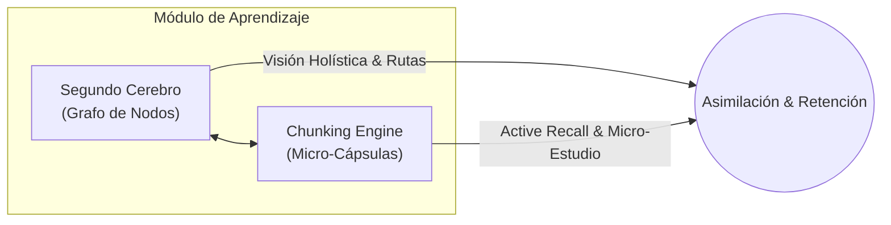
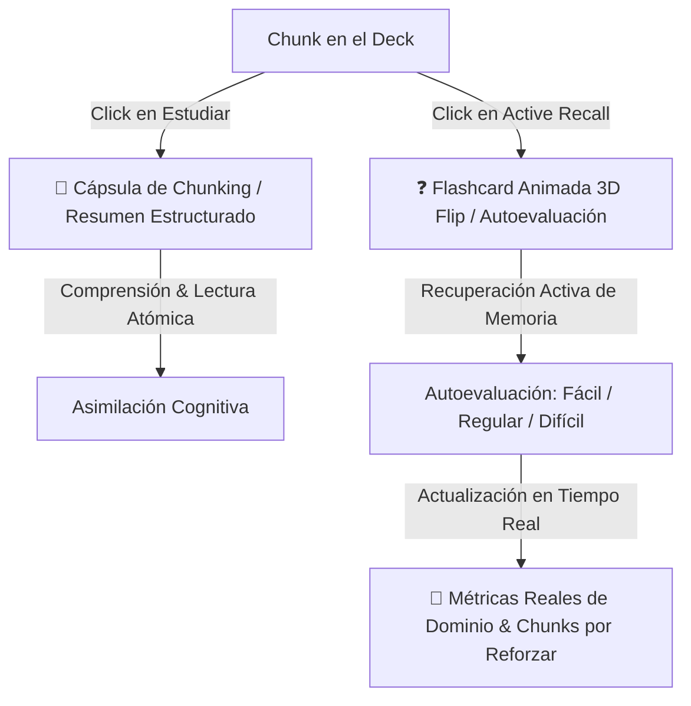

# 🚀 Epycus Killer Features — Módulo de Aprendizaje & Segundo Cerebro

Documento de análisis conceptual, arquitectónico y de diseño para la evolución del sistema de grafos de conocimiento y el nuevo motor de aprendizaje de Epycus.

---

## 🧠 1. Visión General: El Módulo «Aprendizaje»

El objetivo es transformar la visualización de grafos en un ecosistema integral de asimilación del conocimiento que combine:
1. **La visión Macro (Segundo Cerebro):** Relaciones, interdisciplinariedad y mapa de conocimiento interconectado.
2. **La visión Micro (Chunking & Active Recall):** Descomposición de temas complejos en cápsulas atómicas digeribles para estudio activo y retención a largo plazo.



---

## ⚡ 2. Estrategia de IA: Procesamiento Incremental y Ahorro Extremo de Tokens

Para garantizar un rendimiento ágil y costos mínimos de API, la IA opera bajo una arquitectura **estrictamente incremental**:

```
[Nueva Entrada / Apunte] 
          │
          ▼
[Detección de Cambios / Hashing Local] ──(Si ya existe)──► [Ignorar / Sin llamada a IA]
          │ (Solo información nueva)
          ▼
[Chunking Semántico Previo]
          │
          ▼
[Prompt Compacto a IA (JSON estructurado)]
          │
          ▼
[Merge Incremental al Grafo Existente]
```

### Principios de Ahorro:
* **Detección de Novedad (Diff / Fingerprint):** Al ingresar nuevos apuntes o documentos, el cliente/servidor calcula qué secciones son nuevas mediante hashing de párrafos antes de contactar a la IA.
* **Extracción Estructurada Directa:** La IA responde únicamente en JSON estricto (`{ "chunks": [...], "new_nodes": [...], "edges": [...] }`), eliminando preámbulos conversacionales innecesarios.
* **Actualización Modular del Grafo:** Los nuevos nodos se acoplan a la estructura ya existente mediante etiquetas y proximidad semántica, sin reconstruir la red completa.

---

## 🧩 3. Metodología de Chunking vs. Nodos

| Nivel | Componente | Función Cognitiva | Formato |
| :--- | :--- | :--- | :--- |
| **Macro** | **Nodo del Grafo** | Ubicación en el mapa mental, conexión interdisciplinaria, dependencias teóricas. | Título, Categoría, Estado de Dominio (1 a 5), Enlaces. |
| **Micro** | **Chunk (Cápsula)** | Unidad mínima de asimilación (1 idea clave por chunk), aplicación profesional. | Micro-resumen (≤ 280 caracteres), Caso práctico, Pregunta de *Active Recall*. |

---

## 🎨 4. Rediseño Visual y Experiencia de Usuario (Anti-Fatiga Visual)

### 🧐 Diagnóstico del Diseño Anterior:
* **Problema:** Fondos oscuros saturados (`slate-900/90`), multiplicidad de bordes oscuros (`slate-800`), sombras pesadas y tonos morados/índigos de bajo contraste.
* **Consecuencia:** Fatiga visual rápida (*eye strain*) y sensación de saturación mental tras sesiones prolongadas de estudio.

### 🌟 Nueva Dirección de Color y Estilo:

#### 1. Panel de Detalle Limpio (Clean Light / Elevated Surface):
* **Fondo del Panel:** Blanco puro (`#FFFFFF`) o blanco marfil descansado (`#F8FAFC`) con bordes ultra-sutiles (`border-slate-200/80`) y sombras de elevación suaves (`shadow-xl shadow-slate-900/5`).
* **Tipografía:** Textos principales en gris grafito de alta legibilidad (`#0F172A` / `#334155`), evitando contrastes duros o textos apagados.

#### 2. Paleta de Acentos Vivos & Terapéuticos:
* 🌿 **Verde Menta / Esmeralda (`#10B981` / `#059669`):** Estado de dominio, conceptos clave y progreso asimilado (transmite claridad y avance).
* ☀️ **Ámbar Cálido (`#F59E0B`):** Aplicaciones prácticas, tips de campo y alertas de estudio.
* 🌊 **Cian / Celeste Glaciar (`#0EA5E9`):** Relaciones de conexión, enlaces activos y navegación entre nodos.
* 🌸 **Coral / Rosa Vivo Suave (`#F43F5E`):** Preguntas de autoevaluación (*Active Recall*) y puntos que requieren repaso.

---

## 🖥️ 5. Estructura de Interfaz del Módulo «Aprendizaje»

1. **Vistas de Aprendizaje (Sin Desorden de Información):**
   * 🗺️ **Modo Mapa (Segundo Cerebro):** Canvas interactivo con el grafo de conocimiento, interconexiones interdisciplinarias y nivel de dominio.
   * 🗂️ **Modo Chunks (Deck de Estudio):** Vista enfocada en tarjetas atómicas para repasar tema por tema con *Active Recall*.
   * 📖 **Fuente Única y Confiable (Apuntes del Curso):** Los nodos y chunks se alimentan **exclusivamente de los apuntes estructurados del curso**. No se permiten entradas sueltas o no categorizadas para garantizar un orden impecable en el grafo.

2. **Panel Lateral de Nodo / Chunk (Diseño Clean Light):**
   * **Encabezado:** Chip temático con color vivo + Título en gris grafito de alta legibilidad.
   * **Indicador de Dominio:** Puntos de dominio limpios y descansados para la vista.
   * **Sección de Chunks:** Micro-conceptos con preguntas de autoevaluación desplegables.
   * **Conexiones del Segundo Cerebro:** Tarjetas claras con navegación instantánea a nodos relacionados.
   * **Acceso Directo a Apuntes:** Botón limpio para saltar al apunte original del curso.
   * 🚫 **Limpieza de Interfaz:** Se **elimina el botón de «Exportar JSON»** para evitar ruido visual técnico; el estudiante solo ve herramientas pedagógicas directas.

---

## 📓 6. Integración y Sinergia con Google NotebookLM

NotebookLM y Epycus se complementan como un sistema de estudio de alto rendimiento:

* **Epycus:** Estructura mental, grafo de relaciones (*Segundo Cerebro*), control de dominio y *Chunking / Active Recall* diario basado en los apuntes del curso.
* **NotebookLM:** Síntesis profunda de documentos extensos, consultas complejas a fuentes bibliográficas y generación de resúmenes de audio / podcast (*Audio Overview*).

### 🔍 Viabilidad Técnica en el Sistema Actual:
Google **no ofrece una API pública** para crear libretas ni subir archivos automáticamente desde apps de terceros. Por tanto, la integración óptima es un **puente ágil y asistido**:

1. **Vínculo Directo por Curso / Tema:** Cada materia o tema en Epycus tiene un campo opcional para guardar el enlace directo a su libreta correspondiente de NotebookLM.
2. **Exportador Rápido de Chunks a Fuente (1-Click Prep):** Botón para copiar los chunks y conceptos clave formateados en Markdown limpio, listos para pegar como nueva fuente en NotebookLM sin basura ni redundancias.

## 🧩 7. Anatomía del Chunking vs. Active Recall (Diferenciación Real de Funcionalidad)

Uno de los mayores errores en apps de estudio es abrir la misma pantalla para diferentes propósitos cognitivos. En Epycus, cada botón activa una experiencia mental totalmente distinta:



---

### 📖 7.1. Modo «Estudiar» (Cápsula de Chunking & Resumen Cognitivo)
* **Objetivo:** Comprensión rápida, lectura atómica y asimilación conceptual sin distracciones.
* **Estructura Visual:**
  1. **Título del Concepto & Materia:** Encabezado claro con su badge temático.
  2. **💡 Idea Clave:** Explicación precisa de 2 a 3 líneas con lo esencial.
  3. **📑 Desglose Atómico (Chunking):** Micro-puntos esenciales para no saturar la memoria de trabajo.
  4. **🔗 Conceptos Relacionados:** Chips navegables que permiten saltar a conceptos hermanos con 1 solo clic.
  5. **📚 Acceso Directo a Apuntes:** Botón para consultar las notas originales del curso.

---

### ❓ 7.2. Modo «Active Recall» (Flashcard Animada con Giro 3D / Flip Card)
* **Objetivo:** Estimulación de la memoria a largo plazo mediante recuperación activa (*Retrieval Practice*).
* **Estructura Visual & Mecánica Interactiva:**
  * **Cara Frontal (Anverso - El Reto):**
    * ❓ Pregunta disparadora destacada.
    * Indicador de memoria y botón **`[ 🔄 Voltear Flashcard / Ver Respuesta ]`**.
  * **Efecto de Animación (3D Flip):**
    * Giro tridimensional suave (`transform: rotateY(180deg)` con `perspective: 1000px`).
  * **Cara Posterior (Reverso - La Respuesta & Calificación):**
    * 💡 **Respuesta Clave Explicada.**
    * **Autoevaluación de Retención en 1 Clic:**
      * 🔴 `Difícil (-10% Dominio)`: Disminuye la retención, marca el concepto como crítico.
      * 🟡 `Regular (+5% Dominio)`: Mantiene consolidación media.
      * 🟢 `Fácil (+15% Dominio)`: Consolida el concepto y eleva el porcentaje.
    * **Impacto en Vivo:** Al pulsar cualquiera, se dispara animación de éxito y se recalcula al instante el Dominio Global y los Chunks por Reforzar.

---

## 📊 8. Motor de Métricas Reales en Vivo

Las métricas de la barra superior no son números estáticos; responden dinámicamente al progreso del estudiante:

$$\text{Dominio Global (\%)} = \frac{\sum_{i=1}^{N} \text{Dominio}_i}{N}$$

$$\text{Chunks por Reforzar} = \{ c \in \text{Chunks} \mid \text{Dominio}(c) < 60\% \lor \text{DíasSinRepaso}(c) \ge 3 \}$$

* **Comportamiento en Vivo:**
  * Si un chunk pasa de `50%` a `65%` al responder *"Fácil"*, el contador **«Por Reforzar»** baja automáticamente de `1` a `0`.
  * La barra de progreso de **«Dominio Global»** se anima en tiempo real reflejando el nuevo promedio del estudiante.

---

## 🕹️ 9. Motor Cinemático 3D (W, A, S, D, +, -)

### 🔬 Diagnóstico del Movimiento 3D Anterior:
* **Problema:** Modificar directamente las coordenadas cartesianas globales `(x, y)` en un sistema orbital (Three.js OrbitControls) distorsiona el vector de vista de la cámara y produce movimientos bruscos o desalineados con respecto al objetivo central.
* **Solución Cinemática:**
  * **`A` / `D` (Rotación Orbital Azimutal):** Modifica el ángulo $\theta$ (yaw) de la cámara en coordenadas esféricas para orbitar suave y fluidamente alrededor del cerebro holográfico.
  * **`W` / `S` (Elevación Polar / Pitch):** Ajusta la elevación polar $\phi$ o el desplazamiento frontal de la cámara.
  * **`+` / `-` (Dolly Zoom Cinemático):** Ajusta el radio $r$ acercando o alejando la cámara directamente a lo largo de su línea de visión sin perder el centro de gravedad.

### 🎨 Componente y Logo SVG de NotebookLM:

```html
<!-- Botón estilizado Clean Light con SVG de NotebookLM -->
<a 
  :href="course.notebooklm_url || 'https://notebooklm.google.com'" 
  target="_blank" 
  rel="noopener noreferrer"
  class="inline-flex items-center gap-2 px-3 py-1.5 rounded-xl bg-white border border-slate-200/90 text-slate-700 hover:text-blue-600 hover:border-blue-300 hover:shadow-sm text-xs font-semibold transition-all shadow-[0_1px_2px_rgba(0,0,0,0.04)]"
>
  <!-- Isotipo SVG NotebookLM -->
  <svg class="w-4 h-4 shrink-0" viewBox="0 0 24 24" fill="none" xmlns="http://www.w3.org/2000/svg">
    <path d="M12 2C6.48 2 2 6.48 2 12s4.48 10 10 10 10-4.48 10-10S17.52 2 12 2z" fill="#E8F0FE"/>
    <path d="M7 6.5h10a1.5 1.5 0 0 1 1.5 1.5v8a1.5 1.5 0 0 1-1.5 1.5H7A1.5 1.5 0 0 1 5.5 16V8A1.5 1.5 0 0 1 7 6.5z" fill="#1A73E8"/>
    <path d="M8.5 9.5h7M8.5 12h5M8.5 14.5h4" stroke="#FFFFFF" stroke-width="1.2" stroke-linecap="round"/>
    <circle cx="16.5" cy="14.5" r="1" fill="#34A853"/>
  </svg>
  <span>Abrir en NotebookLM</span>
  <svg class="w-3.5 h-3.5 text-slate-400" fill="none" stroke="currentColor" viewBox="0 0 24 24">
    <path stroke-linecap="round" stroke-linejoin="round" stroke-width="2" d="M10 6H6a2 2 0 00-2 2v10a2 2 0 002 2h10a2 2 0 002-2v-4M14 4h6m0 0v6m0-6L10 14" />
  </svg>
</a>
```

---

## 🎓 7. Casos de Uso Reales: ¿Cómo funciona en la práctica?

La dupla **Epycus + NotebookLM** cubre todo el ciclo de aprendizaje: desde la digestión de volúmenes masivos de lectura hasta la fijación de memoria a largo plazo.

### 🩺 Caso 1: Estudiante de Medicina (Ej. Farmacología y Fisiopatología)
* **El reto:** Libros de 1,000 páginas (Guyton, Goodman & Gilman), guías clínicas del ministerio y diapositivas del docente.
* **El flujo de estudio:**
  1. **En NotebookLM:** Sube el libro y las guías. Le pide: *«Genera un Audio Overview (Podcast) sobre el eje Renina-Angiotensina-Aldosterona»* para escucharlo en el bus camino al hospital, y consulta dudas complejas (*«¿Qué contraindicación tiene el fármaco X en pacientes renales según la guía Y?»*).
  2. **En Epycus:** Sus apuntes de clase se organizan en el grafo: el nodo *«Insuficiencia Cardíaca»* se conecta automáticamente con *«Fisiología Renal»*. Los conceptos se desglosan en **Chunks atómicos** (dosis, mecanismo de acción, alerta clínica) y realiza **Active Recall diario** para no olvidar los fármacos clave en la guardia médica.

---

### ⚖️ Caso 2: Estudiante de Derecho (Ej. Derecho Penal o Constitucional)
* **El reto:** Códigos de cientos de artículos, jurisprudencia extensa y sentencias de 80 páginas.
* **El flujo de estudio:**
  1. **En NotebookLM:** Carga las sentencias y el código. Hace preguntas comparativas: *«¿Qué contradicciones existen entre la sentencia de 2021 y la de 2024 respecto al concepto de dolo eventual?»*.
  2. **En Epycus:** Estructura la teoría del delito en el grafo (*Conducta ➔ Tipicidad ➔ Antijuridicidad ➔ Culpabilidad*). Cada nodo contiene **Chunks con casos prácticos** y preguntas de autoevaluación oculta (*Active Recall*) para entrenarse de cara a los exámenes orales y de grado.

---

### 💻 Caso 3: Estudiante de Ingeniería de Sistemas (Ej. Arquitectura y Sistemas Distribuidos)
* **El reto:** Documentación oficial (RFCs, AWS/GCP docs), libros de patrones (Gang of Four) y código de proyectos.
* **El flujo de estudio:**
  1. **En NotebookLM:** Sube la documentación técnica y libros de arquitectura para resolver dudas de diseño: *«¿Cómo mitigar el problema de split-brain en este protocolo según el autor?»*.
  2. **En Epycus:** Visualiza el grafo de dependencias de su malla/carrera (*Bases de Datos ➔ Caché Redis ➔ Arquitecturas Distribuidas*). Cada nodo contiene **Chunks con código de ejemplo y trade-offs**, permitiéndole repasar conceptos clave en 5 minutos antes de una entrevista técnica o parcial.

---

*Documento generado para análisis y planificación arquitectónica de Epycus.*
