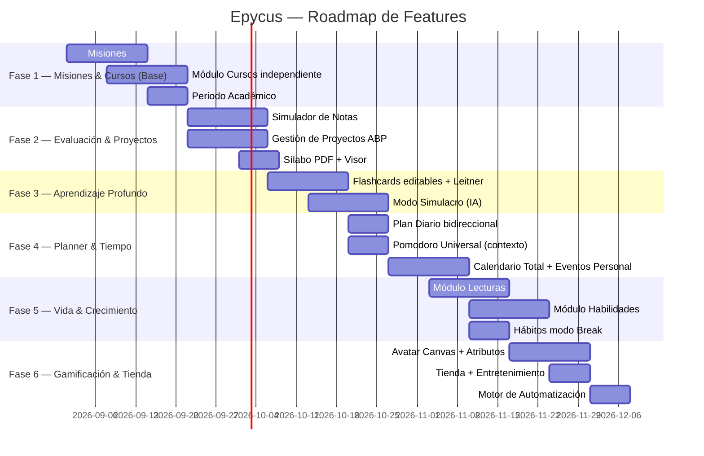

# 🎓 Epycus Killer Features — Análisis Técnico Universitario

> **Documento de referencia técnica:** Evalúa la viabilidad de cada idea contra el código actual (rama `main`). Todo lo marcado ✅ Alta es desarrollable. El documento se actualiza de forma incremental.

---

## 📋 Índice

1. [Módulo Misiones (Tareas) — Rediseño con Eisenhower + Kanban](#1-módulo-misiones-tareas--rediseño-con-eisenhower--kanban)
2. [Categorías de Tareas — Académicas, Trabajo y Personal](#2-categorías-de-tareas--académicas-trabajo-y-personal)
3. [Módulo Cursos — Nodo Central](#3-módulo-cursos--nodo-central)
4. [Gestión de Proyectos por Curso (ABP)](#4-gestión-de-proyectos-por-curso-abp)
5. [Periodo Académico — Del Perfil al Sistema](#5-periodo-académico--del-perfil-al-sistema)
6. [Sílabo PDF con Visor](#6-sílabo-pdf-con-visor)
7. [Simulador de Notas y Calculadora Predictiva](#7-simulador-de-notas-y-calculadora-predictiva)
8. [Apuntes: Imágenes Redimensionables y Arrastrables](#8-apuntes-imágenes-redimensionables-y-arrastrables)
9. [Flashcards Editables + Sistema de Cajas de Leitner](#9-flashcards-editables--sistema-de-cajas-de-leitner)
10. [Modo Simulacro — Opción Múltiple + Respuesta Libre con IA](#10-modo-simulacro--opción-múltiple--respuesta-libre-con-ia)
11. [Hábitos: Modo «Dejar Malos Hábitos»](#11-hábitos-modo-dejar-malos-hábitos)
12. [Plan Diario — Integración Bidireccional con Misiones](#12-plan-diario--integración-bidireccional-con-misiones)
13. [Avatar en Canvas — Mapa Visual de Progreso](#13-avatar-en-canvas--mapa-visual-de-progreso)
14. [Módulo Lecturas — Libros, Artículos y Tesis](#14-módulo-lecturas--libros-artículos-y-tesis)
15. [Módulo Habilidades — Aprendizaje Extracurricular](#15-módulo-habilidades--aprendizaje-extracurricular)
16. [Pomodoro como Motor de Control de Tiempo Universal](#16-pomodoro-como-motor-de-control-de-tiempo-universal)
17. [Calendario Total — Vida Académica, Trabajo y Personal](#17-calendario-total--vida-académica-trabajo-y-personal)
18. [Tienda + Entretenimiento — Películas, Series y Anime](#18-tienda--entretenimiento--películas-series-y-anime)
19. [El Personaje como Espejo del Progreso Real](#19-el-personaje-como-espejo-del-progreso-real)
20. [Automatización Pura — Sin IA, Solo Algoritmos](#20-automatización-pura--sin-ia-solo-algoritmos)

---

## 1. Módulo Misiones (Tareas) — Rediseño con Eisenhower + Kanban

### 📊 Estado Actual — Hallazgo clave

La Matriz de Eisenhower **ya está implementada** en `missions.eisenhower_quadrant` con valores `q1`, `q2`, `q3`, `q4` y el `ChangeQuadrantUseCase`. Lo que falta es solo la **vista Kanban** del módulo. El campo `course_id` ya existe pero no hay `mission_type` para diferenciar tareas académicas, de trabajo o personales.

```
missions
  id, user_id, course_id, title, description
  difficulty: easy | medium | hard
  priority: baja | normal | alta
  eisenhower_quadrant: q1 | q2 | q3 | q4   ← YA EXISTE
  due_date, completed_at, is_overdue, xp_awarded
  → HasMany: subtasks
```

### ✅ Viabilidad — Muy Alta (Eisenhower ya está, solo falta Kanban)

### 🏗️ Propuesta de Implementación

**Migración — Tipo de misión y canvas de proyecto:**
```sql
ALTER TABLE missions
  ADD COLUMN mission_type ENUM('academic', 'work', 'personal', 'project') DEFAULT 'academic' AFTER course_id,
  ADD COLUMN project_phase_id BIGINT UNSIGNED NULL AFTER mission_type,
  ADD COLUMN planned_date  DATE NULL AFTER due_date,
  ADD COLUMN planned_start TIME NULL AFTER planned_date,
  ADD COLUMN planned_end   TIME NULL AFTER planned_start;

ALTER TABLE missions ADD CONSTRAINT fk_missions_phase
  FOREIGN KEY (project_phase_id) REFERENCES project_phases(id) ON DELETE SET NULL;
```

**Las 4 vistas del Módulo Misiones:**

| Vista | Descripción | Estado |
|:------|:------------|:------:|
| **Lista** | Tarjetas agrupadas por prioridad | Ya existe |
| **Eisenhower** | 4 cuadrantes Q1/Q2/Q3/Q4 | Lógica lista, falta UI |
| **Kanban** | Columnas: Pendiente → En Progreso → Completada | Por implementar |
| **Canvas Proyecto** | Vista de fases del proyecto con misiones anidadas | Por implementar |

**Vista Kanban (sin librerías externas — Vue + CSS Grid):**
```
┌────────────────┬────────────────┬────────────────┐
│   Pendiente    │  En Progreso   │   Completadas  │
│   (Q2 + Q3)   │   (Q1 activas) │               │
├────────────────┼────────────────┼────────────────┤
│ 📝 Parcial BD  │ 🔄 Proyecto API│ ✅ Lab Química │
│ 📝 Leer cap 5  │                │ ✅ Tarea Física│
│ + Añadir tarea │                │               │
└────────────────┴────────────────┴────────────────┘
```

**Vista Eisenhower (rediseñada con colores):**
```
             URGENTE          NO URGENTE
           ┌──────────────┬──────────────┐
IMPORTANTE │ Q1 🔴 Hacer  │ Q2 🔵 Planif│
           │ ahora        │ con calma   │
           ├──────────────┼──────────────┤
NO IMPORT. │ Q3 🟡 Delegar│ Q4 ⬜ Elim. │
           │ o posponer   │ si es posible│
           └──────────────┴──────────────┘
```

**Relación completa de una Misión:**
```
Misión "Implementar API REST"
  ├── mission_type: 'project'
  ├── course_id: 5 (Sistemas Distribuidos)  ← opcional
  ├── project_phase_id: 12 (Fase 2: Backend) ← opcional
  ├── eisenhower_quadrant: 'q1'
  ├── subtasks:
  │     ├── [✅] Setup del servidor Node.js
  │     ├── [🔄] Endpoints de usuarios
  │     └── [⬜] Tests de integración
  └── Pomodoro vinculado: 🍅 45 min de foco hoy
```

---

## 2. Categorías de Tareas — Académicas, Trabajo y Personal

### 📊 Estado Actual

`missions.course_id` asume que toda misión pertenece a un curso. No hay un campo para distinguir misiones de trabajo, proyectos personales o tareas del hogar.

### ✅ Viabilidad — Alta (solo un campo nuevo)

**El campo `mission_type` (definido en §1) es la clave:**

| Tipo | `mission_type` | Vincula con | Aparece en |
|:-----|:--------------:|:-----------:|:----------:|
| Tarea de curso | `academic` | `course_id` | Calendario académico |
| Tarea de proyecto | `project` | `course_id` + `project_phase_id` | Canvas del proyecto |
| Tarea de trabajo | `work` | *(ninguno)* | Calendario general |
| Tarea personal | `personal` | *(ninguno)* | Calendario general |

**Filtros en el módulo de Misiones:**
```
[Todas] [Académicas] [Trabajo] [Personal] [Proyectos]
[Q1 Urgente] [Q2 Importante] [Vencidas]
```

**Misiones de trabajo en el Calendario:** Un estudiante que trabaja como freelancer, en una empresa o en un emprendimiento puede crear tareas de `type = 'work'` con fecha y hora, y estas aparecen en su calendario junto con las clases y tareas universitarias. Así puede ver toda su vida en una sola pantalla.

---

## 3. Módulo Cursos — Nodo Central

### 📊 Estado Actual
`CourseModel` ya existe con `name`, `color`, `starts_at`, `ends_at`. Los cursos se crean desde el Módulo Calendario. Falta el módulo propio de cursos y campos adicionales.

### 🏗️ Migración y estructura

```sql
ALTER TABLE courses
  ADD COLUMN syllabus_path  VARCHAR(255) NULL  AFTER color,
  ADD COLUMN professor      VARCHAR(100) NULL  AFTER syllabus_path,
  ADD COLUMN credits        TINYINT UNSIGNED DEFAULT 3,
  ADD COLUMN target_grade   DECIMAL(4,2)  NULL,   -- Sin default, el estudiante lo pone
  ADD COLUMN min_pass_grade DECIMAL(4,2)  NULL;   -- Sin default, idem
```

**Pestañas del hub del curso:**
```
[📝 Apuntes] [📊 Simulador de Notas] [📄 Sílabo] [🏗️ Proyecto] [🃏 Flashcards]
```

---

## 4. Gestión de Proyectos por Curso (ABP)

### 📊 Contexto

El ABP es estándar en universidades latinoamericanas. El proyecto es **opcional por curso** — no todos los cursos lo tienen. Un proyecto tiene fases, y cada fase tiene tareas (misiones). El Canvas es una vista visual de esas fases.

### ✅ Viabilidad — Alta

**Tablas:**
```sql
CREATE TABLE course_projects (
    id BIGINT UNSIGNED AUTO_INCREMENT PRIMARY KEY,
    course_id BIGINT UNSIGNED NOT NULL,
    user_id BIGINT UNSIGNED NOT NULL,
    study_group_id BIGINT UNSIGNED NULL,   -- Para proyectos grupales
    title VARCHAR(150) NOT NULL,
    description TEXT NULL,
    weight_percentage DECIMAL(5,2) DEFAULT 0.00, -- % en la nota final
    due_date DATE NULL,
    status ENUM('planning', 'in_progress', 'review', 'completed') DEFAULT 'planning',
    rubric_criteria JSON NULL,  -- [{"name": "Metodología", "weight": 30}, ...]
    created_at TIMESTAMP NULL,
    updated_at TIMESTAMP NULL,
    FOREIGN KEY (course_id) REFERENCES courses(id) ON DELETE CASCADE,
    FOREIGN KEY (user_id) REFERENCES users(id) ON DELETE CASCADE
) ENGINE=InnoDB;

CREATE TABLE project_phases (
    id BIGINT UNSIGNED AUTO_INCREMENT PRIMARY KEY,
    project_id BIGINT UNSIGNED NOT NULL,
    title VARCHAR(120) NOT NULL,     -- "Fase 1: Propuesta", "Fase 2: Desarrollo"
    due_date DATE NULL,
    sort_order TINYINT UNSIGNED DEFAULT 0,
    is_completed BOOLEAN DEFAULT FALSE,
    FOREIGN KEY (project_id) REFERENCES course_projects(id) ON DELETE CASCADE
) ENGINE=InnoDB;
```

**Vista del proyecto — 3 opciones de interfaz:**

| Versión | Vista | Complejidad |
|:--------|:-----:|:-----------:|
| **v1** | Lista de fases con misiones anidadas | Baja |
| **v1.5** | Kanban por fase (drag-and-drop) | Media |
| **v2** | Canvas visual — nodos de fases conectados | Alta |

**Canvas Visual (v2) — concepto:**
```
┌─────────────────────────────────────────────┐
│  🏗️ Proyecto Final — Sistemas Distribuidos   │
│                                              │
│  [Fase 1: Propuesta] ──→ [Fase 2: Backend]  │
│       ✅ Completada           ⏳ En curso    │
│       3/3 tareas              2/5 tareas     │
│                    ↓                         │
│             [Fase 3: Sustentación]           │
│                  📅 15 Nov                  │
│                  0/3 tareas                  │
│                                              │
│  Progreso total: ████████░░░░  55%           │
│  Peso en nota: 30%   Rúbrica: ver detalle   │
└─────────────────────────────────────────────┘
```

---

## 5. Periodo Académico — Del Perfil al Sistema

```sql
CREATE TABLE academic_periods (
    id BIGINT UNSIGNED AUTO_INCREMENT PRIMARY KEY,
    user_id BIGINT UNSIGNED NOT NULL,
    year SMALLINT UNSIGNED NOT NULL,       -- 2026
    period TINYINT UNSIGNED NOT NULL,      -- 0=Verano, 1=Primer, 2=Segundo
    is_current BOOLEAN DEFAULT FALSE,
    starts_at DATE NULL,
    ends_at DATE NULL,
    created_at TIMESTAMP NULL,
    updated_at TIMESTAMP NULL,
    FOREIGN KEY (user_id) REFERENCES users(id) ON DELETE CASCADE,
    UNIQUE KEY uq_user_period (user_id, year, period)
) ENGINE=InnoDB;

ALTER TABLE courses ADD COLUMN period_id BIGINT UNSIGNED NULL;
```

---

## 6. Sílabo PDF con Visor

Laravel `Storage` + `<iframe>` nativo. Sin dependencias. Alternativa premium: `pdfjs-dist` (~350 KB) con búsqueda interna y zoom.

---

## 7. Simulador de Notas y Calculadora Predictiva

**Sin default en nota mínima** — el estudiante define la suya:

```sql
CREATE TABLE grade_evaluations (
    id BIGINT UNSIGNED AUTO_INCREMENT PRIMARY KEY,
    course_id BIGINT UNSIGNED NOT NULL,
    name VARCHAR(80) NOT NULL,
    weight DECIMAL(5,2) NOT NULL,
    obtained_score DECIMAL(4,2) NULL,   -- null hasta que el estudiante lo llene
    max_score DECIMAL(4,2) DEFAULT 20.00,
    eval_date DATE NULL,
    FOREIGN KEY (course_id) REFERENCES courses(id) ON DELETE CASCADE
) ENGINE=InnoDB;
```

Lógica de promedio ponderado + «¿cuánto necesito sacar?» es 100% Vue `computed`, sin IA.

---

## 8. Apuntes: Imágenes Redimensionables y Arrastrables

El JSON del bloque imagen ya es extensible: añadir `width`, `align`, `float`, `caption`. Librería recomendada: `vue-draggable-resizable` (4 KB gzipped).

---

## 9. Flashcards Editables + Sistema de Cajas de Leitner

```sql
CREATE TABLE flashcards (
    id BIGINT UNSIGNED AUTO_INCREMENT PRIMARY KEY,
    user_id BIGINT UNSIGNED NOT NULL,
    -- Polimórfico: puede pertenecer a curso, lectura, habilidad o proyecto
    course_id    BIGINT UNSIGNED NULL,
    reading_id   BIGINT UNSIGNED NULL,
    skill_id     BIGINT UNSIGNED NULL,
    node_id VARCHAR(80) NULL,
    source ENUM('ai', 'manual') DEFAULT 'ai',
    question TEXT NOT NULL,
    answer TEXT NOT NULL,
    leitner_box TINYINT UNSIGNED DEFAULT 1,  -- 1..5
    next_review_at DATE NULL,
    last_reviewed_at TIMESTAMP NULL,
    created_at TIMESTAMP NULL,
    updated_at TIMESTAMP NULL,
    FOREIGN KEY (user_id) REFERENCES users(id) ON DELETE CASCADE,
    INDEX idx_user_review (user_id, next_review_at)
) ENGINE=InnoDB;
```

| Caja | Repaso | Avanza si | Retrocede a |
|:----:|:------:|:---------:|:-----------:|
| 1 | Cada 1 día | Fácil o Regular | Caja 1 |
| 2 | Cada 3 días | Fácil | Caja 1 |
| 3 | Cada 7 días | Fácil | Caja 2 |
| 4 | Cada 14 días | Fácil | Caja 2 |
| 5 | Cada 30 días | — (dominada) | Caja 3 si falla |

---

## 10. Modo Simulacro — Opción Múltiple + Respuesta Libre con IA

2 llamadas a la IA por sesión (generar + evaluar). Respuestas incorrectas → Flashcards Caja 1. Prompt JSON estructurado: 6 preguntas múltiple opción + 4 respuesta corta.

---

## 11. Hábitos: Modo «Dejar Malos Hábitos»

```sql
ALTER TABLE habits
  ADD COLUMN habit_type ENUM('build', 'break') DEFAULT 'build',
  ADD COLUMN max_per_week TINYINT UNSIGNED NULL;
```

| Acción | Build | Break |
|:-------|:-----:|:-----:|
| Completar | "Lo hice ✅" | "Lo evité hoy 🚫" |
| Racha | Crece al hacer | Crece sin caer |
| XP | +25 al completar | +25 libre; -10 recaída |

---

## 12. Plan Diario — Integración Bidireccional con Misiones

`daily_plan_items` **ya tiene** `linked_mission_id` en DB. Solo faltan:
- 3 columnas en `missions`: `planned_date`, `planned_start`, `planned_end`.
- Botón «📅 Planificar» en la tarjeta de misión con selector de fecha(s) y hora.
- Múltiples fechas → múltiples `daily_plan_items` con el mismo `linked_mission_id`.

---

## 13. Avatar en Canvas — Mapa Visual de Progreso

Todo el dato ya existe: `CharacterStatsCalculator`, `HerosJourneyPhases`, XP, nivel, racha. Solo falta la capa visual SVG animada (recomendada) o Three.js (ya está en el proyecto para el Knowledge Graph 3D).

---

## 14. Módulo Lecturas — Libros, Artículos y Tesis

```sql
CREATE TABLE readings (
    id BIGINT UNSIGNED AUTO_INCREMENT PRIMARY KEY,
    user_id BIGINT UNSIGNED NOT NULL,
    title VARCHAR(255) NOT NULL,
    author VARCHAR(200) NULL,
    year SMALLINT UNSIGNED NULL,
    type ENUM('book_fiction', 'book_nonfiction', 'academic_article', 'thesis', 'manual', 'other') NOT NULL,
    total_pages SMALLINT UNSIGNED NULL,
    isbn VARCHAR(30) NULL,
    cover_url VARCHAR(500) NULL,  -- Open Library API (gratis, sin IA)
    status ENUM('want_to_read', 'reading', 'finished', 'paused', 'dropped') DEFAULT 'want_to_read',
    current_page SMALLINT UNSIGNED DEFAULT 0,
    rating TINYINT UNSIGNED NULL,         -- 1..5 estrellas
    linked_habit_id BIGINT UNSIGNED NULL, -- Hábito "Leer 30 min"
    started_at DATE NULL,
    finished_at DATE NULL,
    created_at TIMESTAMP NULL,
    updated_at TIMESTAMP NULL,
    FOREIGN KEY (user_id) REFERENCES users(id) ON DELETE CASCADE
) ENGINE=InnoDB;

CREATE TABLE reading_tags (
    reading_id BIGINT UNSIGNED NOT NULL,
    tag VARCHAR(50) NOT NULL,
    PRIMARY KEY (reading_id, tag)
) ENGINE=InnoDB;
```

Reutiliza el mismo editor de apuntes JSON de los cursos. Flashcards vinculadas a `reading_id`.

---

## 15. Módulo Habilidades — Aprendizaje Extracurricular

| Concepto | Uso |
|:---------|:----|
| **Hábito** | Acción diaria. *"Practicar piano 20 min"* |
| **Misión** | Entregable puntual. *"Aprender escala de Do"* |
| **Habilidad** | Contenedor de progreso a largo plazo. *"Tocar Ukelele"* |

```sql
CREATE TABLE skills (
    id BIGINT UNSIGNED AUTO_INCREMENT PRIMARY KEY,
    user_id BIGINT UNSIGNED NOT NULL,
    name VARCHAR(120) NOT NULL,
    category ENUM('music', 'language', 'sport', 'art', 'tech', 'other') NOT NULL,
    icon VARCHAR(50) NULL,
    level INT UNSIGNED DEFAULT 1,
    total_practice_minutes INT UNSIGNED DEFAULT 0,
    linked_habit_id BIGINT UNSIGNED NULL,
    created_at TIMESTAMP NULL,
    updated_at TIMESTAMP NULL,
    FOREIGN KEY (user_id) REFERENCES users(id) ON DELETE CASCADE
) ENGINE=InnoDB;
```

**Niveles por minutos acumulados (algoritmo puro, sin IA):**

| Nivel | Horas | Título |
|:-----:|:-----:|:------:|
| 1 | 0 h | Inicio |
| 2 | 5 h | Principiante |
| 3 | 15 h | Básico |
| 5 | 70 h | Intermedio |
| 8 | 300 h | Avanzado |
| 10 | 600 h | Maestro |

---

## 16. Pomodoro como Motor de Control de Tiempo Universal

### 📊 Estado Actual

`pomodoro_sessions` ya tiene `mission_id` y `focus_minutes`. Le faltan 2 columnas para el contexto polimórfico.

### 🏗️ Migración mínima

```sql
ALTER TABLE pomodoro_sessions
  ADD COLUMN context_type VARCHAR(30) NULL AFTER mission_id,
  -- 'mission' | 'reading' | 'skill' | 'course_project' | 'habit' | 'free'
  ADD COLUMN context_id BIGINT UNSIGNED NULL AFTER context_type;
```

**Pantalla de inicio del Pomodoro — "¿En qué te vas a enfocar?":**
```
┌─────────────────────────────────────────────────┐
│  ⏱️ Nuevo Pomodoro                               │
├─────────────────────────────────────────────────┤
│  🎯 Misiones de hoy                              │
│     ○ Estudiar parcial de Algoritmos (Q1 · Alta) │
│     ○ Avanzar API del proyecto BD (Q1 · Media)   │
│     ○ Entregar informe trabajo (Trabajo · Alta)  │
│                                                  │
│  📚 Lecturas activas                             │
│     ○ El Hobbit (pág 180/310)                   │
│                                                  │
│  🎸 Habilidades                                  │
│     ○ Ukelele — Nivel 3                         │
│                                                  │
│  [ ▶️ Iniciar sin contexto ]                     │
└─────────────────────────────────────────────────┘
```

**Reporte Mensual de Tiempo de Enfoque:**
```
Tiempo de Enfoque — Septiembre 2026
Total: 38.5 horas

  ████████░░░░  Cursos / Misiones  52%  (20h)
  ████░░░░░░░░  Trabajo            21%  (8h)
  ██░░░░░░░░░░  Habilidades        13%  (5h)
  ██░░░░░░░░░░  Lecturas           8%   (3h)
  █░░░░░░░░░░░  Sin contexto       6%   (2.5h)
```

---

## 17. Calendario Total — Vida Académica, Trabajo y Personal

### 📊 Concepto

El Módulo Calendario debe ser **el centro de la vida del estudiante**, no solo de sus clases. Un universitario tiene:
- Clases (`course_sessions`)
- Misiones con fecha (`missions.planned_date`)
- Hábitos diarios
- Eventos personales (cumpleaños, reuniones, citas)
- Tareas de trabajo (`mission_type = 'work'`)
- Sesiones de lectura y habilidades (del Plan Diario)

### ✅ Viabilidad — Alta

**Nueva tabla para eventos personales:**
```sql
CREATE TABLE personal_events (
    id BIGINT UNSIGNED AUTO_INCREMENT PRIMARY KEY,
    user_id BIGINT UNSIGNED NOT NULL,
    title VARCHAR(160) NOT NULL,
    description TEXT NULL,
    type ENUM('birthday', 'meeting', 'appointment', 'social', 'reminder', 'other') NOT NULL,
    event_date DATE NOT NULL,
    start_time TIME NULL,
    end_time TIME NULL,
    is_recurring BOOLEAN DEFAULT FALSE,
    recurrence_rule VARCHAR(100) NULL, -- Ej: "FREQ=YEARLY" para cumpleaños
    color VARCHAR(30) DEFAULT 'primary',
    created_at TIMESTAMP NULL,
    updated_at TIMESTAMP NULL,
    FOREIGN KEY (user_id) REFERENCES users(id) ON DELETE CASCADE,
    INDEX idx_user_date (user_id, event_date)
) ENGINE=InnoDB;
```

**Vista del Calendario — Capas de información (toggleables):**
```
[✅ Clases] [✅ Misiones] [✅ Hábitos] [✅ Trabajo] [✅ Personal] [⬜ Eventos]

LUNES 2 SEP
  08:00  🎓 Algoritmos (clase)
  10:00  🎯 Estudiar parcial (misión académica)
  12:00  💼 Reunión cliente (trabajo)
  15:00  📚 Leer El Hobbit (plan diario)
  20:00  🎂 Cumpleaños de Ana (personal)
```

**Código de colores por tipo:**
- Clases: color del curso
- Misiones académicas: azul
- Misiones de trabajo: verde
- Eventos personales: lavanda
- Hábitos: ámbar

---

## 18. Tienda + Entretenimiento — Películas, Series y Anime

### 📊 Estado Actual

La Tienda (módulo `Shop`) ya tiene:
- `custom_rewards`: recompensas personalizadas con `cost_coins`, `icon`, `category`
- `reward_redemptions`: historial de canjeos con `status: redeemed | used`

El estudiante ya puede crear una recompensa "Ver una película" y canjearla con monedas. **Lo que falta** es registrar qué película fue, darle rating y reseña — convertir el canje en un registro de entretenimiento.

### ✅ Viabilidad — Alta

**Extensión de la Tienda con categoría `entertainment`:**

El flujo es sencillo:
1. El admin/estudiante crea una recompensa: **título "Ver El Padrino"**, `category = 'entertainment'`, `cost_coins = 150`.
2. El estudiante canjea la recompensa (ya funciona).
3. **Nuevo:** después del canje, puede abrir ese item y completar su reseña.

```sql
-- Añadir reseña a las redenciones de entretenimiento
ALTER TABLE reward_redemptions
  ADD COLUMN entertainment_type ENUM('movie', 'series', 'anime', 'game', 'other') NULL,
  ADD COLUMN review_title VARCHAR(255) NULL,
  ADD COLUMN review_text TEXT NULL,
  ADD COLUMN review_rating TINYINT UNSIGNED NULL,   -- 1..5 estrellas
  ADD COLUMN review_season VARCHAR(20) NULL,        -- Para series: "Temporada 1"
  ADD COLUMN reviewed_at TIMESTAMP NULL;
```

**Flujo de experiencia de usuario:**
```
[Tienda] El estudiante ve:
  🎬 "Ver El Padrino" — 150 monedas    [Canjear]

Después del canje:
  ✅ Canjeado — ¿Ya lo viste?
  [📝 Agregar reseña]

Formulario de reseña:
  Tipo: ○ Película  ○ Serie  ○ Anime  ○ Otro
  Temporada: _________ (solo para series/anime)
  Tu reseña: [____________________________]
  Calificación: ⭐⭐⭐⭐☆ (4/5)
  [Guardar]
```

**Vista "Mi Entretenimiento" (sección dentro de Tienda o módulo propio):**
```
┌─────────────────────────────────────────────┐
│  🎬 El Padrino  · Película                  │
│  "Obra maestra del cine. La actuación..."   │
│  ⭐⭐⭐⭐⭐  Canjeado: 12 Sep 2026           │
├─────────────────────────────────────────────┤
│  📺 Breaking Bad · Serie · Temp. 1-3        │
│  "Me enganchó desde el primer episodio..."  │
│  ⭐⭐⭐⭐⭐  Canjeado: 5 Sep 2026            │
├─────────────────────────────────────────────┤
│  🌸 Attack on Titan · Anime · Temp. 4      │
│  "El final fue muy impactante, aunque..."  │
│  ⭐⭐⭐⭐☆  Canjeado: 28 Ago 2026           │
└─────────────────────────────────────────────┘
```

**Filtros:**
```
[Todos] [Películas] [Series] [Anime] [Por ver] [Vistos]
⭐ Ordenar por: fecha | calificación | costo
```

**Plan Diario — Opcional:** Si el estudiante canjea "Ver una película el viernes", puede añadirlo al Plan Diario de ese día como un ítem de ocio planificado. El Plan Diario ya acepta cualquier ítem con categoría libre.

---

## 19. El Personaje como Espejo del Progreso Real

Todo lo que el estudiante hace en Epycus alimenta a su personaje con datos medibles:

```
DATO REAL                              ATRIBUTO DEL PERSONAJE
───────────────────────────────────────────────────────────
pomodoro_sessions.focus_minutes     →  🧠 Sabiduría
habit_completions (racha)           →  ⚡ Disciplina
skill_logs.total_practice_minutes   →  🎭 Talento
readings.finished (libros leídos)   →  📚 Cultura
grade_evaluations (promedio)        →  🎓 Rendimiento Académico
project_phases (fases completadas)  →  🏗️ Maestría Práctica
flashcard_reviews (dominio >80%)    →  🧩 Retención Cognitiva
```

**Canvas del Personaje:**
```
┌────────────────────────────────────────────┐
│  ✨ Marco · Nivel 7 · "El Estratega"       │
│                                            │
│          [Avatar personalizado]            │
│                                            │
│  🧠 Sabiduría  ██████████░  82% (41h)     │
│  ⚡ Disciplina  █████████░░  74% (18 días) │
│  🎭 Talento    ████░░░░░░░  35% (Ukelele) │
│  📚 Cultura    ██████░░░░░  48% (6 libros)│
│  🎓 Rendimiento ████████░░  16.4/20       │
│                                            │
│  [📊 Reporte Mensual] [🗺️ Camino del Héroe]│
└────────────────────────────────────────────┘
```

---

## 20. Automatización Pura — Sin IA, Solo Algoritmos

| # | Automatización | Qué hace |
|:--|:--------------|:---------|
| 20.1 | **Planificador del Día** | Genera borrador del Plan Diario con misiones + hábitos + clases en los slots libres |
| 20.2 | **Racha Inteligente** | No rompe racha si el hábito no tiene ese día de semana activo |
| 20.3 | **Alertas Académicas** | Job nocturno: detecta si el promedio proyectado cae bajo la nota mínima |
| 20.4 | **Leitner Diario** | Recomienda las 30 flashcards con `next_review_at <= hoy` por caja |
| 20.5 | **Hora Pico** | Cruza `habit_completions + pomodoro_sessions` → *"Tus mejores horas son a las 9:00"* |
| 20.6 | **Cumpleaños** | Detecta `personal_events.type = 'birthday'` de los próximos 7 días y envía notificación |
| 20.7 | **Endpoint Unificado** | `GET /api/unified-day` → clases + misiones + hábitos + eventos + flashcards pendientes |

---

## 🗺️ Roadmap Técnico Recomendado



---

## ✅ Resumen de Viabilidad

| # | Feature | Viabilidad | Nueva tabla/campo | Reutiliza |
|:--|:--------|:----------:|:-----------------:|:---------:|
| 1 | Misiones Kanban + Eisenhower visual | ✅ Alta | Campo `mission_type` en `missions` | `eisenhower_quadrant` ya existe |
| 2 | Tipos de tarea (académica, trabajo, personal) | ✅ Alta | Campo `mission_type` | `MissionModel`, `CalendarController` |
| 3 | Módulo Cursos independiente | ✅ Alta | Campos en `courses` | `CourseModel` ya existe |
| 4 | Gestión de Proyectos ABP + Canvas | ✅ Alta | `course_projects`, `project_phases` | `MissionModel`, `StudyGroups` |
| 5 | Periodo Académico | ✅ Alta | `academic_periods` | `users.cycle` |
| 6 | Sílabo PDF | ✅ Alta | Campo `syllabus_path` | Laravel `Storage` |
| 7 | Simulador de Notas | ✅ Alta | `grade_evaluations` | Vue `computed` |
| 8 | Imágenes arrastrables | ✅ Media | JSON del bloque | Editor de apuntes |
| 9 | Flashcards + Leitner | ✅ Alta | `flashcards`, `flashcard_reviews` | `user_knowledge_graphs` |
| 10 | Simulacro con IA | ✅ Alta | — | `AiAssistant`, `ai_quotas` |
| 11 | Malos hábitos | ✅ Alta | Campo `habit_type` en `habits` | `HabitModel` |
| 12 | Plan Diario bidireccional | ✅ Alta | 3 campos en `missions` | `linked_mission_id` ya existe |
| 13 | Avatar en Canvas | ✅ Alta | — | `CharacterStatsCalculator` |
| 14 | Módulo Lecturas | ✅ Alta | `readings`, `reading_tags` | Editor de apuntes, hábitos |
| 15 | Módulo Habilidades | ✅ Alta | `skills`, `skill_logs` | Hábitos, misiones, flashcards |
| 16 | Pomodoro Universal | ✅ Alta | 2 campos en `pomodoro_sessions` | `PomodoroSessionModel` |
| 17 | Calendario Total + Eventos Personales | ✅ Alta | `personal_events` | `CalendarController` |
| 18 | Tienda + Entretenimiento (reseñas) | ✅ Alta | 5 campos en `reward_redemptions` | `ShopController`, `custom_rewards` |
| 19 | Personaje como espejo | ✅ Alta | — | `CharacterStatsCalculator` extendido |
| 20 | Automatización sin IA | ✅ Alta | — | Todo el ecosistema |

---

*Documento técnico de evaluación y diseño — Epycus · Rama `main`*
