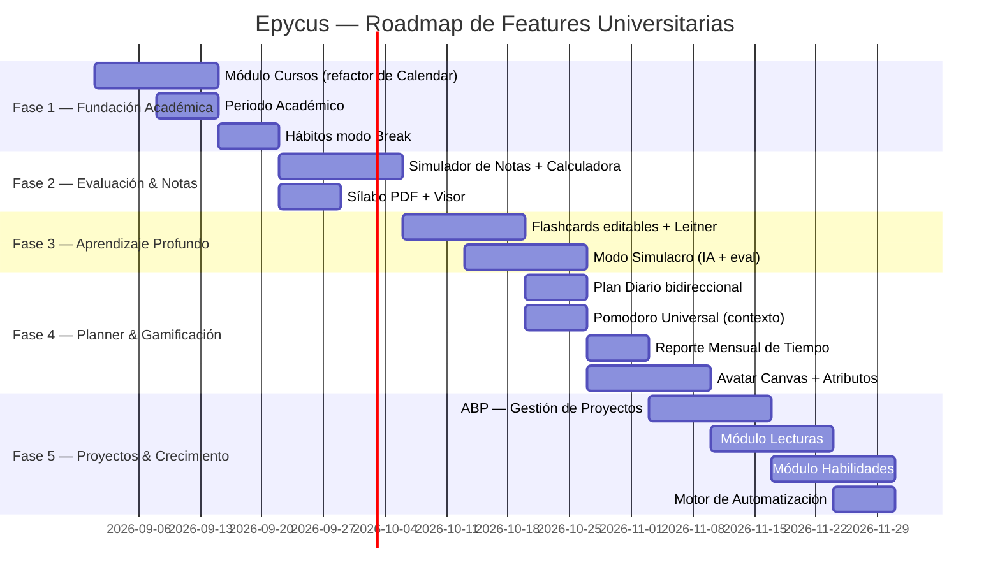

# 🎓 Epycus Killer Features — Análisis Técnico Universitario

> **Documento de referencia técnica:** Evalúa la viabilidad de cada idea contra el código actual (rama `main`), propone la arquitectura de implementación y especifica el diseño visual dentro del sistema de diseño de Epycus.

---

## 📋 Índice

1. [Módulo Cursos — Nodo Central](#1-módulo-cursos--nodo-central)
2. [Periodo Académico — Del Perfil al Sistema](#2-periodo-académico--del-perfil-al-sistema)
3. [Sílabo PDF con Visor](#3-sílabo-pdf-con-visor)
4. [Simulador de Notas y Calculadora Predictiva](#4-simulador-de-notas-y-calculadora-predictiva)
5. [Apuntes: Imágenes Redimensionables y Arrastrables](#5-apuntes-imágenes-redimensionables-y-arrastrables)
6. [Flashcards Editables + Sistema de Cajas de Leitner](#6-flashcards-editables--sistema-de-cajas-de-leitner)
7. [Modo Simulacro — Opción Múltiple + Respuesta Libre con IA](#7-modo-simulacro--opción-múltiple--respuesta-libre-con-ia)
8. [Hábitos: Modo «Dejar Malos Hábitos»](#8-hábitos-modo-dejar-malos-hábitos)
9. [Plan Diario — Integración Bidireccional con Misiones](#9-plan-diario--integración-bidireccional-con-misiones)
10. [Avatar en Canvas — Mapa Visual de Progreso](#10-avatar-en-canvas--mapa-visual-de-progreso)
11. [Módulo Lecturas — Registro Personal de Libros y Artículos](#11-módulo-lecturas--registro-personal-de-libros-y-artículos)
12. [Módulo Habilidades — Aprendizaje Extracurricular](#12-módulo-habilidades--aprendizaje-extracurricular)
13. [Pomodoro como Motor de Control de Tiempo Universal](#13-pomodoro-como-motor-de-control-de-tiempo-universal)
14. [Gestión de Proyectos por Curso (ABP)](#14-gestión-de-proyectos-por-curso-abp)
15. [El Personaje como Espejo del Progreso Real](#15-el-personaje-como-espejo-del-progreso-real)
16. [Automatización Pura — Sin IA, Solo Algoritmos](#16-automatización-pura--sin-ia-solo-algoritmos)

---

## 1. Módulo Cursos — Nodo Central

### 📊 Estado Actual
El sistema **ya tiene cursos** (`courses` table + `CourseModel`). Actualmente los cursos se crean desde el Módulo Calendario. El `LearningController` ya consume `CourseModel` con sus relaciones `note` y `sessions`.

```
courses
  id, user_id, name, color, starts_at, ends_at
  → HasMany: course_sessions (horarios)
  → HasOne:  course_notes (apuntes con entries JSON)
```

### ✅ Viabilidad
**Alta.** Mover la gestión de cursos de Calendario a un módulo propio `Courses` es un refactor de rutas y vistas, no un cambio de base de datos. El modelo ya existe y funciona.

### 🏗️ Propuesta de Implementación

**Estructura del módulo:**
```
resources/js/Pages/Courses/
  ├── Index.vue         ← Grid de cursos del ciclo activo
  ├── Show.vue          ← Hub del curso: pestañas
  └── Partials/
       ├── CourseCard.vue
       ├── GradeSimulator.vue
       ├── SyllabusViewer.vue
       ├── CourseNotes.vue
       └── CourseProject.vue   ← (ver §14)
```

**Migración para campos nuevos:**
```sql
ALTER TABLE courses
  ADD COLUMN syllabus_path  VARCHAR(255) NULL  AFTER color,
  ADD COLUMN professor      VARCHAR(100) NULL  AFTER syllabus_path,
  ADD COLUMN credits        TINYINT UNSIGNED DEFAULT 3,
  ADD COLUMN target_grade   DECIMAL(4,2) DEFAULT 14.00,
  ADD COLUMN min_pass_grade DECIMAL(4,2) DEFAULT 11.00;
```

**Diseño visual — CourseCard:**
```
┌─────────────────────────────────┐
│ 🎨 [color] ──── Algoritmos      │  ← Chip de color del curso
│ Ing. Marco López · 3 créditos   │
│                                  │
│ Promedio Actual: ██████░ 14.5   │  ← Barra viva
│ Meta: 15.0 · Mín. aprobatorio: 11│
│                                  │
│ [📝 Apuntes] [📊 Notas] [📄 Sílabo] [🏗️ Proyecto]│
└─────────────────────────────────┘
```

---

## 2. Periodo Académico — Del Perfil al Sistema

### 📊 Estado Actual
El `cycle` se guarda en `users` como entero. El periodo académico (año + 0/1/2) no existe como entidad: solo es texto de referencia en el Perfil y aparece en el subtítulo del Calendario.

### ✅ Viabilidad
**Alta.** Solo falta la tabla y vincularla con `courses`.

### 🏗️ Propuesta de Implementación

```sql
CREATE TABLE academic_periods (
    id BIGINT UNSIGNED AUTO_INCREMENT PRIMARY KEY,
    user_id BIGINT UNSIGNED NOT NULL,
    year SMALLINT UNSIGNED NOT NULL,      -- Ej: 2026
    period TINYINT UNSIGNED NOT NULL,     -- 0=Verano, 1=Primer, 2=Segundo
    is_current BOOLEAN DEFAULT FALSE,
    starts_at DATE NULL,
    ends_at DATE NULL,
    created_at TIMESTAMP NULL,
    updated_at TIMESTAMP NULL,
    FOREIGN KEY (user_id) REFERENCES users(id) ON DELETE CASCADE,
    UNIQUE KEY uq_user_period (user_id, year, period)
) ENGINE=InnoDB;

ALTER TABLE courses ADD COLUMN period_id BIGINT UNSIGNED NULL;
ALTER TABLE courses ADD CONSTRAINT fk_courses_period
    FOREIGN KEY (period_id) REFERENCES academic_periods(id) ON DELETE SET NULL;
```

---

## 3. Sílabo PDF con Visor

### ✅ Viabilidad — Alta

Laravel `Storage` + `<iframe>` nativo es suficiente. Sin dependencias externas.

```php
// POST /courses/{course}/syllabus
$path = $request->file('syllabus')->store("syllabi/{$course->user_id}", 'public');
$course->update(['syllabus_path' => $path]);
```

```vue
<iframe v-if="course.syllabus_url" :src="course.syllabus_url"
  class="w-full h-[70vh] rounded-xl border border-border" />
```

> **Alternativa premium:** `pdfjs-dist` (Mozilla PDF.js) — búsqueda interna, zoom, miniaturas. ~350 KB.

---

## 4. Simulador de Notas y Calculadora Predictiva

### ✅ Viabilidad — Alta

Lógica 100% front-end (`computed` Vue). Solo persiste la configuración en DB.

```sql
CREATE TABLE grade_evaluations (
    id BIGINT UNSIGNED AUTO_INCREMENT PRIMARY KEY,
    course_id BIGINT UNSIGNED NOT NULL,
    name VARCHAR(80) NOT NULL,
    weight DECIMAL(5,2) NOT NULL,        -- Ej: 30.00 para el 30%
    obtained_score DECIMAL(4,2) NULL,    -- Vacío hasta que el estudiante lo llena
    max_score DECIMAL(4,2) DEFAULT 20.00,
    eval_date DATE NULL,
    FOREIGN KEY (course_id) REFERENCES courses(id) ON DELETE CASCADE
) ENGINE=InnoDB;
```

**Diseño visual:**
```
┌─────────────────────────────────────────┐
│  Nota mínima aprobatoria: [  11  ] /20  │  ← El estudiante define, sin default
│  PC1  │ 20%  │ Nota: [16.5] │ ✅       │
│  PC2  │ 20%  │ Nota: [---]  │ ⏳       │
│  EP   │ 30%  │ Nota: [14.0] │ ✅       │
│  EF   │ 30%  │ Nota: [---]  │ ⏳       │
├─────────────────────────────────────────┤
│  Promedio Actual: 15.3  │  Para aprobar necesitas: 8.6 🟢  │
└─────────────────────────────────────────┘
```

---

## 5. Apuntes: Imágenes Redimensionables y Arrastrables

### ✅ Viabilidad — Media-Alta

El JSON del bloque imagen ya es extensible. Solo añadir `width`, `align`, `float` al bloque.

```json
{ "type": "image", "url": "...", "width": "60%", "align": "center", "caption": "..." }
```

> **Librería recomendada:** `vue-draggable-resizable` (4 KB gzipped) — drag & resize accesible sin reinventar la rueda.

---

## 6. Flashcards Editables + Sistema de Cajas de Leitner

### 📊 Estado Actual
Las flashcards están embebidas en el JSON del grafo (`user_knowledge_graphs.nodes[].quiz_question`). Generadas por IA, no editables, sin tabla propia.

### ✅ Viabilidad — Alta

```sql
CREATE TABLE flashcards (
    id BIGINT UNSIGNED AUTO_INCREMENT PRIMARY KEY,
    user_id BIGINT UNSIGNED NOT NULL,
    course_id BIGINT UNSIGNED NULL,
    reading_id BIGINT UNSIGNED NULL,     -- ← también para Lecturas
    skill_id BIGINT UNSIGNED NULL,       -- ← también para Habilidades
    node_id VARCHAR(80) NULL,
    source ENUM('ai', 'manual') DEFAULT 'ai',
    question TEXT NOT NULL,
    answer TEXT NOT NULL,
    leitner_box TINYINT UNSIGNED DEFAULT 1,
    next_review_at DATE NULL,
    last_reviewed_at TIMESTAMP NULL,
    created_at TIMESTAMP NULL,
    updated_at TIMESTAMP NULL,
    FOREIGN KEY (user_id) REFERENCES users(id) ON DELETE CASCADE,
    INDEX idx_user_review (user_id, next_review_at)
) ENGINE=InnoDB;
```

**Cajas de Leitner:**

| Caja | Repaso | Avanza si | Retrocede a |
|:----:|:------:|:---------:|:-----------:|
| **1** | Cada 1 día | Fácil o Regular | Caja 1 |
| **2** | Cada 3 días | Fácil | Caja 1 |
| **3** | Cada 7 días | Fácil | Caja 2 |
| **4** | Cada 14 días | Fácil | Caja 2 |
| **5** | Cada 30 días | — (dominada) | Caja 3 si falla |

---

## 7. Modo Simulacro — Opción Múltiple + Respuesta Libre con IA

### ✅ Viabilidad — Alta

2 llamadas a la IA por sesión (generar + evaluar). Las respuestas incorrectas se convierten automáticamente en flashcards de Caja 1.

**Prompt base (JSON estructurado, sin texto libre de la IA):**
```
Genera 10 preguntas basadas en estos apuntes:
- 6 de opción múltiple (4 alternativas, 1 correcta)
- 4 de respuesta corta
Responde ÚNICAMENTE en JSON: {"questions": [...]}
```

> **Flujo:** Apuntes del curso → IA genera preguntas → Estudiante responde → IA evalúa → Incorrectas → Flashcards Caja 1 → Leitner programa repaso.

---

## 8. Hábitos: Modo «Dejar Malos Hábitos»

### ✅ Viabilidad — Alta

Una sola columna nueva en la tabla existente:

```sql
ALTER TABLE habits
  ADD COLUMN habit_type ENUM('build', 'break') DEFAULT 'build' AFTER category,
  ADD COLUMN max_per_week TINYINT UNSIGNED NULL;
```

| Aspecto | Hábito a construir | Hábito a eliminar |
|:--------|:-----------------:|:-----------------:|
| **Acción** | "Lo hice ✅" | "Lo evité hoy 🚫" |
| **Racha** | Crece al completar | Crece al NO caer |
| **XP** | +25 al completar | +25 por día libre; -10 en recaída |

---

## 9. Plan Diario — Integración Bidireccional con Misiones

### 📊 Hallazgo Clave
`daily_plan_items` **ya tiene** `linked_mission_id` y `linked_habit_id` en DB. La mitad está hecha.

### 🏗️ Solo faltan

```sql
-- En missions: soporte de bloque horario
ALTER TABLE missions
  ADD COLUMN planned_date  DATE NULL AFTER due_date,
  ADD COLUMN planned_start TIME NULL AFTER planned_date,
  ADD COLUMN planned_end   TIME NULL AFTER planned_start;
```

**Flujo bidireccional:**
```
[Módulo Misiones] → Botón "📅 Planificar" → Modal fecha(s) + hora
       ↓
daily_plan_items.linked_mission_id + missions.planned_date/start/end
       ↓
[Plan Diario] → muestra la misión en la línea de tiempo
```

> **Múltiples fechas:** Seleccionar Lun, Mié, Vie → 3 registros en `daily_plan_items` con el mismo `linked_mission_id`.

---

## 10. Avatar en Canvas — Mapa Visual de Progreso

### 📊 Estado Actual
Todo el dato ya existe: `CharacterStatsCalculator`, `HerosJourneyPhases`, XP, nivel, racha, logros, estadísticas RPG.

### 🏗️ Solo falta la capa visual

| Opción | Tech | Visual | Complejidad |
|:-------|:----:|:------:|:-----------:|
| A | CSS puro | Media | Baja |
| B — **Recomendada** | SVG animado | Alta | Media |
| C — Evolución | Three.js (ya en el proyecto) | Muy Alta | Alta |

**Micro-animaciones:** Avatar respira (scale 1.0→1.02→1.0), barras se animan al cargar, partículas proporcionales al nivel, `+45 XP` flotante al ganar XP.

---

## 11. Módulo Lecturas — Registro Personal de Libros y Artículos

### ✅ Viabilidad — Alta

Reutiliza: editor de apuntes (mismo JSON), hábitos, flashcards, Plan Diario.

```sql
CREATE TABLE readings (
    id BIGINT UNSIGNED AUTO_INCREMENT PRIMARY KEY,
    user_id BIGINT UNSIGNED NOT NULL,
    title VARCHAR(255) NOT NULL,
    author VARCHAR(200) NULL,
    year SMALLINT UNSIGNED NULL,
    type ENUM('book_fiction', 'book_nonfiction', 'academic_article', 'thesis', 'manual', 'other') NOT NULL,
    total_pages SMALLINT UNSIGNED NULL,
    isbn VARCHAR(30) NULL,
    cover_url VARCHAR(500) NULL,          -- Open Library API (gratuita)
    status ENUM('want_to_read', 'reading', 'finished', 'paused', 'dropped') DEFAULT 'want_to_read',
    current_page SMALLINT UNSIGNED DEFAULT 0,
    rating TINYINT UNSIGNED NULL,         -- 1 a 5 estrellas
    linked_habit_id BIGINT UNSIGNED NULL,
    started_at DATE NULL,
    finished_at DATE NULL,
    created_at TIMESTAMP NULL,
    updated_at TIMESTAMP NULL,
    FOREIGN KEY (user_id) REFERENCES users(id) ON DELETE CASCADE
) ENGINE=InnoDB;

CREATE TABLE reading_tags (
    reading_id BIGINT UNSIGNED NOT NULL,
    tag VARCHAR(50) NOT NULL,
    PRIMARY KEY (reading_id, tag),
    INDEX idx_tag (tag)
) ENGINE=InnoDB;
```

**Open Library API (sin IA, sin costo):** Autocompletar portada, autor, páginas y año al escribir el ISBN o título.

**Diseño visual:**
```
┌───────────────────────────────────────────┐
│  [Portada]  El Hobbit · Tolkien · 1937    │
│  Ficción · 310 págs                       │
│  ████████████░░░░  180 / 310 págs         │
│  ⭐⭐⭐⭐☆  Etiquetas: [aventura] [fantasy]│
│  [📝 Apuntes] [🃏 Flashcards] [✅ Terminar]│
└───────────────────────────────────────────┘
```

---

## 12. Módulo Habilidades — Aprendizaje Extracurricular

### 📊 Diferencia conceptual

| Concepto | Cuándo usar |
|:---------|:------------|
| **Hábito** | Acción diaria. *"Practicar piano 20 min"* |
| **Misión** | Entregable puntual. *"Aprender escala de Do"* |
| **Habilidad** | Contenedor de progreso acumulado. *"Tocar Ukelele"* |

### ✅ Viabilidad — Alta

```sql
CREATE TABLE skills (
    id BIGINT UNSIGNED AUTO_INCREMENT PRIMARY KEY,
    user_id BIGINT UNSIGNED NOT NULL,
    name VARCHAR(120) NOT NULL,
    category ENUM('music', 'language', 'sport', 'art', 'tech', 'other') NOT NULL,
    icon VARCHAR(50) NULL,
    level INT UNSIGNED DEFAULT 1,
    total_practice_minutes INT UNSIGNED DEFAULT 0,
    linked_habit_id BIGINT UNSIGNED NULL,
    created_at TIMESTAMP NULL,
    updated_at TIMESTAMP NULL,
    FOREIGN KEY (user_id) REFERENCES users(id) ON DELETE CASCADE
) ENGINE=InnoDB;

CREATE TABLE skill_logs (
    id BIGINT UNSIGNED AUTO_INCREMENT PRIMARY KEY,
    skill_id BIGINT UNSIGNED NOT NULL,
    practice_minutes SMALLINT UNSIGNED NOT NULL,
    note TEXT NULL,
    logged_at DATE NOT NULL,
    created_at TIMESTAMP NULL,
    FOREIGN KEY (skill_id) REFERENCES skills(id) ON DELETE CASCADE
) ENGINE=InnoDB;
```

**Niveles por minutos acumulados (sin IA):**

| Nivel | Horas | Título |
|:-----:|:-----:|:------:|
| 1 | 0 h | Inicio |
| 2 | 5 h | Principiante |
| 3 | 15 h | Básico |
| 5 | 70 h | Intermedio |
| 8 | 300 h | Avanzado |
| 10 | 600 h | Maestro |

---

## 13. Pomodoro como Motor de Control de Tiempo Universal

### 📊 Estado Actual

`pomodoro_sessions` ya tiene `mission_id` (nullable, sin FK formal) y `study_group_session_id`. El modelo `PomodoroSessionModel` expone `focus_minutes` (minutos reales de enfoque). Lo que **no tiene** son referencias a lecturas, habilidades ni un tipo/categoría del contexto de enfoque.

### ✅ Viabilidad — Alta

**La idea central:** el Pomodoro es el cronómetro universal de Epycus. Cada sesión de enfoque — ya sea estudiando un curso, leyendo un libro, practicando piano o trabajando en un proyecto — se registra bajo el mismo motor. Al final del mes, el estudiante ve **en qué invirtió su tiempo de verdad**.

### 🏗️ Propuesta de Implementación

**Migración — Añadir contexto polimórfico al Pomodoro:**
```sql
ALTER TABLE pomodoro_sessions
  ADD COLUMN context_type VARCHAR(30) NULL  AFTER mission_id,
  -- Valores: 'mission', 'reading', 'skill', 'course_project', 'habit', 'free'
  ADD COLUMN context_id BIGINT UNSIGNED NULL AFTER context_type;
  -- context_type + context_id → relación polimórfica
  -- (sin FK estricta para mantener flexibilidad entre módulos)
```

**Cuadros de Contexto en el Pomodoro (lo que el estudiante ve al arrancar):**
```
┌─────────────────────────────────────────────────┐
│  ⏱️ Nuevo Pomodoro — ¿En qué vas a enfocarte?   │
├─────────────────────────────────────────────────┤
│  🎯 Misiones pendientes hoy                      │
│     ○ Estudiar parcial de Algoritmos (Alta)      │
│     ○ Avanzar proyecto de BD (Media)             │
│                                                  │
│  📚 Lecturas activas                             │
│     ○ El Hobbit (pág 180/310)                   │
│                                                  │
│  🎸 Habilidades                                  │
│     ○ Ukelele — Nivel 3                         │
│                                                  │
│  📖 Hábitos de estudio de hoy                   │
│     ○ Repasar Flashcards                         │
│                                                  │
│  [ ⏩ Iniciar sin contexto ]                     │
└─────────────────────────────────────────────────┘
```

**Pomodoro Grupal (StudyGroups):** Ya existe `study_group_session_id`. El contexto grupal soporta el mismo selector, pero las misiones mostradas pueden ser de cualquier miembro del grupo.

**Dashboard Mensual de Tiempo de Enfoque:**
```php
// GET /api/focus-report?month=2026-09
public function focusReport(Request $request): JsonResponse
{
    $userId = $request->user()->id;
    $month = $request->input('month', now()->format('Y-m'));

    $rows = DB::table('pomodoro_sessions')
        ->where('user_id', $userId)
        ->where('status', 'completed')
        ->whereRaw("DATE_FORMAT(started_at, '%Y-%m') = ?", [$month])
        ->selectRaw("
            COALESCE(context_type, 'free') as category,
            SUM(focus_minutes) as total_minutes,
            COUNT(*) as sessions
        ")
        ->groupBy('category')
        ->get();

    return response()->json([
        'month' => $month,
        'total_focus_minutes' => $rows->sum('total_minutes'),
        'by_category' => $rows,
    ]);
}
```

**Visualización del reporte (gráfico de dona, sin libs externas — CSS puro):**
```
Tiempo de Enfoque — Septiembre 2026
Total: 38.5 horas

  [████████░░░░░░] Cursos/Misiones  52%  (20h)
  [████░░░░░░░░░░] Lecturas         21%  (8h)
  [██░░░░░░░░░░░░] Habilidades      13%  (5h)
  [█░░░░░░░░░░░░░] Sin contexto     14%  (5.5h)
```

> **Impacto en el Personaje:** Los `focus_minutes` mensuales alimentan directamente los atributos del avatar (§15). Más minutos de estudio → mayor stat de "Sabiduría". Más minutos de habilidades → mayor stat de "Talento".

---

## 14. Gestión de Proyectos por Curso (ABP)

### 📊 Contexto

El Aprendizaje Basado en Proyectos (ABP) es cada vez más común en universidades latinoamericanas. Un proyecto de curso tiene: título, descripción, integrantes, fases, entregables y una rúbrica. El estudiante puede activarlo como **opción del curso** — no es obligatorio.

### ✅ Viabilidad — Alta

Reutiliza `missions` (las tareas del proyecto son misiones) y el módulo de `StudyGroups` (para proyectos grupales).

**Decisión de diseño — ¿Canvas visual o vista básica?**

| Opción | Lo que ve el estudiante | Complejidad |
|:-------|:-----------------------:|:-----------:|
| **Vista Lista (Recomendada para v1)** | Fases numeradas con misiones anidadas | Baja |
| **Kanban (v1.5)** | Columnas drag-and-drop | Media |
| **Canvas Visual (v2)** | Nodos conectados, estilo Notion/Miro | Alta |

> **Recomendación:** Arrancar con la Vista Lista (fases + misiones), que ya reutiliza `MissionModel` al 100%. El Canvas puede ser la evolución natural en la misma vista del grafo de conocimiento.

### 🏗️ Propuesta de Implementación

```sql
CREATE TABLE course_projects (
    id BIGINT UNSIGNED AUTO_INCREMENT PRIMARY KEY,
    course_id BIGINT UNSIGNED NOT NULL,
    user_id BIGINT UNSIGNED NOT NULL,
    study_group_id BIGINT UNSIGNED NULL,  -- Si es grupal, enlaza con study_sessions
    title VARCHAR(150) NOT NULL,
    description TEXT NULL,
    weight_percentage DECIMAL(5,2) DEFAULT 0.00, -- % que vale en la nota del curso
    due_date DATE NULL,
    status ENUM('planning', 'in_progress', 'review', 'completed') DEFAULT 'planning',
    rubric_criteria JSON NULL,   -- Ej: [{"name": "Metodología", "weight": 30}, ...]
    created_at TIMESTAMP NULL,
    updated_at TIMESTAMP NULL,
    FOREIGN KEY (course_id) REFERENCES courses(id) ON DELETE CASCADE,
    FOREIGN KEY (user_id) REFERENCES users(id) ON DELETE CASCADE
) ENGINE=InnoDB;

CREATE TABLE project_phases (
    id BIGINT UNSIGNED AUTO_INCREMENT PRIMARY KEY,
    project_id BIGINT UNSIGNED NOT NULL,
    title VARCHAR(120) NOT NULL,         -- "Fase 1: Propuesta", "Fase 2: Desarrollo"
    due_date DATE NULL,
    sort_order TINYINT UNSIGNED DEFAULT 0,
    is_completed BOOLEAN DEFAULT FALSE,
    FOREIGN KEY (project_id) REFERENCES course_projects(id) ON DELETE CASCADE
) ENGINE=InnoDB;

-- Las tareas del proyecto son misiones normales, vinculadas por phase_id
ALTER TABLE missions
  ADD COLUMN project_phase_id BIGINT UNSIGNED NULL;
ALTER TABLE missions ADD CONSTRAINT fk_missions_phase
  FOREIGN KEY (project_phase_id) REFERENCES project_phases(id) ON DELETE SET NULL;
```

**Vista del Proyecto (Lista de Fases):**
```
🏗️ Proyecto Final — Sistemas Distribuidos
   Estado: En Progreso · Peso: 30% de la nota final
   Fecha límite: 15 Nov 2026

   ── Fase 1: Propuesta de Arquitectura ✅ (completada)
      ✅ Diagrama de componentes
      ✅ Justificación tecnológica

   ── Fase 2: Implementación del Backend ⏳
      ✅ Setup del servidor Node.js
      🔄 API REST de usuarios [Pomodoro activo 🍅]
      ⬜ Integración con base de datos

   ── Fase 3: Sustentación 📅 15 Nov
      ⬜ Preparar slides
      ⬜ Demo en vivo

   Rúbrica: Metodología 30% · Implementación 40% · Sustentación 30%
   Progreso: ████████░░░░  65%
```

**Conexión con Pomodoro:** Cuando el estudiante inicia un Pomodoro con contexto `course_project`, aparece la lista de tareas de la fase activa del proyecto para marcar subtareas en tiempo real, igual que con las misiones normales.

---

## 15. El Personaje como Espejo del Progreso Real

### 🎯 Concepto Central

Todo lo que el estudiante hace en Epycus alimenta a su personaje. No es solo estético: **los atributos del avatar reflejan hábitos reales medibles**.

### 🏗️ Arquitectura de Atributos del Personaje

```
DATO REAL (medible)                    ATRIBUTO DEL PERSONAJE
────────────────────────────────────────────────────────────
focus_minutes (Pomodoro, misiones)  →  🧠 Sabiduría
habit_completions.streak            →  ⚡ Disciplina
skill_logs.total_practice_minutes   →  🎭 Talento
readings.finished (libros leídos)   →  📚 Cultura
user_progress.current_streak        →  🔥 Constancia
grade_evaluations (promedio)        →  🎓 Rendimiento Académico
project phases completadas          →  🏗️ Maestría Práctica
flashcard reviews (dominio >80%)    →  🧩 Retención Cognitiva
```

**Fórmulas simples (sin IA, solo aritmética):**
```php
// CharacterStatsCalculator.php (extender el existente)
public function calculateExtended(int $userId): array
{
    $focusMinutes = PomodoroSession::where('user_id', $userId)
        ->where('status', 'completed')->sum('focus_minutes');
    
    $booksRead = Reading::where('user_id', $userId)
        ->where('status', 'finished')->count();
    
    $skillMinutes = SkillLog::whereHas('skill', fn($q) => $q->where('user_id', $userId))
        ->sum('practice_minutes');
    
    $avgGrade = GradeEvaluation::whereHas('course', fn($q) => $q->where('user_id', $userId))
        ->whereNotNull('obtained_score')
        ->avg(DB::raw('(obtained_score / max_score) * 20'));

    return [
        'sabiduria'    => min(100, (int)($focusMinutes / 60 * 2)),    // 50h = 100
        'disciplina'   => min(100, $this->streakScore($userId)),
        'talento'      => min(100, (int)($skillMinutes / 300)),       // 50h = 100
        'cultura'      => min(100, $booksRead * 8),                   // 12 libros = 96
        'rendimiento'  => $avgGrade ? (int)(($avgGrade / 20) * 100) : 0,
    ];
}
```

**Canvas del Personaje — todo conectado:**
```
┌───────────────────────────────────────────────────────┐
│         ✨ Marco · Nivel 7 · "El Estratega"            │
│                                                        │
│              [Avatar personalizado]                    │
│                                                        │
│  🧠 Sabiduría   ██████████░░  82%  (41h enfoque)      │
│  ⚡ Disciplina  █████████░░░  74%  (racha 18 días)    │
│  🎭 Talento     ████░░░░░░░░  35%  (Ukelele Nivel 3)  │
│  📚 Cultura     ██████░░░░░░  48%  (6 libros leídos)  │
│  🎓 Rendimiento ████████░░░░  16.4 / 20 promedio      │
│                                                        │
│  [📊 Ver Reporte Mensual]  [🗺️ Camino del Héroe]      │
└───────────────────────────────────────────────────────┘
```

> **El loop de motivación:** El estudiante ve que su personaje creció porque estudió más → quiere seguir estudiando → su personaje sigue creciendo. El sistema es el reflejo cuantificado de su esfuerzo real, no un juego de puntos vacíos.

---

## 16. Automatización Pura — Sin IA, Solo Algoritmos

### 16.1 Planificador Automático del Día

```
ENTRADA: misiones vencidas/hoy + hábitos del día + horario de clases
PROCESO: asignar misiones a slots libres respetando time_of_day de hábitos
SALIDA:  daily_plan_items[] generados automáticamente como borrador
```

### 16.2 Racha Inteligente

No rompe racha si el día no está en `habits.frequency`. Soporte de días de gracia configurables por el estudiante.

### 16.3 Alertas Académicas Tempranas (Job Nocturno)

```php
// Job: cada noche a las 23:00 analiza grade_evaluations próximas
// Si el peor escenario pone al estudiante por debajo de min_pass_grade → alerta
```

### 16.4 Recomendador Leitner Diario

```php
Flashcard::where('user_id', $userId)
  ->where(fn($q) => $q->whereNull('next_review_at')->orWhere('next_review_at', '<=', today()))
  ->orderBy('leitner_box', 'asc')
  ->limit(30)->get();
```

### 16.5 Detector de Hora Pico de Rendimiento

```php
// Cruza habit_completions + pomodoro_sessions → "Tus mejores sesiones son a las 9:00 h"
// Alimenta el Planificador Automático (§16.1) para sugerir bloques de estudio
```

### 16.6 Endpoint Unificado del Día

```
GET /api/unified-day?date=2026-09-01
→ {
    classes, missions, habits, plan_items,
    readings, skills, evaluations_upcoming,
    flashcards_due, active_project_phase
  }
```

---

## 🗺️ Roadmap Técnico Recomendado



---

## ✅ Resumen de Viabilidad

| # | Feature | Viabilidad | Nueva tabla | Reutiliza código |
|:--|:--------|:----------:|:-----------:|:----------------:|
| 1 | Módulo Cursos independiente | ✅ Alta | No | `CourseModel`, `CourseNoteModel` |
| 2 | Periodo Académico | ✅ Alta | Sí (`academic_periods`) | `users.cycle`, `ProfileController` |
| 3 | Sílabo PDF | ✅ Alta | No (campo en `courses`) | Laravel `Storage` |
| 4 | Simulador de Notas | ✅ Alta | Sí (`grade_evaluations`) | Vue `computed` |
| 5 | Imágenes arrastrables | ✅ Media | No (JSON del bloque) | Editor de apuntes |
| 6 | Flashcards + Leitner | ✅ Alta | Sí (`flashcards`, `flashcard_reviews`) | `user_knowledge_graphs` |
| 7 | Simulacro con IA | ✅ Alta | No | `AiAssistant`, `ai_quotas`, apuntes |
| 8 | Malos hábitos | ✅ Alta | No (columna en `habits`) | `HabitModel` |
| 9 | Plan Diario bidireccional | ✅ Alta | No — `linked_mission_id` ya existe | `DailyPlanItemModel` |
| 10 | Avatar en Canvas | ✅ Alta | No | `CharacterStatsCalculator` |
| 11 | Módulo Lecturas | ✅ Alta | Sí (`readings`, `reading_tags`) | Editor apuntes, hábitos, flashcards |
| 12 | Módulo Habilidades | ✅ Alta | Sí (`skills`, `skill_logs`) | Hábitos, misiones, flashcards |
| 13 | Pomodoro Universal | ✅ Alta | No (2 columnas en `pomodoro_sessions`) | `PomodoroSessionModel` |
| 14 | Gestión de Proyectos (ABP) | ✅ Alta | Sí (`course_projects`, `project_phases`) | `MissionModel`, `StudyGroups` |
| 15 | Personaje como espejo | ✅ Alta | No | `CharacterStatsCalculator` extendido |
| 16 | Automatización sin IA | ✅ Alta | No | Todo el ecosistema existente |

---

*Documento técnico de evaluación y diseño — Epycus · Rama `main`*
